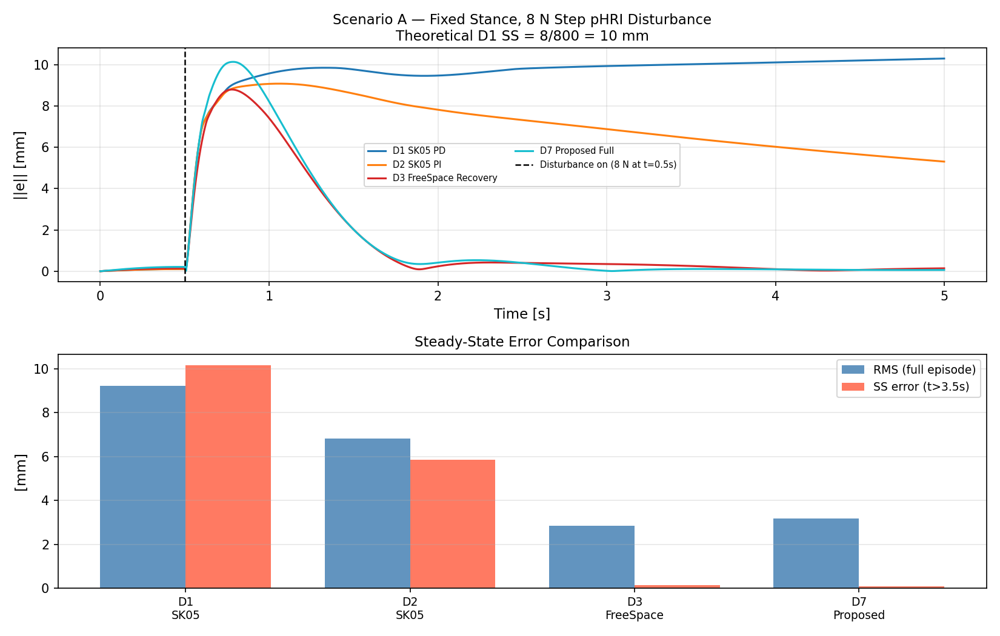
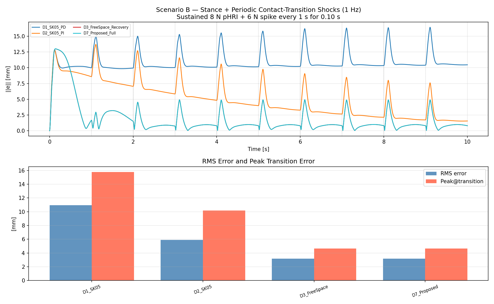
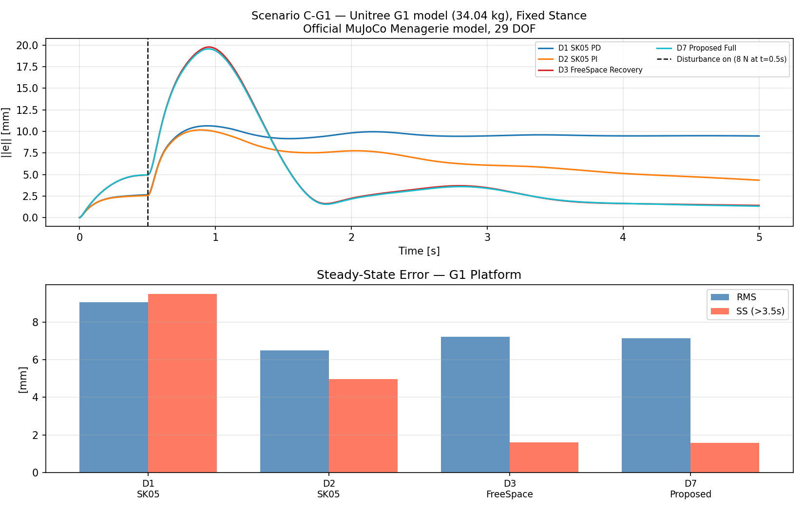
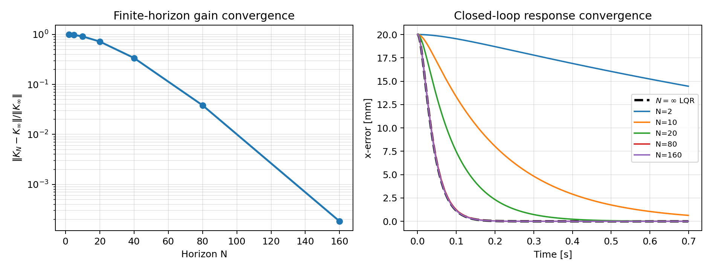
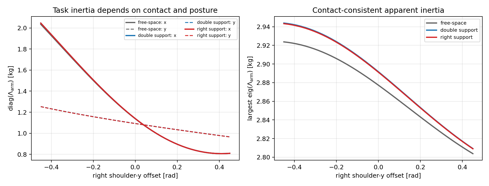
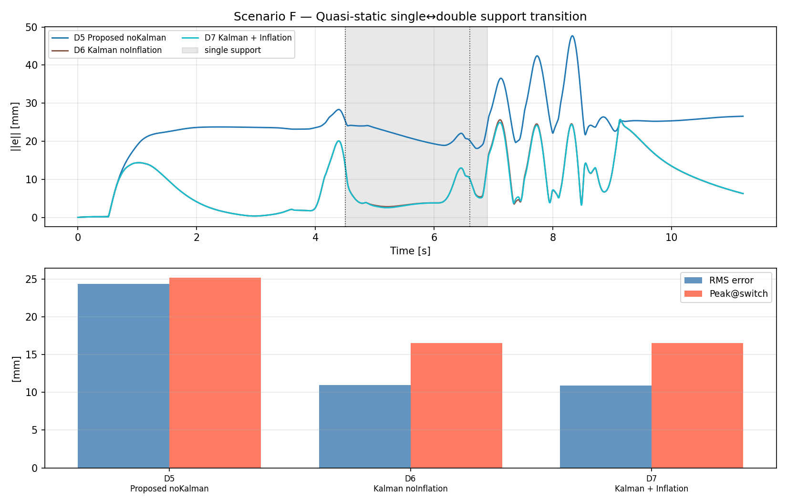

# Contact-Consistent Interaction Dynamics Normalization for Predictive Physical Human–Robot Interaction

**Yongyan Cao**

*Voryx Robotics, San Jose, CA 95136*
*Email: yongyancao@gmail.com*

*Abstract*—Safe physical human–robot interaction on floating-base robots is fundamentally a problem of regulating interaction dynamics under changing contact constraints. This paper develops a contact-consistent normalization of those dynamics: after priority-consistent cancellation of balance and contact tasks, the end-effector interaction channel is expressed as a linear double integrator in residual-acceleration coordinates. Both discrete prediction matrices are independent of robot configuration and support mode; posture and contact enter only through the task-inertia force recovery and its constraints. The resulting controller combines a constant-Hessian receding-horizon quadratic program, an acceleration-disturbance observer for offset-free rejection, and a null-space realization that preserves higher-priority tasks under the ideal hierarchy assumptions. We further show that classical operational-space impedance is the unconstrained infinite-horizon limit of the normalized predictive law. MuJoCo experiments on a 17-DOF biped and a Menagerie-derived Unitree G1 model evaluate sustained-force rejection, transmitted force shocks, and scheduled contact-model changes. The experiments show that disturbance estimation, rather than contact consistency alone, is the dominant source of fixed-stance accuracy; contact-mode covariance inflation provides only scenario-dependent transient benefit. These results support interaction-dynamics normalization as a useful representation while keeping dynamic walking and hardware validation outside the present evidence.

*Index Terms*—Interaction dynamics, whole-body control, model predictive control, impedance control, floating-base robots, physical human–robot interaction, contact-consistent dynamics, legged manipulation.

---

## I. Introduction

Legged and floating-base robots must increasingly do more than locomote: they must physically interact with people and their surroundings while keeping balance. Safe interaction on such platforms is fundamentally a problem of *interaction dynamics*—the closed-loop relation between the arm end-effector force and motion—coupled, through the contact constraints, to the whole-body balance task. These objectives are tightly coupled—arm motions shift the center of mass (CoM), changing contact force distribution, while ground reactions propagate back through the body and appear as disturbances at the end-effector. Classical fixed-base impedance control [1] and its MPC extensions [2] cannot address this coupling because they assume the robot base is rigidly anchored.

The dominant paradigm for whole-body control of legged systems decouples the problem into two layers: a centroidal MPC that optimizes ground reaction forces (GRFs) using a linearized single rigid-body dynamics (SRBD) model [3], [4], and an inner WBC layer that resolves these forces into joint torques via a prioritized quadratic program (QP) [5], [6]. This architecture achieves remarkable locomotive agility—the MIT Cheetah 3 [3] executes high-speed bounding and stair climbing—but it allocates 100% of the robot's control authority to locomotion and base-posture maintenance. Any external arm interaction is treated as a disturbance to be suppressed, not as a channel to be actively regulated. A biped reaching to assist a human standing beside it, or a quadruped manipulating a valve while maintaining stance, cannot be handled by these frameworks with the compliance and zero-steady-state-error guarantees required for safe pHRI.

Conversely, impedance MPC methods designed for fixed-base manipulators [2], [7], [8] lack an unactuated base state, generalized-coordinate partitioning, or contact-consistent mass inverses. They assume an infinite-mass ground connection and cannot model the propagation of foot contact forces to end-effector apparent inertia. Deploying them directly on a floating-base platform produces steady-state torque errors and potential instability during contact transitions.

The technical gap is therefore not merely the absence of another whole-body controller. It is the absence of a representation in which interaction dynamics remain structurally the same as robot posture, contact mode, and apparent inertia change. This paper closes that gap through the following sequence:

$$\text{Interaction dynamics}
\rightarrow \text{contact-consistent normalization}
\rightarrow \text{linear double integrator}
\rightarrow \text{predictive regulation}
\rightarrow \text{impedance as a limiting case}.$$

The main contributions are:

1. **Interaction-dynamics normalization.** We formulate floating-base arm pHRI as an interaction-dynamics problem and derive the contact-consistent residual plant obtained after higher-priority balance and contact tasks are removed through the whole-body null space.

2. **Configuration-invariant predictor.** We prove that the normalized end-effector interaction dynamics reduce to an exact linear double integrator with constant discrete matrices $(A_d,B_d)$. Contact configuration and robot posture affect only the force recovery and constraint rows through $\Lambda_\text{arm}$.

3. **Predictive interaction control and impedance equivalence.** We regulate the normalized dynamics with a finite-horizon QP and show that classical operational-space impedance is recovered as the infinite-horizon, zero-input limit. Thus impedance behavior is a special case of predictive interaction dynamics rather than a separate controller family.

4. **Floating-base realization and validation.** We realize the predictor inside a priority-consistent WBC stack using contact-dependent force recovery, a disturbance observer, and optional covariance inflation. Simulations evaluate fixed stance, force shocks, and scheduled contact-model changes.

The remainder of this paper follows the same logic. Section II surveys related work. Section III formulates interaction dynamics on floating-base robots. Section IV derives the contact-consistent normalization. Section V presents predictive regulation of the normalized dynamics. Section VI treats contact-mode changes. Section VII proves the impedance-equivalence result. Section VIII analyzes stability. Section IX gives the whole-body torque realization. Section X compares the architecture with existing frameworks. Section XI reports theory-validation simulations. Section XII concludes.

---

## II. Related Work

### A. Centroidal MPC for Locomotion

The dominant approach to predictive whole-body control projects the robot's dynamics onto its centroidal frame. Di Carlo et al. [3] introduced the convex SRBD formulation for MIT Cheetah 3, linearizing the rotation dynamics about a nominal pitch-roll and treating each support foot as a rigid contact. The resulting time-varying linear system admits a QP solution at 40 Hz for the outer MPC, while an inner Whole-Body Impulse Control (WBIC) layer maps GRFs to joint torques at 500 Hz. This bi-level architecture is foundational to the present work; however, Kim et al. dedicate both layers entirely to locomotion. External arm forces are filtered out through centroidal inertia assumptions and rigid GRF assignment, and no mechanism exists for compliant manipulation.

Bellicoso et al. [5] proposed a hierarchical WBC scheme for the ANYmal quadruped that solves a cascaded sequence of QPs to track base and end-effector tasks simultaneously. While effective for continuous trotting and terrain adaptation, the WBC stack uses classical PD task objectives with instantaneous feedback ($N=1$); there is no receding-horizon mechanism to predict and pre-load corrective torque before a disturbance develops. Sustained contact forces produce the steady-state error quantified in (16) below.

Koolen et al. [6] implemented a momentum-based controller for Atlas that regulates centroidal momentum via a QP distributing contact forces. The formulation shares the centroidal perspective but does not include a predictive loop for arm impedance and relies on high-gain stiffness to suppress interaction errors.

Sleiman et al. [19] proposed a unified MPC framework for whole-body dynamic locomotion and manipulation on legged robots, simultaneously optimising body posture, gait timing, and arm end-effector trajectories over a receding horizon. This represents the state of the art for integrated loco-manipulation and is the closest prior work to the present architecture. The key structural difference is that the arm task in [19] is formulated as a fixed-base QP subproblem: the task-space inertia uses $M^{-1}$ rather than the contact-consistent $\bar{M}^{-1}$, and no integrating disturbance state is included to guarantee zero steady-state pHRI error under sustained contact.

### B. Trajectory Optimization and Nonlinear MPC

Winkler et al. [9] developed TOWR, a phase-based trajectory optimizer that simultaneously synthesizes gait sequences, foothold locations, and full-body motions over multi-second horizons using a nonlinear program (NLP) solved by interior-point methods. The full rigid-body model captures leg-inertia coupling that SRBD ignores, but the non-convex optimization landscape restricts operation to $\sim$20–50 Hz and offline planning. Real-time pHRI management at 1 kHz is outside the scope of this approach.

Grandia et al. [10] extended TOWR with a real-time model-predictive framework using sequential convex approximations, achieving 20 Hz replanning for rough terrain. While this improves responsiveness compared to pure offline planning, it still lacks the integrating disturbance estimation required for zero steady-state error under sustained contact.

### C. Impedance MPC for Manipulation

Force control for robotic manipulators—encompassing impedance, admittance, and hybrid position/force strategies—is surveyed comprehensively in [22]. The foundational impedance control law of Hogan [1] was unified with position and torque control into a passivity-preserving framework by Albu-Schäffer, Ott, and Hirzinger [20], providing the theoretical basis on which predictive extensions build.

The present paper is a direct structural extension of the authors' prior work on saturated and predictive control. Anti-windup designs for output tracking under actuator saturation and constant disturbances [14], and the associated domain-of-attraction analysis [15], motivate the integrating disturbance state used here. Cao, Cheng, and Li [2] introduced passive MPC for fixed-base pHRI by optimizing impedance parameters over a receding horizon. Here the decision variable is instead residual interaction acceleration. Contact-consistent feedforward cancellation then yields constant prediction matrices, while posture and support mode remain in the physical force recovery.

Haninger, Hegeler, and Peternel [7] optimize force references and impedance parameters jointly using stochastic MPC with Gaussian Process models of task forces. Contact-force safety is enforced as a probabilistic chance constraint. This provides complementary insights into uncertainty-aware impedance shaping but does not address floating-base dynamics, underactuation, or contact-consistent operational-space formulation.

**Saturation-aware control and anti-windup.** Prior anti-windup and domain-of-attraction results [14], [15] motivate explicit treatment of persistent offsets and feasible cancelling inputs. The present observer is not itself an anti-windup proof: it estimates normalized acceleration disturbance, while the MPC enforces recovered-force limits. The LPV min–max framework in [16] provides related tools for parameter-varying constraints; here normalization removes parameter variation from the prediction matrices and leaves it in force recovery.

### D. Operational Space Control and Floating-Base Inverse Dynamics

Khatib [11] formulated the operational space control framework, establishing task-space inertia, Coriolis compensation, and dynamically-consistent pseudoinverses as the mathematical foundation for task-level manipulation. Sentis and Khatib [12] extended this to hierarchical synthesis of whole-body behaviors, proving that priority-ordered null-space projection guarantees non-interference between tasks—the SK05 law that forms the backbone of Level 2 in the present architecture. Righetti et al. [18] unified the floating-base inverse dynamics perspective with external contact constraints, showing how the contact-consistent mass inverse $\bar{M}^{-1}$ arises naturally from an orthogonal decomposition of the constrained dynamics. The present work builds on [11], [12], and [18] by embedding a predictive MPC layer in the residual null space of the floating-base contact-consistent hierarchy.

---

## III. Interaction Dynamics on Floating-Base Robots

### A. Generalized Coordinates

A floating-base robot (humanoid, quadruped) has $n$ actuated joints and a 6-DOF unactuated base [18]. The generalized coordinates are:

$$q = \begin{bmatrix} q_b \\ q_j \end{bmatrix} \in \mathbb{R}^{n+6}, \quad q_b \in SE(3),\; q_j \in \mathbb{R}^n \tag{1}$$

where $q_b = (p_b, R_b)$ is the base position and orientation and $q_j$ are the $n$ joint angles. The velocity vector is:

$$\dot{q} = \begin{bmatrix} v_b \\ \dot{q}_j \end{bmatrix} \in \mathbb{R}^{n+6}, \quad v_b = \begin{bmatrix} \dot{p}_b \\ \omega_b \end{bmatrix} \tag{2}$$

### B. Equations of Motion

The floating-base equations of motion (Lagrangian mechanics) are [18]:

$$M(q)\ddot{q} + C(q,\dot{q})\dot{q} + G(q) = S^\top\tau + J_c^\top(q)\lambda \tag{3}$$

where $M(q) \in \mathbb{R}^{(n+6)\times(n+6)}$ is the positive-definite inertia matrix; $h = C(q,\dot{q})\dot{q} + G(q) \in \mathbb{R}^{n+6}$ collects Coriolis, centrifugal, and gravity terms; $S = [0_{n\times6},\; I_n] \in \mathbb{R}^{n\times(n+6)}$ is the selection matrix (the base has no direct actuation); $\tau \in \mathbb{R}^n$ are commanded joint torques; $J_c(q) \in \mathbb{R}^{n_c \times (n+6)}$ is the contact Jacobian; and $\lambda \in \mathbb{R}^{n_c}$ are ground reaction forces (GRFs).

The selection matrix $S^\top\tau$ highlights the fundamental underactuation: the 6 base DOF are driven only indirectly through the contact forces $\lambda$. Partitioning (3) into base and joint blocks:

$$\begin{bmatrix}M_b & M_{bj} \\ M_{bj}^\top & M_j\end{bmatrix} \begin{bmatrix}\ddot{q}_b \\ \ddot{q}_j\end{bmatrix} + \begin{bmatrix}h_b \\ h_j\end{bmatrix} = \begin{bmatrix}0 \\ \tau\end{bmatrix} + \begin{bmatrix}J_{c,b}^\top \\ J_{c,j}^\top\end{bmatrix}\lambda \tag{4}$$

where $J_c = [J_{c,b}\; J_{c,j}]$ is partitioned into base and joint columns.

### C. Rigid Contact Constraints

A rigid contact at point $i$ enforces zero contact-point velocity: $J_{c,i}(q)\dot{q} = 0$ [18]. Differentiating yields the acceleration-level constraint:

$$J_{c,i}\ddot{q} = -\dot{J}_{c,i}\dot{q} \tag{5}$$

Stacking all contacts: $J_c\ddot{q} = \gamma_c \triangleq -\dot{J}_c\dot{q}$. Combining (3) and (5):

$$\begin{bmatrix}M & -J_c^\top \\ J_c & 0\end{bmatrix}\begin{bmatrix}\ddot{q} \\ \lambda\end{bmatrix} = \begin{bmatrix}S^\top\tau - h \\ \gamma_c\end{bmatrix} \tag{6}$$

Solving for the GRFs:

$$\lambda = \Lambda_c(q)\bigl(-\dot{J}_c\dot{q} - J_cM^{-1}(S^\top\tau - h)\bigr) \tag{7}$$

where $\Lambda_c = (J_cM^{-1}J_c^\top)^{-1}$ is the contact-space inertia matrix.

### D. Contact-Consistent Mass Inverse

Define the contact-space inertia and the corresponding constrained inverse [11], [18]:

$$\Lambda_c = (J_cM^{-1}J_c^\top)^{-1} \tag{8}$$

$$\bar{M}^{-1} = M^{-1} - M^{-1}J_c^\top\Lambda_cJ_cM^{-1} \tag{9}$$

This expression is the Schur-complement inverse of the constrained dynamics and is symmetric positive semidefinite on the admissible acceleration subspace when $M \succ 0$ and $J_c$ has full row rank. It replaces $M^{-1}$ in all operational-space formulas when contacts are active. The associated contact-consistent projector may be written in left/right forms depending on the metric, but (9) is the definition used in the task inertia $\Lambda_i=(J_i\bar M^{-1}J_i^\top)^{-1}$. This quantity is the central link between the contact configuration and the apparent inertia at the end-effector.

The derivation uses the exact inverse. The simulation code replaces $\Lambda_c$ by $(J_cM^{-1}J_c^\top+\rho_cI)^{-1}$ with $\rho_c=0.1$ and eigenvalue-clamps the task mobility before inversion. This regularization avoids numerical singularity in the simplified point-contact models but makes contact decoupling approximate; exact identities involving $J_c\bar M^{-1}$ apply only as $\rho_c\to0$.

### E. Centroidal Dynamics

The centroidal momentum $h_G = [k^\top, L^\top]^\top = A(q)\dot{q} \in \mathbb{R}^6$ aggregates the robot's linear and angular momentum about its CoM [17], where $A(q) \in \mathbb{R}^{6\times(n+6)}$ is the centroidal momentum matrix. Differentiating:

$$\dot{h}_G = A(q)\ddot{q} + \dot{A}(q,\dot{q})\dot{q} = G_c(q)\lambda + \begin{bmatrix}mg \\ 0\end{bmatrix} \tag{10}$$

where $G_c(q) \in \mathbb{R}^{6\times n_c}$ maps contact forces to centroidal momentum rate:

$$G_c(q) = \begin{bmatrix}I_3 & I_3 & \cdots \\ (p_1-p_G)^\times & (p_2-p_G)^\times & \cdots\end{bmatrix} \tag{11}$$

For the outer MPC, equation (10) is approximated by the **single rigid-body dynamics (SRBD)** model [3], treating the robot as a lumped mass $m$ with constant inertia $I_G$. Linearizing about a nominal orientation yields:

$$\dot{x}_c = A_c x_c + B_c(\{p_i\})u_c \tag{12}$$

where $x_c \in \mathbb{R}^{12}$ is the centroidal state and $u_c$ collects contact forces. The SRBD approximation error is $O(m_\text{leg}/m_\text{total})^2$, acceptable for robots where leg mass is below 20–30% of total mass.

---

## IV. Contact-Consistent Interaction Dynamics

### A. Task-Space Dynamics

For a task variable $x_i = \phi_i(q) \in \mathbb{R}^{m_i}$ with Jacobian $J_i = \partial\phi_i/\partial q$, substituting (3) into the task-space acceleration $\ddot{x}_i = J_i\ddot{q} + \dot{J}_i\dot{q}$ yields the contact-consistent task-space dynamics [11],[18]:

$$\Lambda_i(q)\ddot{x}_i + \mu_i = F_i \tag{13}$$

where:
- $\Lambda_i = (J_i\bar{M}^{-1}J_i^\top)^{-1}$ is the task-space inertia (contact-consistent via $\bar{M}^{-1}$)
- $\mu_i = \bar{J}_i^\top h - \Lambda_i\dot{J}_i\dot{q}$ collects Coriolis, centrifugal, and gravity terms projected to task space ($h = C(q,\dot{q})\dot{q}+G(q)$ includes gravity, so no separate gravity term appears)
- $\bar{J}_i = \bar{M}^{-1}J_i^\top\Lambda_i$ is the dynamically-consistent pseudoinverse
- $F_i$ is the commanded operational-space force

The torque commanded for task $i$ in isolation is $\tau_i = J_i^\top F_i$.

### B. Hierarchical Task Synthesis (SK05)

For $k$ tasks in priority order (Task 1 = highest), the Sentis–Khatib law [12] synthesizes the control torque as:

$$\tau = J_1^\top F_1 + \bar{N}_1^\top J_2^\top F_2 + \bar{N}_{12}^\top J_3^\top F_3 + \cdots + \bar{N}_{1\cdots k}^\top\tau_\text{null} \tag{14}$$

where $\bar{N}_{1\cdots i} = \prod_{j=1}^{i}(I - \bar{J}_j J_j)$ is the accumulated contact-consistent null-space projector. Under an exact model, dynamically consistent projectors, inactive actuator saturation, and no change in the active contact/friction inequalities, the key property is $J_j \bar{N}_{1\cdots i} = 0$ for all $j \leq i$: lower-priority task torques produce zero acceleration at higher-priority task coordinates. Thus the arm predictive interaction layer is designed to be non-interfering with contact maintenance and balance in the ideal hierarchy; in implementation, saturation and contact active-set changes are handled by conservative force limits and by the contact-mode update protocol.

Each task force $F_i$ in (14) is typically a PD law:

$$F_i = \Lambda_i(\ddot{x}_{di} + K_{D,i}\dot{e}_i + K_{P,i}e_i) + \mu_i \tag{15}$$

Under no disturbance, (15) yields closed-loop error dynamics $\ddot{e}_i + K_{D,i}\dot{e}_i + K_{P,i}e_i = 0$, stable for any $K_{P,i}, K_{D,i} > 0$. Under a persistent disturbance force $F_h$:

$$e_{\infty,i} = K_{P,i}^{-1}\Lambda_i^{-1}F_h = K_{x,i}^{-1}F_h \neq 0,\qquad K_{x,i}\triangleq \Lambda_i K_{P,i} \tag{16}$$

Here $K_{P,i}$ is the acceleration-level proportional gain in (15), while $K_{x,i}$ is the equivalent Cartesian stiffness in N/m. The simulation baselines report $K_x$ directly; therefore the D1 theoretical offset under an 8 N force and $K_x=800\,\text{N/m}$ is $8/800=10\,\text{mm}$.

This residual steady-state error under sustained pHRI is the fundamental limitation of the OS PD law and the primary motivation for regulating the arm task through predictive interaction dynamics.

---

## V. Predictive Regulation of Interaction Dynamics

### A. Architecture Overview

Consider an $n$-DOF floating-base robot in a fixed support configuration (e.g., bipedal stance) performing arm manipulation while subject to pHRI forces. The control objectives are:
1. maintain balance with contact forces inside friction cones;
2. track an arm end-effector reference $p_d(t)$; and
3. reject pHRI forces with zero steady-state tracking error.

These objectives are addressed by three nested control levels operating at different timescales:

**Level 1 (Centroidal MPC, 40–100 Hz):** plans CoM trajectory and GRFs over a 500 ms horizon via the SRBD model (12).

**Level 2 (WBC Hierarchy, 500 Hz):** resolves the Level 1 GRFs into joint torques using the SK05 law (14) for contact and balance tasks, leaving the arm end-effector task slot open.

**Level 3 (Predictive interaction regulation, ≥1 kHz):** fills the arm slot with a receding-horizon QP that predicts and rejects pHRI disturbances, replacing the PD law (15) with a predictive force command.

### B. Contact-Consistent Residual Plant

After Level 2 commits torques $\tau_1$ (contact maintenance) and $\tau_2$ (balance), the residual arm end-effector dynamics are governed by the contact-consistent task-projected plant:

$$\Lambda_\text{arm}(q)\ddot{x}_\text{arm} + \mu_\text{arm} = F_\text{arm} + d_\text{ext} \tag{17}$$

where $\Lambda_\text{arm} = (J_\text{arm}\bar{M}^{-1}J_\text{arm}^\top)^{-1}$ uses the contact-consistent mass inverse (9), $\mu_\text{arm} = \bar{J}_\text{arm}^\top h - \Lambda_\text{arm}\dot{J}_\text{arm}\dot{q}$ collects all Coriolis, centrifugal, and gravitational terms (note that $h = C\dot{q}+G$ already includes $G(q)$, so no separate gravity term appears), and $d_\text{ext}$ is the pHRI wrench projected to arm task space. Equation (17) has the same mathematical structure as the fixed-base case, with $\bar{M}^{-1}$ replacing $M^{-1}$ in $\Lambda_\text{arm}$. All feedforward cancellation and linear double-integrator reduction steps follow identically.

### C. Contact-Consistent Feedforward and Horizon Freezing

Rather than take the task *force* as the decision variable — which leaves the input matrix configuration-dependent — we optimize the **residual interaction acceleration** $u$ and recover the physical force afterward. The arm command is an operational-space feedforward plus the residual acceleration mapped through the task inertia:

$$F_\text{arm} = \underbrace{\Lambda_\text{arm}(q)\ddot{p}_{d} + \mu_\text{arm}}_{F_\text{ff}\ (\text{model feedforward})} + \Lambda_\text{arm}(q)\,u \;=\; \Lambda_\text{arm}(q)\big(\ddot{p}_d + u\big) + \mu_\text{arm} \tag{18a}$$

which is mapped to the joint space via the balance null-space projector:

$$\tau_\text{arm} = S\,\bar{N}_{12}^\top J_\text{arm}^\top F_\text{arm}. \tag{18b}$$

**Multi-rate execution.** Level 2 updates $\bar{N}_{12}(q)$, $\Lambda_\text{arm}(q)$, and $\mu_\text{arm}$ at 500 Hz. Level 3 runs at $\geq$1 kHz; during the interleaved 1 kHz cycles that do not coincide with a Level 2 tick, the projector $\bar{N}_{12}$ and feedforward terms are held constant at their most recent Level 2 values. Because the configuration changes by at most $\|\dot{q}\|\Delta t_2 \approx 0.002\,\text{rad}$ per Level 2 interval, the frozen-matrix error is first-order small and its contribution to the tracking error is bounded by $O(\Delta t_2)$—comparable in magnitude to the SRBD modeling error already absorbed by the Kalman disturbance state $\hat{d}$.

Substituting the recovery (18a) into the residual plant (17) cancels the $\Lambda_\text{arm}\ddot{p}_d + \mu_\text{arm}$ terms; with $e_\text{arm} = x_\text{arm} - p_d$ (actual minus desired) and $d(t) \triangleq \Lambda_\text{arm}^{-1}d_\text{ext}$, the residual error obeys the **configuration-invariant predictive model**:

$$\boxed{\;\ddot{e}_\text{arm} = u + d(t)\;} \tag{19}$$

The task inertia $\Lambda_\text{arm}(q)$ no longer appears in the model the optimizer sees; it has moved into the static recovery map (18a). Relative to a corrective-force variable $F_\text{corr}$, this is the invertible change of variables $u=\Lambda_\text{arm}^{-1}F_\text{corr}$ when $\Lambda_\text{arm}\succ0$. The predictive model is therefore robot-independent, while the delivered force remains robot-dependent.

**Proposition 1** (Constant predictive model): *In the residual-acceleration coordinates (19), the exact zero-order-hold discretization for the error state $x_{e,k} = [e_\text{arm}^\top, \dot{e}_\text{arm}^\top]^\top$ is constant across all configurations and contact modes:*

$$A_d = \begin{bmatrix}I_3 & \Delta t I_3 \\ 0 & I_3\end{bmatrix}, \qquad B_d = \begin{bmatrix}\tfrac{1}{2}\Delta t^2 I_3 \\ \Delta t\, I_3\end{bmatrix} \tag{20}$$

*Both $A_d$ and $B_d$ are configuration- and contact-mode-independent; because $u$ is an acceleration, the control and the disturbance $d$ enter through the same $B_d$. All robot dependence is confined to the static recovery map (18a) and to the force-limit constraint (§V-D).*

*Proof:* The continuous model (19) has state matrix $A_c = \left[\begin{smallmatrix}0 & I_3 \\ 0 & 0\end{smallmatrix}\right]$, nilpotent ($A_c^2 = 0$), so $A_d = e^{A_c\Delta t} = I + A_c\Delta t$ is exact and configuration-free. The input $u$ enters through $E_c = [0;\, I_3]$; its exact ZOH is $B_d = \int_0^{\Delta t} e^{A_c s}E_c\,ds = [\tfrac{1}{2}\Delta t^2 I_3;\, \Delta t\, I_3]$, likewise configuration-free. $\square$

Because $(A_d, B_d)$ are constant, the lifted prediction matrix $\Gamma$, the cost Hessian $H = \Gamma^\top\bar{Q}\Gamma + \bar{R}$, and its factorization are computed **once offline** and reused at every configuration and contact mode. This is the decisive change from the force-input formulation, in which $B_d(q_k)$ — and hence $\Gamma$ and $H$ — were rebuilt online: here the online step updates only the recovery inertia $\Lambda_\text{arm}(q_k)$ in (18a) and the force-limit rows (§V-D), never the QP structure or Hessian. Configuration-dependence does not disappear; it relocates from the *predicted model* to a *static per-sample recovery*, where it costs nothing in the horizon rollout.

### D. Receding-Horizon QP

Let $x_{e,k} = [e^\top, \dot{e}^\top]^\top \in \mathbb{R}^6$ be the arm tracking error state and $U = [u_0^\top,\dots,u_{N-1}^\top]^\top$ the stacked residual-acceleration decision variable. With the constant $(A_d, B_d)$ of (20), the $N$-step prediction matrix $\Gamma$ (and hence the Hessian) is constant across configurations *and* contact modes and is built once offline:

$$\Gamma = \begin{bmatrix} B_d & 0 & \cdots \\ A_d B_d & B_d & \cdots \\ \vdots & & \ddots \end{bmatrix},\qquad B_d = \begin{bmatrix}\tfrac{1}{2}\Delta t^2 I_3 \\ \Delta t\, I_3\end{bmatrix}\ \text{(constant).} \tag{21}$$

The contact mode $m$ no longer enters the predictor; it enters only the recovery inertia $\Lambda_\text{arm}^{(m)}(q_k)$ used in (18a) and in the force-limit rows below.

The receding-horizon QP is:

$$\min_{U}\;\frac{1}{2}U^\top H\, U + h_k^\top U \quad\text{s.t.}\quad \big\|F_{\text{ff},k} + \Lambda_\text{arm}^{(m)}(q_k)\,u_k\big\|_\infty \leq F_\text{max},\ \ k=0,\dots,N-1 \tag{22}$$

with the **constant** Hessian $H = \Gamma^\top\bar{Q}\Gamma + \bar{R}$ and $h_k = \Gamma^\top\bar{Q}\,x_{\text{free},k}$, where $\bar{Q} = \text{blkdiag}(Q,\ldots,Q)$, $\bar{R} = \text{blkdiag}(R,\ldots,R)$, and $x_{\text{free},k}$ is the free-response prediction. The safety cap is imposed on the **total delivered force** $F_\text{arm} = F_{\text{ff},k} + \Lambda_\text{arm}^{(m)}(q_k)\,u$ from the recovery (18a), not on the corrective increment alone: the human and the actuators feel the sum of feedforward and corrective, so bounding only $\Lambda_\text{arm}u$ would let the feedforward push the actual force past $F_\text{max}$. When actuator saturation must also be pre-empted, the same principle adds a torque row on the total joint torque,
$$\big\|\tau_{\text{ff},k} + J_\text{arm}^\top(q_k)\,\Lambda_\text{arm}^{(m)}(q_k)\,u_k\big\|_\infty \leq \tau_\text{max}. \tag{22b}$$
Both bounds are **affine in $u$** with a configuration-dependent matrix ($\Lambda_\text{arm}$, or $J_\text{arm}^\top\Lambda_\text{arm}$) and a configuration-dependent offset ($F_{\text{ff},k}$, or $\tau_{\text{ff},k}$). All robot dependence that previously sat inside the Hessian therefore relocates into these constraint rows only: the Hessian stays constant and the online step is a small linear-inequality update, never a Hessian rebuild [15]. The QP (22) is strictly convex and solved by an operator-splitting solver (e.g., OSQP [13]) in $< 0.1$ ms for $N = 20$, reusing the offline factorization across all modes. In the common regime where the caps are inactive—the pHRI task force stays well below $F_\text{max}$—the solution is the constant-gain unconstrained law $U^\star = -H^{-1}h_k$, a single matrix–vector product with a factorization computed once; the caps engage only near the limits.

### E. Kalman Disturbance Augmentation

The disturbance $d(t)$ in (19) captures three coupled effects: (i) external pHRI forces directly applied to the arm; (ii) unmodeled contact reactions propagated from the feet; and (iii) SRBD approximation error from neglected leg inertia. These are jointly estimated by augmenting the MPC state with an integrating disturbance state $\hat{d} \in \mathbb{R}^3$:

$$\begin{bmatrix}x_{e,k+1} \\ \hat{d}_{k+1}\end{bmatrix} = \underbrace{\begin{bmatrix}A_d & B_d \\ 0 & I\end{bmatrix}}_{\displaystyle A_\text{aug}\ (\text{constant})}\begin{bmatrix}x_{e,k} \\ \hat{d}_{k}\end{bmatrix} + \begin{bmatrix}B_d \\ 0\end{bmatrix}u_{k} + w_k \tag{23}$$

Because $u$ and $d$ are both accelerations they enter through the same constant $B_d$, so the augmented estimator model $A_\text{aug}$ is likewise configuration- and contact-mode-independent — one steady-state Kalman gain serves every mode.

with process noise $w \sim \mathcal{N}(0, Q_w)$ and measurement noise $v \sim \mathcal{N}(0, R_v)$ on arm end-effector position. The Kalman gain $K_f$ is computed offline from the steady-state discrete algebraic Riccati equation. The integrating structure of $A_\text{aug}$ guarantees $\hat{d}_{k} \to d$ for any bounded constant disturbance, independent of its physical origin. This is the predictive-control analogue of the anti-windup result of [14], which shows that augmenting an integrating channel achieves zero steady-state error under actuator limits and persistent constant disturbances: here the Kalman state $\hat{d}$ takes the role of that integrating channel and feeds it forward through the MPC horizon rather than feeding it back as a fixed integral gain.

The free-response prediction fed into the QP is constructed using $\hat{d}$:

$$x_\text{free} = \Phi^N x_e + \sum_{j=0}^{N-1}\Phi^j B_d\hat{d}. \tag{24}$$

where $\Phi = A_d$. This causes the optimizer to pre-load corrective force before the disturbance fully manifests at the end-effector.

---

## VI. Contact-Mode Changes in Interaction Dynamics

### A. Contact-Mode Switch Protocol

When a foot lifts off or touches down, $J_c$, $\bar{M}^{-1}$, and $\Lambda_\text{arm}$ change. The normalized matrices $(A_d,B_d)$ do not. The acceleration disturbance $d=\Lambda_\text{arm}^{-1}d_\text{ext}$ can nevertheless jump because the same physical wrench is divided by a new task inertia; covariance inflation allows the observer to adapt to that changed normalized disturbance.

At contact switch time $t_s$, the following protocol is executed in order:

1. Recompute $\bar{M}^{-1}$ with the new $J_c$.
2. Recompute $\Lambda_\text{arm}$ for the force recovery and constraint rows.
3. **Covariance inflation:** $P_\text{aug} \leftarrow \alpha P_\text{aug}$ with $\alpha \in [3, 5]$ to inflate the error covariance and allow rapid re-estimation of the disturbance in the new contact configuration.
4. **Hold $\hat{d}$:** do not reset to zero—balance-related disturbances persist across contact transitions and the estimate retains useful information.

Covariance inflation is a heuristic adaptation mechanism, not a stability guarantee. Its benefit depends on whether the normalized disturbance changes enough at the switch to outweigh the additional estimator sensitivity.

### B. Contact-Mode Recovery Library

The lifted predictor, Hessian, and unconstrained gain are computed once. A contact-mode library stores only the current contact Jacobian pattern and the latest $\Lambda_\text{arm}^{(m)}$ used by force recovery and constraints. Thus a mode switch updates robot-dependent algebra without rebuilding the prediction rollout.

---

## VII. Impedance as the Infinite-Horizon Limit

**Theorem 1** (Impedance Equivalence of Predictive Interaction Dynamics). *Under rigid contacts, fixed contact mode, and no disturbance, the unconstrained infinite-horizon predictive interaction controller (Level 3, $N \to \infty$) renders a classical task-space impedance law:*

$$\Lambda_\text{arm}(q)\ddot{e} + \Lambda_\text{arm}K_v\dot{e} + \Lambda_\text{arm}K_e e = F_h \tag{25}$$

*with effective configuration-adaptive mass $M_{d,\text{eff}} = \Lambda_\text{arm}(q)$ that depends on both arm posture and contact configuration.*

*Proof.* In the infinite-horizon unconstrained limit with $\hat{d}=0$, the acceleration-input QP reduces to the discrete-LQR feedback $u=-K_\infty x_e$. Partition $K_\infty=[K_e\;K_v]$. Substituting this law into (19), with $d=\Lambda_\text{arm}^{-1}F_h$, gives
$$\ddot{e} = -(K_e e + K_v \dot{e}) + \Lambda_\text{arm}^{-1}F_h,$$ 

and premultiplying by $\Lambda_\text{arm}$ yields (25). Hence the effective mass, damping, and stiffness are $M_{d,\text{eff}} = \Lambda_\text{arm}(q)$, $D_\text{eff} = \Lambda_\text{arm}K_v$, and $K_\text{eff} = \Lambda_\text{arm}K_e$. The gains $(K_e,K_v)$ are the Riccati image of the QP weights $(Q,R)$, not the weights themselves; no direct equality between the cost weights and physical stiffness/damping is assumed. The contact-consistent $\bar{M}^{-1}$ in $\Lambda_\text{arm}$ means the effective mass adapts to both the arm joint configuration and the active contact footprint. $\square$

Theorem 1 is an asymptotic structural equivalence, not a claim that the deployed $N=20$ gain equals the infinite-horizon gain. The QP weights $(Q,R)$ tune the Riccati gains $(K_e,K_v)$ indirectly; the physical stiffness and damping are $K_\text{eff}=\Lambda_\text{arm}K_e$ and $D_\text{eff}=\Lambda_\text{arm}K_v$, not the weights themselves.

Notably, all three closed-loop impedance parameters—$M_{d,\text{eff}}$, $D_\text{eff}$, and $K_\text{eff}$—adapt automatically as the arm configuration and contact state change, while the QP weights remain fixed design parameters. This adaptation is a structural by-product of $\Lambda_\text{arm}(q)$ and incurs no additional solver cost, preserving the ≥1 kHz control rate.

---

## VIII. Stability of Normalized Interaction Dynamics

### A. Zero Steady-State Error Under Fixed Contact Mode

**Theorem 2** (Nominal Zero Steady-State Error). *Suppose the deterministic normalized model is exact, $(A_d,B_d)$ is regulated by a stabilizing unconstrained gain, the constant-disturbance observer is convergent, and the cancelling equilibrium satisfies all force and torque constraints. If $d_k\to d_\infty$, then* $\lim_{k\to\infty}\|e_{\text{arm},k}\|=0$.

*Proof.* The claim combines regulator stability with offset-free rejection, which rest on two *distinct* structural properties.

*Regulator (control) side.* The normalized pair $(A_d,B_d)$ in (20) is controllable because $[B_d\;\;A_dB_d]$ has rank 6 for every $\Delta t>0$. Physical force recovery additionally requires a finite, positive-definite $\Lambda_\text{arm}$, so implementation is restricted to a compact set away from task singularities and invalid support configurations.

*Offset-free (observer) side.* The disturbance state is not actuated; it is inferred because it enters the measured error dynamics through full-column-rank $B_d$. In the deterministic, correctly modeled, constant-disturbance case, detectability of $(A_\text{aug},C)$ and a stable estimator imply $\hat d_k\to d$. Input centering then gives $u\to-\hat d$, so the stable nominal regulator converges to $e_\infty=0$. This conclusion requires inactive constraints at the cancelling equilibrium. Under force saturation, convergence is guaranteed only for feasible initial states whose trajectories remain in a positively invariant admissible set; this paper does not compute that maximal set. $\square$

### B. Transient Bound Across Contact Transitions

Across a contact switch, $B_d$ remains constant but the normalized disturbance can jump by $\Delta d_s=d_\text{new}-d_\text{old}$ because $\Lambda_\text{arm}$ changes. A stable linear error/observer interconnection admits a bound of the form

$$\|e(t)\| \leq c_0\rho^{\,t-t_s}\|z(t_s)\| + c_1\|\Delta d_s\|,\qquad 0<\rho<1, \tag{26}$$

where $z$ stacks regulation and estimation error and the constants depend on the closed-loop observer realization. This is an input-to-state bound, not a numerical certificate for the nonlinear robot. It motivates rapid re-estimation but does not imply that covariance inflation improves every switch, as the experiments confirm.

### C. Null-Space Barrier Stability

The contact-consistent null-space torque that enforces joint limits and workspace boundaries is:

$$\tau_\text{null} = \bar{N}_\text{arm}^\top\bigl(-k_\text{null}(q-q_0) - d_\text{null}\dot{q} + g(q)\bigr) \tag{27}$$

where $\bar{N}_\text{arm} = I - \bar{J}_\text{arm}J_\text{arm}$ uses the contact-consistent pseudoinverse and $g(q)$ is the joint-limit barrier gradient. Under the same ideal hierarchy assumptions used above, projection through $\bar{N}_\text{arm}$ makes (27) produce zero wrench at the arm task coordinate, preserving task tracking and the higher-priority balance constraints. With torque saturation or friction-cone active-set changes, this decoupling becomes approximate and must be enforced by the low-level QP limits.

---

## IX. Whole-Body Realization

Combining all three levels, the complete joint torque command for a floating-base robot performing pHRI is:

$$\tau = \tau_\text{contact} + \bar{N}_1^\top\tau_\text{balance} + \tau_\text{arm} + \bar{N}_{12}^\top\tau_\text{null}. \tag{28}$$

Here $\tau_\text{arm}$ already contains both model feedforward and the recovered correction $\Lambda_\text{arm}u$ through (18); it must not be added a second time.

Equation (28) is the whole-body realization of the normalized interaction-dynamics controller. The hierarchical null-space structure follows the SK05 law [12] extended to the contact-consistent floating-base setting [11],[18]. The contribution here is not the null-space hierarchy itself, but the normalized predictive interaction force $F_\text{mpc}$ that occupies the residual arm channel. Under exact dynamics and inactive saturation/friction active-set changes, the projections $\bar{N}_1^\top$ and $\bar{N}_{12}^\top$ isolate this interaction layer from contact maintenance and balance, while the Kalman-augmented QP provides the offset-free disturbance rejection that the classical OS PD law (15) cannot achieve.

---

## X. Framework Comparison

Table I summarizes the mathematical and architectural distinctions. The proposed predictor uses constant acceleration-input matrices; contact and posture enter through $\Lambda_\text{arm}$ in force recovery, while the disturbance state propagates normalized acceleration uncertainty through the horizon.

**Table I: Architectural and Mathematical Comparison**

| Architectural Vector | Fixed-Base Baseline [2] | Bellicoso et al. [5] | Kim et al. [4] | Proposed Framework |
| :--- | :--- | :--- | :--- | :--- |
| Primary objective | Fixed-base pHRI | Quadruped locomotion | Dynamic locomotion | Normalized interaction dynamics for floating-base pHRI |
| Task-space inertia | $\Lambda = (JM^{-1}J^\top)^{-1}$ | N/A | N/A | $\Lambda_\text{arm} = (J\bar{M}^{-1}J^\top)^{-1}$ |
| Prediction horizon | $N$-step QP | $N = 1$ | $\sim$10–30 steps | $N$-step QP (≥1 kHz) |
| Disturbance handling | Kalman, fixed-base | WBC weight tuning | Centroidal inertia | Kalman: pHRI + leg momentum |
| Input matrix | Force-input, inertia dependent | N/A | N/A | Constant acceleration-input $B_d$ |
| Null-space use | Joint centering | Posture tracking | Locomotion | Predictive interaction QP |
| Steady-state error | Zero (fixed base) | Nonzero under load | Nonzero under load | Zero (Theorem 2) |
| Contact transitions | N/A | Mode switching | Gait phases | Covariance-inflation protocol |

---

## XI. Theory-Validation Experiments

The simulations are organized around claim validation. Scenarios A and C test the constant normalized predictor and offset-free rejection under fixed contact. Scenario B applies periodic transmitted force shocks without changing the contact set. Scenarios E and F change the contact model and therefore the force-recovery inertia, while the normalized predictor remains unchanged. A separate horizon sweep tests the asymptotic impedance-equivalence claim.

### A. Simulation Platform

Experiments were rerun with MuJoCo 3.10 at a 2 kHz integration rate. Scenarios A and B use a 17-DOF biped (11 actuated, approximately 46 kg). Scenario C uses a Menagerie-derived Unitree G1 MJCF with 29 actuators, 35 generalized velocities, and 34.04 kg total modeled mass, augmented with a right-hand site. Its XML position actuators use $K_p=500$ and unit damping ratio. The benchmark explicitly overrides the XML's 2 ms default timestep with 0.5 ms and advances two physics steps per 1 ms controller update. The fixed-stance scenarios use joint-space PD for balance; they do not exercise the centroidal controller described in Section V.

Level 3 cost weights: $Q = \mathrm{diag}(6 \times 10^4 I_3,\; 60\, I_3)$, $R = 0.01\, I_3$. Kalman noise: $Q_w = \mathrm{diag}(10^{-4}I_6,\; 10^{-2}I_3)$, $R_v = 10^{-6}I_3$. All QPs are solved via the unconstrained analytical solution (fast path); covariance-inflation coefficient $\alpha = 4$ (Section VI).

**Unitree G1/R1 hardware interface.** The Unitree G1 (29 DOF, ~20.9 kg) and R1 (26 DOF, 25–29 kg, 1.23 m) robots expose a low-level joint control interface via `unitree_sdk2` at 500 Hz. Each joint accepts a command tuple $(q_\text{des},\, \dot{q}_\text{des},\, \tau_\text{ff},\, K_p,\, K_d)$, implementing $\tau = K_p(q_\text{des}-q) + K_d(\dot{q}_\text{des}-\dot{q}) + \tau_\text{ff}$. High-level locomotion in Unitree's open-source release (`unitree_rl_gym`) is provided by a reinforcement-learning policy that outputs joint position targets at 50 Hz; no WBC or MPC stack is open-sourced. The proposed three-level architecture maps directly onto this interface: Level 2 WBC and Level 3 predictive interaction regulation produce joint torques $\tau$ that are sent as $\tau_\text{ff}$ with $K_p = K_d = 0$ (pure torque mode), compatible with both G1 and R1 EDU variants.

### B. Benchmarked Controllers

Seven controllers are evaluated across all three scenarios (Table II). All controllers run above the identical joint-space PD balance controller and are evaluated on the same MuJoCo plant; they differ only in the arm interaction layer.

**Table II: Benchmarked Controllers**

| Label | Description |
| :--- | :--- |
| D1 | Operational-space PD (task PD, no priority hierarchy), Cartesian stiffness $K_x = 800\,\text{N/m}$, damping $D_x = 40\,\text{Ns/m}$ |
| D2 | Operational-space PI: adds $K_I = 150\,\text{N/(m·s)}$ with anti-windup clamping |
| D3 | Normalized MPC with free-space $M^{-1}$ in force recovery (ignores contact consistency) |
| D4 | WBC assembler + null-space PD centering (no prediction or estimation) |
| D5 | Proposed: WBC + predictive interaction regulation, no Kalman augmentation |
| D6 | Proposed: WBC + predictive interaction regulation + Kalman, no covariance inflation ($\alpha = 1$) |
| D7 | Proposed full: WBC + predictive interaction regulation + Kalman + covariance inflation ($\alpha = 4$) |

D1 establishes the analytical baseline: for $K_x=800\,\text{N/m}$ and $F_h=8\,\text{N}$, (16) predicts 10 mm offset. D4 isolates the WBC assembly from prediction. D3 tests whether contact-consistent rather than free-space inertia recovery matters in the chosen stance.

### C. Scenario A: Fixed Double-Support Step Disturbance

The robot holds a stationary double-support stance. The right arm holds a fixed Cartesian target. At $t = 0.5\,\text{s}$, a step pHRI force of 8 N is applied at the end-effector in the $x$-direction and held for the remaining 4.5 s. Total episode: 5 s. All controllers run at 1 kHz (1 ms control period); physics advances at 2 kHz via two 0.5 ms sub-steps per control cycle.

**Metrics:** RMS position error over the full episode; steady-state (SS) error averaged over $t > 3.5\,\text{s}$. Theoretical baseline: $e_\infty = F_h/K_x = 8/800 = 10\,\text{mm}$ for D1.

**Table III: Scenario A — Fixed Stance, 8 N Step Disturbance**

| Controller | RMS err [mm] | SS err [mm] |
| :--- | :---: | :---: |
| D1 OS PD | 9.24 | 10.17 |
| D2 OS PI | 6.82 | 5.86 |
| D3 Free-space recovery | 2.85 | 0.128 |
| D4 WBC + PD | 10.06 | 10.87 |
| D5 Proposed, no Kalman | 12.09 | 13.21 |
| D6 Proposed, no inflation | **3.19** | **0.079** |
| D7 Proposed full | **3.19** | **0.079** |

**Fig. 1.** Scenario A — Fixed double-support stance, 8 N step pHRI disturbance at $t = 0.5\,\text{s}$. *Top:* Cartesian end-effector error norm $\|e\|$ over time for the readability subset D1, D2, D3, and D7; D4--D6 are reported in Table III. The Kalman-augmented predictive controller removes most of the steady-state offset, while the no-Kalman predictive controller is biased by the sustained pHRI load. *Bottom:* Bar chart of RMS and steady-state (SS) error for the same plotted subset.

The reactive baselines retain the expected approximately 10 mm offset. The no-observer normalized controller is likewise biased, whereas D6/D7 reduce steady-state error to 0.079 mm. D3 reaches 0.128 mm, confirming that this fixed stance does not isolate a substantial contact-consistency benefit. Covariance inflation is inactive because the contact mode never switches.

### D. Scenario B: Stance with Periodic Transmitted Force Shocks

The robot holds a stable double-support stance throughout. The right arm tracks a fixed Cartesian target while a sustained 8 N pHRI force is applied from $t = 0$. Every $T_\text{switch} = 1\,\text{s}$, an additional 6 N spike is superimposed on the pHRI for $T_\text{spike} = 0.1\,\text{s}$ and then withdrawn, totalling 9 events over 10 s. This models the brief mechanical shock transmitted through the kinematic chain when a swing foot contacts the ground during walking. Since the contact set remains double support throughout, covariance inflation is not triggered in this scenario; Scenario E isolates the genuine contact-mode switch.

**Additional metric:** peak Cartesian error within a ±150 ms window centred on each shock event.

**Table IV: Scenario B — Stance + 1 Hz Force Shocks, Sustained 8 N pHRI**

| Controller | RMS err [mm] | Peak at transition [mm] |
| :--- | :---: | :---: |
| D1 OS PD | 10.94 | 15.77 |
| D2 OS PI | 5.91 | 10.17 |
| D3 Free-space recovery | 3.17 | 4.64 |
| D4 WBC + PD | 11.89 | 17.24 |
| D5 Proposed, no Kalman | 14.41 | 18.75 |
| D6 Proposed, no inflation | **3.17** | **4.65** |
| D7 Proposed full | **3.17** | **4.65** |

**Fig. 2.** Scenario B — double-support stance, sustained 8 N pHRI + 6 N periodic shocks at 1 Hz. *Top:* Error norm over the full episode for D1, D2, D3, and D7; D4--D6 are reported in Table IV. The disturbance observer removes the steady-state bias: the no-Kalman predictive controller (D5) is offset by the sustained load, while the Kalman-augmented D7 tracks to a few millimetres. With both feet planted throughout, the free-space (D3) and contact-consistent (D7) predictors are indistinguishable. *Bottom:* Bar chart of RMS and peak-at-transition error for the plotted subset.

The disturbance observer is again the dominant factor: D5 has 14.41 mm RMS error, while D6/D7 reach 3.17 mm. D3 and D7 are indistinguishable because this is a force-shock test, not a contact transition. Covariance inflation is inert.

### E. Scenario C: Unitree G1 Real Model, Fixed Stance, 8 N Step Disturbance

Scenario A is repeated on the Menagerie-derived G1 model. Because this MJCF exposes position actuators, Level 3 uses the simulation-only approximation $\Delta q_i=\tau_i/K_p$. This is not equivalent to validating the SDK's pure feedforward-torque mode and should not be interpreted as hardware evidence.

**Table V: Scenario C — Unitree G1 Model (34.04 kg), Fixed Stance, 8 N Step Disturbance**

| Controller | RMS err [mm] | SS err [mm] |
| :--- | :---: | :---: |
| D1 OS PD | 9.06 | 9.50 |
| D2 OS PI | 6.50 | 4.98 |
| D3 Free-space recovery | 7.21 | 1.606 |
| D4 WBC + PD | 9.06 | 9.50 |
| D5 Proposed, no Kalman | 23.87 | 26.37 |
| D6 Proposed, no inflation | **7.13** | **1.589** |
| D7 Proposed full | **7.13** | **1.589** |

**Fig. 3.** Scenario C — Menagerie-derived G1 model (34.04 kg, 29 actuators), fixed stance, 8 N step pHRI. D3 and D7 have nearly identical steady-state error; the observer, not contact consistency, drives the improvement.

With corrected simulation timing, D3 and D7 remain nearly identical (1.606 versus 1.589 mm steady state). The observer is again decisive: D5 remains at 26.37 mm, while D7 reaches 1.589 mm. The remaining error is consistent with the position-actuator approximation, but a torque-mode hardware experiment is required before attributing a specific recovery to the real low-level interface.

### F. Theorem and Inertia Diagnostics

The normalized double-integrator model permits a robot-independent check of Theorem 1. For the reported $(Q,R,\Delta t)$, the relative first-step gain error $\|K_N-K_\infty\|/\|K_\infty\|$ is 0.671 at $N=20$, 0.0246 at $N=80$, and $9.13\times10^{-5}$ at $N=160$. Thus the gain converges to the impedance-equivalent LQR law, but the deployed $N=20$ controller is intentionally a finite-horizon controller and should not be described as numerically equivalent to that limit.

A posture sweep also compares the diagonal task inertia obtained from free-space, double-support, and right-foot-support models. At the nominal posture these are respectively $[1.138,1.092,2.544]$, $[1.140,1.094,2.557]$, and $[1.139,1.093,2.557]$ kg. The differences are small in this simplified biped. This diagnostic explains why D3 and D7 are nearly indistinguishable in fixed stance and prevents attributing the observer's improvement to contact consistency.

### G. Scenario E: Bracing-Hand Support Transition

To exercise a genuine contact-model transition without single-support balance, a left-arm brace is added to or removed from the modeled contact set while both feet remain planted. The modeled set alternates {L foot, R foot} and {L foot, R foot, L hand}, changing $\bar M^{-1}$ and $\Lambda_\text{arm}$ while leaving the normalized $(A_d,B_d)$ unchanged. A sustained 8 N force acts on the right arm.

**Table VI: Scenario E — Bracing-Hand Support Transition, Sustained 8 N pHRI**

| Controller | RMS err [mm] | Peak at switch [mm] |
| :--- | :---: | :---: |
| D5 Proposed, no Kalman | 11.26 | 11.36 |
| D6 Kalman, no inflation ($\alpha=1$) | 2.69 | 5.25 |
| D7 Kalman + inflation ($\alpha=4$) | **2.53** | **5.07** |

The observer reduces RMS error from 11.26 to 2.53 mm. Inflation provides only a small additional improvement over D6 (2.69 to 2.53 mm RMS), consistent with adaptation to a changed normalized disturbance rather than a changed predictor matrix.

### H. Scenario F: Quasi-Static Single↔Double Support Transition

Scenarios B and E hold both feet planted; this scenario exercises a scheduled change of the **foot-support model** used by the interaction layer — the biped shifts its weight over the right foot, lifts the left foot, switches the contact-consistent predictor from double to right-foot support, holds, and places the foot back:

$$\{\text{L foot}, \text{R foot}\} \;\longleftrightarrow\; \{\text{R foot}\},$$

so the modeled contact Jacobian ($J_c$: 6↔3 rows), $\bar M^{-1}$, and $\Lambda_\text{arm}$ switch at lift and placement. The normalized predictor itself does not switch. The arm target is torso-relative to separate interaction regulation from gross base translation.

**Balance stand-in and its limitations.** A standing single-support phase requires **ankle-roll** (lateral centre-of-pressure) authority, which the biped of Scenarios A/B/E lacks; hip-roll balancing alone produces a foot-tipping moment that cannot be countered, and the robot falls. We therefore use a modified model (`biped_qstatic`: a wider 18 cm foot and added ankle-roll actuators) and a hand-tuned quasi-static controller — a stiff hip-roll CoM regulator for the coarse weight transfer plus a centre-of-pressure–limited ankle-roll torque for the fine support-mode stabilization. This is a deliberate **minimal stand-in** for the Level-1 balance layer, *not* the centroidal MPC of Section V. MuJoCo contact auditing shows that the lifted foot can retain intermittent toe/edge contact with the floor, so Scenario F should be read as a support-mode/contact-model switch test for the interaction layer, not as a full dynamic walking or physically clean single-support result.

**Table VII: Scenario F — Quasi-Static Single↔Double Support Transition, Sustained 8 N pHRI (torso-relative arm error)**

| Controller | RMS err [mm] | Peak at switch [mm] |
| :--- | :---: | :---: |
| D5 Proposed, no Kalman | 24.39 | 25.20 |
| D6 Kalman, no inflation ($\alpha=1$) | 10.95 | **16.51** |
| D7 Kalman + inflation ($\alpha=4$) | **10.88** | 16.53 |

The biped stays upright (minimum torso height 0.861 m), but contact auditing detects the nominally lifted left foot on the floor during 90.4% of the scheduled single-support interval. Thus this is only a deliberate **model-switch stress test**, not evidence of physical single support. The recovered task inertia changes by less than one percent: $[1.11,1.04,2.31]$ kg in the double-support model versus $[1.09,1.04,2.31]$ kg in the right-foot model.

The observer reduces RMS error from 24.39 to 10.88 mm. Inflation is neutral within numerical variation: it slightly improves RMS (10.95 to 10.88 mm) and slightly worsens switch peak (16.51 to 16.53 mm).

**Fig. 4.** Scenario F — torso-relative arm error across a quasi-static scheduled single↔double support-mode transition (shaded: right-foot-support model). All controllers stay stable across the contact-model switch; the Kalman gives a modest offset improvement and covariance inflation is neutral (Table VII).

---

## XII. Conclusion

This paper proposed contact-consistent interaction dynamics normalization for floating-base pHRI. After ideal balance/contact cancellation, residual-acceleration coordinates yield a double integrator with constant state and input matrices. Contact and posture remain in the physical force recovery and constraints.

The disturbance observer is the primary driver of fixed-stance accuracy. In the tested toy posture, free-space and contact-consistent task inertias differ by about one percent, so these experiments do not establish a large performance gain from contact consistency alone. The horizon sweep verifies convergence to the infinite-horizon impedance law while showing that the deployed $N=20$ gain is not numerically close to that limit. Scheduled contact-model changes remain stable, but dynamic walking with a validated centroidal-MPC layer and hardware pHRI validation remain future work.

The proposed framework occupies a structural niche not addressed by prior locomotion-centric frameworks [3]–[6]: it deliberately halts the WBC stack after balance constraints are satisfied and injects normalized predictive interaction regulation into the residual null space.

Future work includes hardware validation on a Unitree R1 or G1 EDU platform (the low-level SDK torque interface is directly compatible with the proposed architecture), extension to variable contact modes during dynamic walking, and integration of force-torque sensor feedback for improved Kalman convergence at contact transitions.

---

## References

[1] N. Hogan, "Impedance control: An approach to manipulation—Parts I, II, III," *ASME J. Dyn. Syst. Meas. Control*, vol. 107, no. 1, pp. 1–24, 1985.

[2] Y. Cao, K. Cheng, and G. Li, "Passive model-predictive impedance control for safe physical human–robot interaction," *IEEE Trans. Cognitive Developmental Syst.*, 2023.

[3] J. Di Carlo, P. M. Wensing, B. Katz, G. Bledt, and S. Kim, "Dynamic locomotion in the MIT Cheetah 3 through convex model-predictive control," in *Proc. IEEE/RSJ IROS*, pp. 1–9, 2018.

[4] D. Kim, J. Di Carlo, B. Katz, G. Bledt, and S. Kim, "Highly dynamic quadruped locomotion via whole-body impulse control and model predictive control," in *Proc. IEEE/RSJ IROS*, pp. 4656–4663, 2019.

[5] C. D. Bellicoso, C. Gehring, J. Hwangbo, P. Fankhauser, and M. Hutter, "Perception-less terrain adaptation through whole body control and hierarchical optimization," in *Proc. IEEE-RAS Humanoids*, pp. 558–564, 2016.

[6] T. Koolen *et al.*, "Design of a momentum-based control framework and application to the humanoid robot Atlas," *Int. J. Humanoid Robotics*, vol. 13, no. 1, 2016.

[7] K. Haninger, C. Hegeler, and L. Peternel, "Model predictive impedance control with Gaussian processes for physical and task-space constraints," in *Proc. IEEE ICRA*, pp. 3739–3745, 2022.

[8] L. Roveda, J. Maskani, P. Franceschi, A. Ghezzi, F. Braghin, L. M. Tosatti, and N. Pedrocchi, "Model-based reinforcement learning variable impedance control for human–robot collaboration," *J. Intell. Robot. Syst.*, vol. 100, no. 2, pp. 417–433, 2020.

[9] A. Winkler, C. D. Bellicoso, M. Hutter, and J. Buchli, "Gait and trajectory optimization for legged systems through phase-based end-effector parameterization," *IEEE Robotics Autom. Lett.*, vol. 3, no. 3, pp. 1560–1567, 2018.

[10] R. Grandia, F. Jenelten, S. Yang, F. Farshidian, and M. Hutter, "Perceptive locomotion through nonlinear model-predictive control," *IEEE Trans. Robotics*, vol. 39, no. 5, pp. 3402–3421, 2023.

[11] O. Khatib, "A unified approach for motion and force control of robot manipulators: The operational space formulation," *IEEE J. Robotics Autom.*, vol. 3, no. 1, pp. 43–53, 1987.

[12] L. Sentis and O. Khatib, "Synthesis of whole-body behaviors through hierarchical control of behavioral primitives," *Int. J. Humanoid Robotics*, vol. 2, no. 4, pp. 505–518, 2005.

[13] B. Stellato, G. Banjac, P. Goulart, A. Bemporad, and S. Boyd, "OSQP: An operator splitting solver for quadratic programs," *Math. Program. Comput.*, vol. 12, no. 4, pp. 637–672, 2020.

[14] Y.-Y. Cao, Z. Lin, and D. G. Ward, "Anti-windup design of output tracking systems subject to actuator saturation and constant disturbances," *Automatica*, vol. 40, no. 7, pp. 1221–1228, Jul. 2004.

[15] Y.-Y. Cao, Z. Lin, and D. G. Ward, "An antiwindup approach to enlarging domain of attraction for linear systems subject to actuator saturation," *IEEE Trans. Autom. Control*, vol. 47, no. 1, pp. 140–145, Jan. 2002.

[16] Y.-Y. Cao and Z. Lin, "Min–max MPC algorithm for LPV systems subject to input saturation," *IEE Proc. Control Theory Appl.*, vol. 152, no. 3, pp. 266–272, May 2005.

[17] D. E. Orin, A. Goswami, and S.-H. Lee, "Centroidal dynamics of a biped robot," *Int. J. Robotics Research*, vol. 32, no. 9, pp. 1043–1060, 2013.

[18] L. Righetti, J. Buchli, M. Mistry, and S. Schaal, "Inverse dynamics control of floating-base robots with external constraints: A unified view," in *Proc. IEEE ICRA*, pp. 1085–1090, 2011.

[19] J.-P. Sleiman, F. Farshidian, M. V. Meduri, and M. Hutter, "A unified MPC framework for whole-body dynamic locomotion and manipulation," *IEEE Robot. Autom. Lett.*, vol. 6, no. 3, pp. 4688–4695, 2021.

[20] A. Albu-Schäffer, C. Ott, and G. Hirzinger, "A unified passivity-based control framework for position, torque and impedance control of flexible joint robots," *Int. J. Robotics Research*, vol. 26, no. 1, pp. 23–39, 2007.

[21] E. Todorov, T. Erez, and Y. Tassa, "MuJoCo: A physics engine for model-based control," in *Proc. IEEE/RSJ IROS*, pp. 5026–5033, 2012.

[22] L. Villani and J. De Schutter, "Force control," in *Springer Handbook of Robotics*, B. Siciliano and O. Khatib, Eds., 2nd ed., Springer, pp. 195–220, 2016.

 cd /Users/yycao/Documents/git/ai_learn/whole_body_control/arXiv && pdflatex -interaction=nonstopmode main.tex && bibtex main && pdflatex -interaction=nonstopmode main.tex && pdflatex -interaction=nonstopmode main.tex
