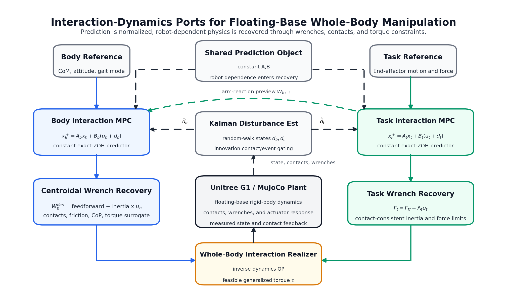
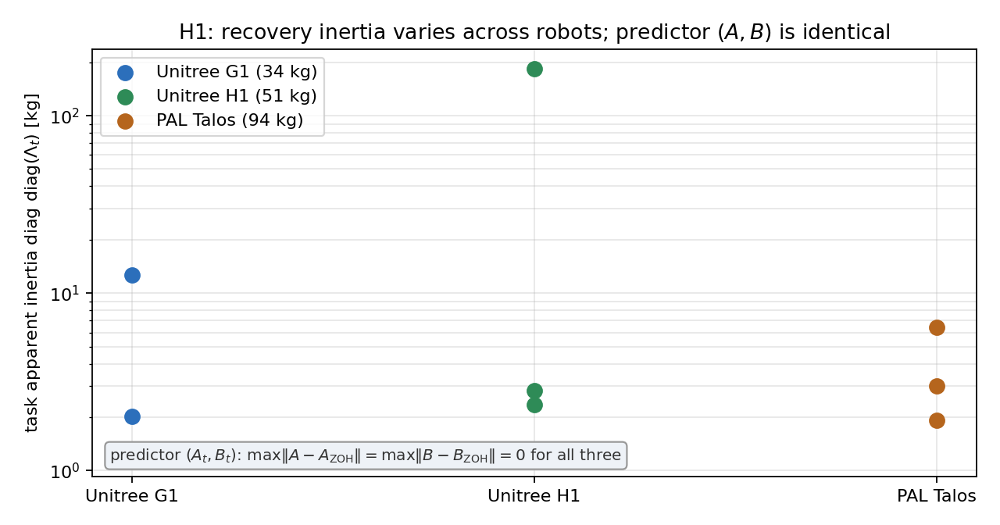
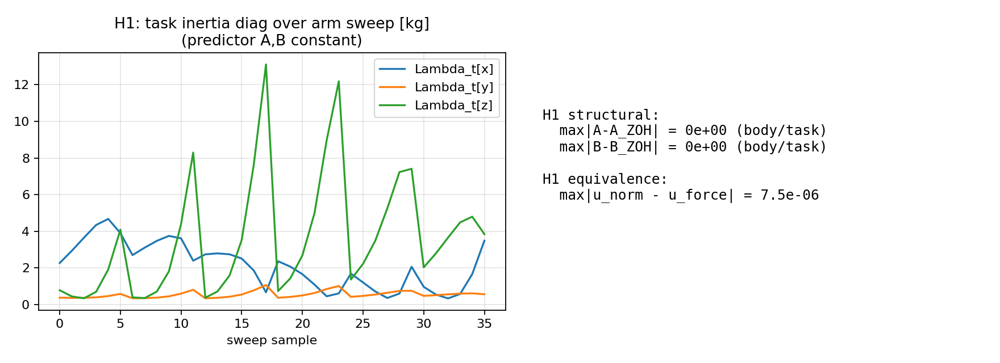
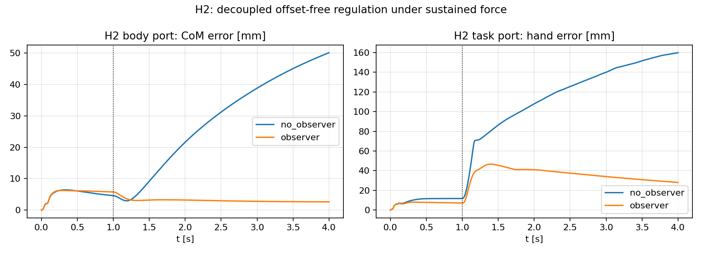
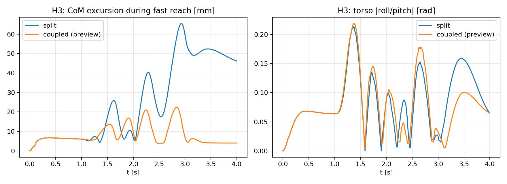
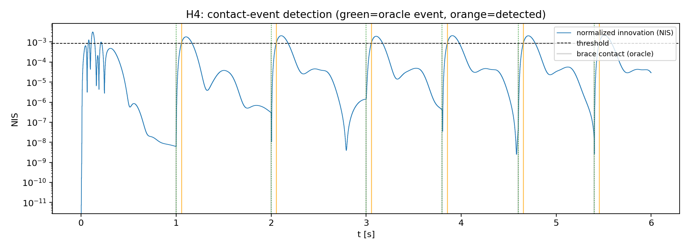
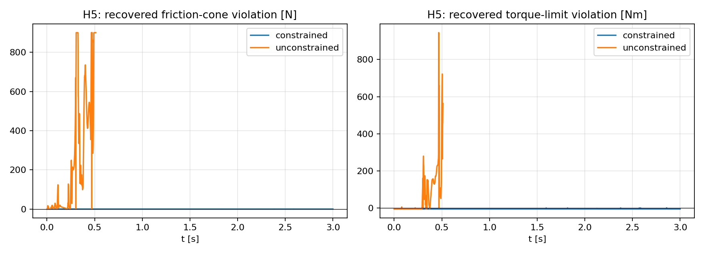
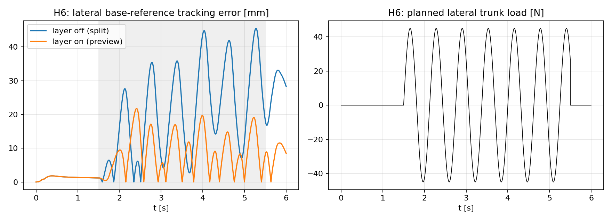
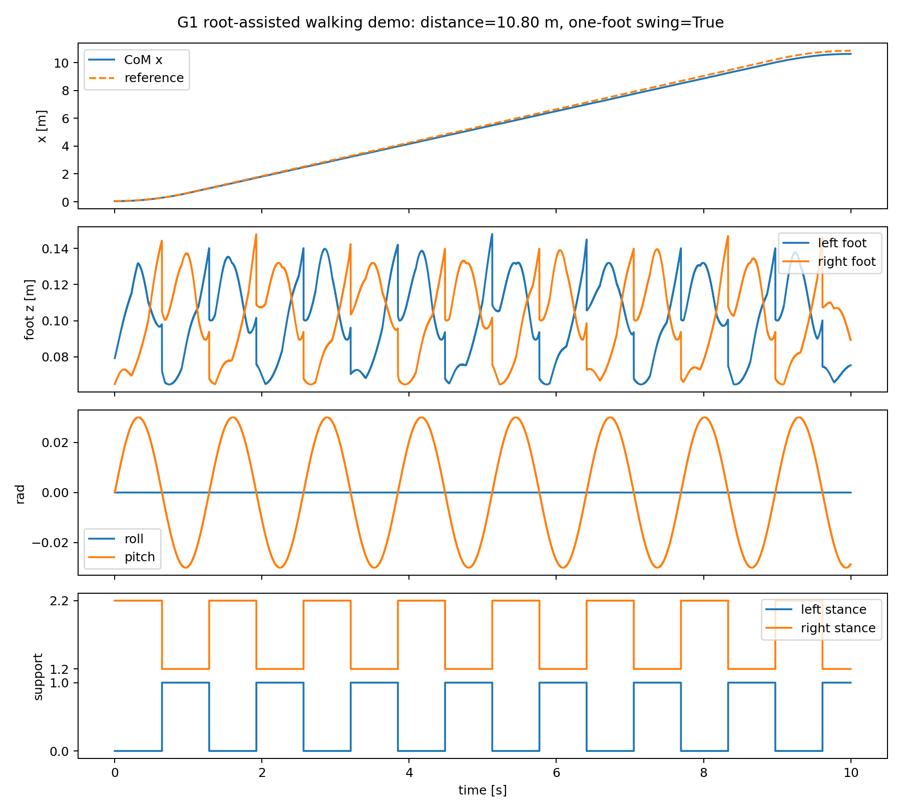
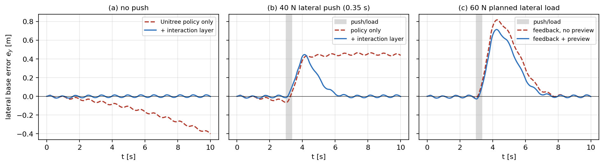

# Interaction Dynamics for Floating-Base Whole-Body Manipulation

**Yongyan Cao**

---

## Abstract

Floating-base loco-manipulation is usually controlled through separate models for centroidal balance, whole-body inverse dynamics, and end-effector interaction. This paper takes a prediction–realization view: body- and task-level interaction *requests* are predicted in canonical residual-acceleration coordinates $\ddot e = u + d$ ($u$ a residual acceleration, $d$ an estimated interaction disturbance), while the full contact-constrained dynamics only *realize* those requests at the current sample through a whole-body QP, keeping the requested-versus-realized mismatch as an explicit *realization residual*. The body port adds a first-order centroidal angular-momentum channel, so no attitude approximation is needed, and a disturbance-augmented predictor gives conditional offset-free regulation when the cancelling request is feasible. On a torque-actuated Unitree G1, robot dependence lives only in recovery: the predictor is *bit-identical* across three humanoids of very different scale (G1, H1, Talos) whose task apparent inertia spans $155\times$, while the closed loop is offset-free at the representation level and substantially reduces the steady-state offset on the full realizer under sustained loads, anticipates planned external loads ($1.7\times$ smaller transient), detects external-wrench events without reading their schedule, confines physical constraints to recovery, and adds interaction rejection on a moving base ($2.4\times$). The contribution is not a locomotion controller but a representation-and-realization interface for adding predictable, constraint-aware physical interaction on top of an existing whole-body locomotion stack.

**Index Terms** - interaction dynamics, centroidal MPC, whole-body control, floating-base robots, loco-manipulation, physical human-robot interaction, model predictive control.

---

## I. Introduction

Humanoid robots regulate two physical interfaces at once: the feet exchange forces with the environment for balance, the hands with people, tools, and objects for a task. Existing stacks assign these to different objects — a centroidal MPC plans contact forces, a whole-body QP maps them to joint commands, an impedance controller regulates the hand — which is practical but hides that both are the same interaction-dynamics problem.

The question here is not whether another whole-body architecture can be assembled, but whether floating-base manipulation admits the same normalized interaction-dynamics representation derived for fixed-base systems in [1]. If so, balance and manipulation are two ports of one predictive representation, with robot-specific mechanics appearing only when the normalized commands are recovered as physical wrenches. This also serves the emerging *physical-AI* stack: learned policies and world models generate whole-body *intent*, but intent is not execution — a robot-independent interaction predictor is a natural target for that intent, with the realizer turning it into safe, constraint-respecting execution (Sections II, XII).

At the body port the interaction is between centroidal motion and the net contact wrench; at the task port, between end-effector motion and task wrench. In both, known dynamics and desired acceleration go in feedforward, leaving a residual acceleration input:

$$
\text{physical wrench}
=\text{model feedforward}+\text{interaction inertia}\times u.
\tag{1}
$$

The resulting error model is the interaction-dynamics backbone of [1]. The floating-base case is nontrivial because contact geometry, support changes, friction, center-of-pressure limits, actuator saturation, and arm–body reactions all affect whether a normalized acceleration can be realized. The central claim is therefore a prediction–realization separation: only the interaction dynamics are predicted over a horizon, while the full robot dynamics act at the current sample as a feasibility projection — not a second prediction model. Both ports share the same exact-ZOH predictor — the task port a double integrator, the body port a double integrator on the CoM error plus a first-order integrator on the centroidal angular momentum — recovering their commands as a centroidal wrench and a contact-consistent task wrench; the architecture thus follows from the representation, not the reverse.

The contributions follow this separation: (i) we formulate floating-base balance and manipulation as two ports of the normalized model of [1]; (ii) we derive the centroidal and contact-consistent task recoveries and show that mass, centroidal/task inertia, and contact mode do not alter the prediction matrices; (iii) we localize contact geometry, friction, center-of-pressure, actuator limits, and whole-body dynamics to recovery; and (iv) we realize the representation as a split or coupled dual-MPC controller and evaluate it on a Unitree G1. The scope is deliberately bounded: the contribution is an interaction-dynamics *layer* on top of a mature balance/locomotion base — when the base is idle, the standing realizer of Section VI supplies the joint commands — not a locomotion controller. Full torque-level, long-horizon locomotion under the G1's wide stance is an orthogonal problem for specialized gait schedulers; we validate the interaction-dynamics *representation*, not a walking controller.

The separation is organized in three levels:

- **Level 1 — body interaction port** (predictor, future): predicts body–environment interaction with an interaction-dynamics MPC.
- **Level 2 — whole-body interaction realizer** (present): an instantaneous constrained inverse-dynamics QP with no horizon or future cost, mapping both requests into generalized torques at the current sample.
- **Level 3 — task interaction port** (predictor, future): predicts hand–task interaction with an interaction-dynamics MPC.

**Fig. 1.** Architecture: a shared exact-ZOH predictor feeds the body and task MPCs, whose residual-acceleration commands become the centroidal and task wrenches entering the whole-body realizer. Measured state, contacts, and wrenches feed the Kalman disturbance estimator; the green dashed path is the optional arm-reaction preview of the coupled realization.

---

## II. Related Work

Centroidal and single-rigid-body MPC [2], [3], [8], [13] predict CoM and body orientation while optimizing contact forces over a gait schedule, with horizon-wide treatment of friction, unilateral contact, and support geometry. The body port retains these constraints but changes the decision coordinates from raw contact forces to a normalized residual acceleration plus a contact-wrench recovery.

Whole-body inverse dynamics and hierarchical QPs [4], [5], [7], [9] enforce rigid contacts, task priorities, and actuator limits; they remain essential here as the instantaneous realizer that maps a desired body wrench and task acceleration to feasible generalized forces, not as another predictive model.

Operational-space impedance, admittance, and task-space MPC [6], [11], [12] regulate the end-effector port; their apparent inertia depends on configuration and support. Residual-acceleration coordinates remove this inertia from the prediction dynamics while retaining it in force recovery.

Learning-based pipelines increasingly *generate* whole-body references: reinforcement-learning policies and human-demonstration retargeting engines produce rich, contact-consistent trajectories at a scale hand-authored planners cannot match. But a kinematic reference, however expressive, does not guarantee the motion is executable under real contact forces, actuator limits, and unexpected interaction; running it on hardware still needs a local, model-based layer that enforces constraints and supplies reactive compliance. The present framework is exactly that layer — it takes a reference, hand-authored or learned, and provides the constraint-aware interaction-dynamics realization that turns kinematic intent into safe torque-level execution, rather than competing with the generator.

Closest in spirit is unified whole-body MPC for locomotion and manipulation [10], which optimizes a single predictive whole-body model. We differ in the prediction–realization split: only the two normalized interaction dynamics are predicted, while the full contact-constrained dynamics act at the current sample as a feasibility projection, not a second predictive model. The normalized model, offset-free regulation, stability conditions, and impedance interpretation belong to [1]; the standard centroidal model [8], [17], whole-body inverse dynamics [9], and the integrating-disturbance observer [16] are prior tools. This paper contributes their floating-base integration, anticipatory coupling, constraint realization, and evaluation on a Unitree G1 in MuJoCo [15].

---

## III. Floating-Base Interaction Dynamics

Let

$$
q=[q_b^\top,q_j^\top]^\top,\qquad
M(q)\ddot q+h(q,\dot q)=S^\top\tau+J_c^\top\lambda+J_t^\top F_h,
\tag{2}
$$

where $q_b$ is the floating-base coordinate, $q_j$ contains actuated joints, $\lambda$ stacks contact wrenches, and $F_h$ is an external task wrench. Rigid active contacts satisfy

$$
J_c\ddot q+\dot J_c\dot q=0.
\tag{3}
$$

The controller uses two controlled ports. The body port is defined by CoM position and body-orientation errors — the orientation channel regulated in centroidal angular-momentum coordinates (Section IV), with a desired attitude entering only through an outer loop — and the task port is defined by Cartesian end-effector tracking error. The active contact mode $\rho$ changes the contact Jacobian and feasible wrench set. Following [1], it does not change the normalized prediction pair used below. This invariance is the organizing idea of the paper, which we state once and then use throughout.

**Definition 1 (interaction-dynamics representation, under exact feedforward normalization).** An *interaction-dynamics representation* of a controlled port is a normalized prediction model $\ddot e = u + d + r$ in which the state-transition pair $(A,B)$ is independent of the robot's mechanics — mass, centroidal and task inertia, contact geometry, friction, and actuator limits — while all of that robot- and configuration-specific dependence is carried by an instantaneous *realization* (recovery) map that projects the residual-acceleration command $u$ onto the feasible whole-body dynamics; $d$ is the estimated interaction disturbance and $r$ the *realization residual* left when the request is not exactly recovered.

The qualifier is essential, and we make its hypotheses explicit.

**Assumption 1 (exact feedforward normalization).** A controlled port has physical coordinate $x$ with tracking error $e = x - x_d$, and constrained dynamics $M_p(q,\rho)\ddot x + \mu_p(q,\dot q,\rho) = F_p^{\rm act} + F_p^{\rm ext}$, where the *interaction inertia* $M_p$ is invertible and well-conditioned on the operating set. The commanded actuation cancels the bias and injects the desired-trajectory plus residual acceleration, $F_p^{\rm act} = \mu_p + M_p(\ddot x_d + u) + \delta$, and the recovery map $u \mapsto F_p^{\rm act}$ is affine on each active-constraint cell.

**Theorem 1 (representation / prediction invariance).** Under Assumption 1, every such port admits the normalized model $\ddot e = u + d + r$, with residual-acceleration input $u$, interaction disturbance $d = M_p^{-1}F_p^{\rm ext}$, and realization residual $r = M_p^{-1}\delta$. The exact-ZOH predictor pair $(A,B)$ of the resulting integrator chain is independent of $M_p$, $\mu_p$, and the contact mode $\rho$; these enter *only* the recovery map and the feasible input set. Hence the body and task ports of Sections IV–V are two instances of one representation, not two models.

*Proof sketch.* Substituting the feedforward of Assumption 1 into the constrained dynamics cancels $\mu_p$, leaving $M_p\ddot x = M_p(\ddot x_d + u) + F_p^{\rm ext} + \delta$; subtracting $M_p\ddot x_d$ and left-multiplying by $M_p^{-1}$ gives $\ddot e = \ddot x - \ddot x_d = u + d + r$. The map from $u$ to $\ddot e$ is the identity, so the sampled predictor is the integrator ZOH pair, which contains no entry of $M_p$, $\mu_p$, or $\rho$. $\square$

**Remark (realization is not unique; the predictor is).** Under actuation redundancy the recovery map is generally non-unique: different feasible realizers — different QP weightings, task priorities, or contact-force allocations — produce different $F_p^{\rm act}$ and hence different residuals $r$, but by Theorem 1 they all share the *same* $(A,B)$. The representation is therefore a property of the port, not of the particular realizer or solver; the specific realizer of Section VI is one admissible choice.

Intuitively, the representation behaves like a stable software interface: the predictor is a fixed, robot-independent contract $\ddot e = u + d$ that upstream planning or learning can target without knowing the robot's mass, inertia, or contact state, while the realizer is the implementation behind it — absorbing the configuration-dependent mechanics and reporting back only the shortfall $r$. Different whole-body realizers honor the same predictor, just as different implementations honor one API (Fig. 2).

**Fig. 2.** The prediction–realization interface of Definition 1 and Theorem 1. A reference generator feeds the robot-independent predictor $\ddot e = u + d$; its residual-acceleration command $u$ passes to the whole-body-QP realizer, which carries all robot mechanics and returns the residual $r$, with a Kalman observer estimating $d$.

---

## IV. Body Interaction Port

### A. Centroidal Normalization

Let $c$ be the CoM, $m$ the robot mass, $f_i$ the force at active contact $i$, and $g$ the signed gravitational-acceleration vector (so $mg$ is the weight). With lumped disturbance $w_c$,

$$
m\ddot c=\sum_{i\in\mathcal C_\rho}f_i+mg+w_c.
\tag{4}
$$

For $e_c=c-c_d$, define the desired resultant

$$
F_c^{\rm des}=m(\ddot c_d-g)+m u_c.
\tag{5}
$$

When the recovered contact forces satisfy $\sum_i f_i=F_c^{\rm des}$,

$$
\ddot e_c=u_c+d_c,\qquad d_c=m^{-1}w_c.
\tag{6}
$$

The rotational channel is expressed directly in centroidal **angular-momentum** coordinates, which avoids identifying the locked-inertia angular velocity with a rigid-body attitude rate. Let $k_G=A_G(q)\dot q$ be the centroidal angular momentum, with $A_G$ the angular block of the centroidal momentum matrix, and let $M_c$ be the net contact moment about the CoM. Then

$$
\dot k_G=M_c+w_\theta,
\tag{7}
$$

where $w_\theta$ lumps unmodeled moments. For the angular-momentum error $e_h=k_G-k_{G,d}$, define the desired net moment

$$
M_c^{\rm des}=\dot k_{G,d}+u_\theta.
\tag{8}
$$

When the recovered contacts realize $M_c=M_c^{\rm des}$,

$$
\dot e_h=u_\theta+d_\theta,\qquad d_\theta=w_\theta,
\tag{9}
$$

a **first-order** integrator. Unlike an attitude parametrization, (9) is exact under exact moment recovery: no locked-inertia-to-attitude approximation is introduced. When a desired attitude is required, it is supplied through the reference $k_{G,d}$ by an outer regulator (for example $k_{G,d}=-K_\theta\,\log(RR_d^\top)^\vee$); the local validity of that attitude map is then a property of the outer loop, not of the port dynamics. The two body channels therefore differ in order — a second-order integrator on the CoM error and a first-order integrator on the angular-momentum error — rather than being forced into a common attitude double integrator.

Crucially, neither the requested translational relation (6) nor the requested rotational relation (9) is the true plant: the recovered resultant force and net moment are realized by the whole-body layer only up to a **realization residual** (Section VI), which is retained explicitly rather than folded silently into $d$. Writing that residual as $r_b=[r_c^\top,r_h^\top]^\top$, the physically realized body port obeys

$$
\ddot e_c=u_c+d_c+r_c,\qquad
\dot e_h=u_\theta+d_\theta+r_h,
\tag{6$'$}
$$

with $r_b=0$ exactly when the requested centroidal wrench and moment are feasibly recovered. Stacking the second-order CoM channel and the first-order angular-momentum channel,

$$
x_b=[e_c^\top,\dot e_c^\top,e_h^\top]^\top,\quad
u_b=[u_c^\top,u_\theta^\top]^\top,\quad
d_b=[d_c^\top,d_\theta^\top]^\top,
$$

and applying the exact-ZOH construction of [1] to the requested model at period $T_b$ — with the inputs $u_b$, $d_b$, and $r_b$ held constant over each sampling interval (the standard zero-order-hold hypothesis) — gives

$$
x_{b,k+1}=A_bx_{b,k}+B_b(u_{b,k}+d_{b,k}+r_{b,k}),
\tag{10}
$$

$$
A_b=
\begin{bmatrix}I_3&T_bI_3&0\\0&I_3&0\\0&0&I_3\end{bmatrix},
\qquad
B_b=
\begin{bmatrix}
\tfrac12T_b^2I_3&0\\
T_bI_3&0\\
0&T_bI_3
\end{bmatrix}.
\tag{11}
$$

The pair $(A_b,B_b)$ is constant; mass, centroidal inertia, contact locations, and contact mode appear only in wrench recovery and constraints.

**Proposition 1 (canonical body-port representation; Theorem 1 for the body port).** For a fixed active contact mode, the *requested* body-port dynamics are the canonical model (10) with the constant exact-ZOH pair (11): a double integrator on the CoM error and a first-order integrator on the centroidal angular-momentum error. The translational channel follows exactly from centroidal force balance (4)–(6); the rotational channel follows exactly from centroidal angular-momentum balance (7)–(9), with no attitude approximation. Mass, centroidal inertia, contact locations, friction, and center-of-pressure limits enter only the recovery map and the feasible input set, not $(A_b,B_b)$. The realized body port equals the requested model up to the realization residual $r_b$ of Section VI, and coincides with it when $r_b=0$.

**Proof.** Substituting the recovered resultant (5) into (4) gives (6); substituting the recovered moment (8) into (7) gives (9). Stacking yields a block-diagonal continuous-time generator (double integrator $\oplus$ first-order integrator) whose exact zero-order hold is (11) — the first-order block $\dot e_h=u_\theta+d_\theta$ discretizes exactly as $e_{h,k+1}=e_{h,k}+T_b(u_{\theta,k}+d_{\theta,k})$. The quantities $m$, $A_G$, $p_i$, $\rho$ convert $u_b$ into a centroidal wrench and contact forces through the recovery (12)–(15); the gap between requested and recovered wrench/moment is the residual $r_b$ defined in Section VI. $\square$

### B. Contact-Wrench Recovery and MPC

For stacked contact forces $f=[f_1^\top,\ldots,f_{n_c}^\top]^\top$, define

$$
\mathcal G_\rho(c,p_i)f=
\begin{bmatrix}
\sum_i f_i\\
\sum_i(p_i-c)\times f_i
\end{bmatrix}.
\tag{12}
$$

The desired centroidal wrench is

$$
W_b^{\rm des}(u_b)=
\begin{bmatrix}
m(\ddot c_d-g)+mu_c\\
\dot k_{G,d}+u_\theta
\end{bmatrix}.
\tag{13}
$$

Recovery enforces

$$
\mathcal G_\rho f=W_b^{\rm des}(u_b)+s_W,
\tag{14}
$$

where $s_W$ is a penalized wrench residual that is zero under exact recovery and may become nonzero under infeasibility or weighted task tradeoffs (hard recovery would require $s_W=0$ as a constraint or lexicographic priority). This residual maps to the body-port acceleration residual of (6$'$): its force part gives $r_c=m^{-1}s_W^{\rm (force)}$ and its moment part $r_h=s_W^{\rm (moment)}$. We keep $r_b$ explicit rather than folding it into $d_b$ — $d_b$ is the external/model disturbance the observer cancels, $r_b$ a physical-infeasibility residual no input can remove — so (6), (9), and (10) are exact when $r_b=0$ and hold with a logged acceleration residual otherwise. Under a scheduled contact sequence the recovery map $\mathcal G_{\rho_j}$ is re-formed per mode while $(A_b,B_b)$ stay unchanged.

Under the prediction–realization separation the body MPC predicts only the normalized dynamics: contact forces $f$, the friction/CoP/unilateral sets $\mathcal F_\rho$, and joint-torque limits are **not** carried in its horizon but imposed at the current sample by the realizer (Section VI). The recovery map (12)–(14) acts once, converting the first optimized residual acceleration $u_{b,0}$ into a centroidal wrench and contact forces; it does not appear inside the rollout.

What the horizon *does* respect is a conservative inner approximation of the residual accelerations the realizer can produce. In the full proposed construction, the realizer can provide at the current sample a polytope

$$
\widehat{\mathcal U}_{b,k}=\{\,u:\;H_{b,k}\,u\le h_{b,k}\,\},
\tag{14b}
$$

obtained by mapping the active friction, center-of-pressure, and torque limits into residual-acceleration coordinates — a box on $\|\Lambda_b u\|$ is the simplest conservative choice — and held fixed over the short horizon. The set (14b), and its task-port analogue (21), are *proposed conservative constructions*: the reported experiments use fixed predefined residual-acceleration limits rather than online-recomputed $H_{b,k},h_{b,k}$ polytopes, and the mapped-limit construction is not exercised in the benchmark. The body MPC is then the purely normalized problem

$$
\begin{aligned}
\min_{U_b}\quad&
\sum_{j=0}^{N_b-1}
\left(
\|x_{b,j}\|_{Q_b}^2+
\|u_{b,j}+\hat d_{b,k}\|_{R_b}^2
\right)
+\|x_{b,N_b}\|_{P_b}^2\\
\text{s.t.}\quad&
x_{b,j+1}=A_bx_{b,j}+B_b(u_{b,j}+\hat d_{b,k}),\\
&u_{b,j}\in\widehat{\mathcal U}_{b,k}.
\end{aligned}
\tag{15}
$$

No robot-specific dynamics enter the state transition or the cost. In the full construction the only footprint of the physics in the predictor is the frozen feasible set $\widehat{\mathcal U}_{b,k}$; the reported experiments instead use fixed predefined acceleration bounds, which are *not* a current-sample footprint of the robot physics. Contact-force, friction, CoP, and torque feasibility — and the residual $r_b$ — are produced instantaneously by the realizer (22). The task port (Section V) is organized identically, with its own feasible set $\widehat{\mathcal U}_{t,k}$.

The input-centered penalty is essential: for a constant estimated disturbance the cancelling equilibrium is $u_b=-\hat d_b$, so penalizing $\|u_b+\hat d_b\|$ rather than $\|u_b\|$ avoids reintroducing a steady-state offset.

---

## V. Task Interaction Port

The task port is not derived from a fixed-base arm model. In (2), $M(q)$ is the full floating-base mass matrix, including the unactuated base and all actuated joints, and $J_{c,\rho}$ is the active whole-body contact Jacobian. Using the contact-consistent inverse associated with mode $\rho$,

$$
\bar M_\rho^{-1}
=M^{-1}-M^{-1}J_{c,\rho}^\top
(J_{c,\rho}M^{-1}J_{c,\rho}^\top)^{-1}
J_{c,\rho}M^{-1},
\tag{16}
$$

the task inertia is

$$
\Lambda_t=(J_t\bar M_\rho^{-1}J_t^\top)^{-1}.
\tag{17}
$$

Thus $\Lambda_t$ already contains the floating-base, stance-contact, and arm–body inertial coupling of the full constrained system; it does not assume the arm is dynamically isolated from the base, only expresses the realized task acceleration in residual-acceleration coordinates after the current contacts are imposed. Predictable base reactions are handled by the coupled body-port preview (Section VII); unmodeled coupling and recovery error go into $d_t$ and the realization residuals of (22).

Projecting the constrained rigid-body dynamics into the task coordinates gives the contact-consistent task-space dynamics

$$
\Lambda_t\,\ddot x_t+\mu_{t,\rho}=F_t^{\rm act}+F_h+r_{t,\rm dyn},
\tag{17b}
$$

where $\mu_{t,\rho}=\bar J_t^\top h-\Lambda_t\dot J_t\dot q$ collects Coriolis, centrifugal, and gravity terms, $F_t^{\rm act}$ is the task-space wrench *actually* produced by the joint torques, $F_h$ is the external task wrench, and $r_{t,\rm dyn}$ lumps contact-consistency and higher-priority null-space couplings. For $e_t=x_t-x_{t,d}$, the controller **requests** the wrench

$$
F_t^{\rm cmd}=F_{t,\rm ff}+\Lambda_tu_t,\qquad
F_{t,\rm ff}=\Lambda_t\ddot x_{t,d}+\mu_{t,\rho},
\tag{18}
$$

equivalently the acceleration request $\ddot x_t^{\rm req}=\ddot x_{t,d}+u_t$. Let $\ddot x_t^{\rm real}$ be the acceleration the whole-body realizer actually imposes, and define the **realization residual**

$$
r_t=\ddot x_t^{\rm real}-\ddot x_t^{\rm req}.
\tag{18b}
$$

Substituting (18) into (17b): when the requested wrench is realized exactly ($F_t^{\rm act}=F_t^{\rm cmd}$, $r_t=0$) the nominal acceleration cancels and $\ddot e_t=u_t+\Lambda_t^{-1}F_h+d_{\rm model}$. In general the realized task port is

$$
\ddot e_t=u_t+d_{h,t}+r_t,\qquad
d_{h,t}=\Lambda_t^{-1}F_h+d_{\rm model},
\tag{19}
$$

with $d_{h,t}$ the observer-cancelled external/model disturbance and $r_t$ the physical-infeasibility residual (kept distinct, as for the body port). The requested model $\ddot e_t^{\rm req}=u_t+d_{h,t}$ discretizes by exact ZOH as

$$
x_{t,k+1}=A_tx_{t,k}+B_t(u_{t,k}+d_{h,t,k}+r_{t,k}),
\tag{20}
$$

with

$$
A_t=\begin{bmatrix}I_3&T_tI_3\\0&I_3\end{bmatrix},
\qquad
B_t=\begin{bmatrix}\tfrac12T_t^2I_3\\T_tI_3\end{bmatrix},
\tag{20b}
$$

the canonical three-dimensional exact-ZOH double-integrator pair.

**Proposition 2 (contact-consistent task port).** For a fixed active contact mode with $J_{c,\rho}M^{-1}J_{c,\rho}^\top$ and $J_t\bar M_\rho^{-1}J_t^\top$ nonsingular on the operating set, the *requested* end-effector port is the canonical model (20) with a constant exact-ZOH pair; configuration and contact mode enter through $\Lambda_t$, the feedforward $\mu_{t,\rho}$, and the feasible set, not through $(A_t,B_t)$. The realized port equals the requested model up to $r_t$, and coincides with it when $r_t=0$.

**Proof.** The constrained inverse (16), formed from the full floating-base mass matrix, restricts admissible accelerations to directions compatible with the active rigid contacts, giving the contact-consistent apparent inertia $\Lambda_t$ (17). Substituting the commanded wrench (18) into the constrained task dynamics (17b) cancels the nominal terms and leaves (19); the exact ZOH of the requested part is (20). The gap $r_t$ between requested and realized task acceleration is the realizer residual $s_t$ of (22). $\square$

Like the body port, the task MPC is normalized-only — it minimizes $\sum_j\!\big(\|x_{t,j}\|_{Q_t}^2+\|u_{t,j}+\hat d_{t,k}\|_{R_t}^2\big)+\|x_{t,N_t}\|_{P_t}^2$ subject to $x_{t,j+1}=A_tx_{t,j}+B_t(u_{t,j}+\hat d_{t,k})$ and $u_{t,j}\in\widehat{\mathcal U}_{t,k}$. The feasible set

$$
\widehat{\mathcal U}_{t,k}=\{\,u:\ \|F_{t,\rm ff,k}+\Lambda_{t,k}u\|_\infty\le F_{\max},\ \|\tau_{{\rm base},k}+S J_t^\top(F_{t,\rm ff,k}+\Lambda_{t,k}u)\|_\infty\le\tau_{\max}\,\}
\tag{21}
$$

is a conservative box on the recovered *total* task wrench and the affine-in-$u$ actuated-torque surrogate ($S J_t^\top$ is the actuated-joint block of the generalized task wrench, $\tau_{{\rm base},k}$ the frozen gravity/Coriolis-plus-balance bias), frozen over the short horizon; it bounds the total commanded wrench, not the corrective increment. As in the body port, the realizer (22) enforces friction, unilateral-force, and torque limits as hard constraints instantaneously, while rigid-contact acceleration consistency is hard only in the non-virtual-foot configuration and otherwise a weighted objective; only the predictor $(A_t,B_t)$ is reused across samples — $\Lambda_t$ and $\mu_{t,\rho}$ are recomputed each sample (and $\widehat{\mathcal U}_{t,k}$ would be, in the full construction of (21), which the reported experiments approximate with fixed acceleration limits). Fast configuration changes, near-singular task Jacobians, and box approximations create recovery mismatch, appearing as $d_{h,t}$ and $r_t$ rather than a certified robust-stability guarantee. In particular, near a task-Jacobian singularity a small task wrench can map to large joint torques ($\tau = J_t^\top F$); this blow-up is capped by the actuated-torque surrogate in (21) and by the hard torque limits of the realizer (22), which trade task tracking through the slack $s_t$ rather than exceeding actuator limits.

---

## VI. Whole-Body Interaction Realizer

The two MPCs output a body request (a centroidal wrench $W_b^{\rm des}$, realized by the contact forces) and a task request (the end-effector acceleration $\ddot x_{t,d}+u_t^\star$, realized by the joint torques). Under exact, unconstrained recovery this acceleration and the commanded wrench $F_t^{\rm cmd}$ correspond through $\Lambda_t$, but the correspondence breaks once torque saturation, friction/CoP limits, or a higher-priority balance task force the realizer to trade the request against constraints and report the shortfall as $s_t=r_t$; imposing the task as an acceleration and exposing $s_t$ is the honest form, while the body request stays a wrench because that is what the unilateral, friction, and CoP constraints act on. This layer predicts no future states — it is not an MPC but an instantaneous projection of both requests onto the generalized accelerations, contact wrenches, and joint torques satisfying the floating-base dynamics and constraints.

Let $S_j$ select the actuated joint coordinates from $q$, and let $\tau_{\rm ref}$ be a nominal torque used only for regularization, such as the previous command or a gravity-compensating inverse-dynamics torque. With polyhedral friction pyramids, the whole-body interaction realizer is the convex instantaneous inverse-dynamics QP

$$
\begin{aligned}
\min_{\ddot q,\tau,\lambda,s_W,s_t}\quad&
\|s_W\|_{W_b}^2
+\|s_t\|_{W_t}^2
+\|\tau-\tau_{\rm ref}\|_{W_\tau}^2\\
\text{s.t.}\quad&
M\ddot q+h=S^\top\tau+J_c^\top\lambda+J_t^\top F_h,\\
&J_c\ddot q+\dot J_c\dot q=0,\\
&\mathcal G_\rho\lambda=W_b^{\rm des}+s_W,\\
&J_t\ddot q+\dot J_t\dot q=\ddot x_{t,d}+u_t^\star+s_t,\\
&\lambda\in\mathcal F_\rho,\quad
\tau_{\min}\le\tau\le\tau_{\max},\\
&q_{j,\min}+\epsilon\le
S_j(q+\Delta t\dot q+\tfrac12\Delta t^2\ddot q)
\le q_{j,\max}-\epsilon.
\end{aligned}
\tag{22}
$$

The external wrench $F_h$ in the dynamics row is a known constant, not a decision variable, and is used in one of two *mutually exclusive* modes so the same wrench is never compensated twice: (i) *measured-wrench feedforward* — the sensed $F_h$ is inserted into the dynamics equality and its contribution is removed from the task disturbance state, so the observer estimates only the residual; or (ii) *observer-only rejection* — $F_h$ is set to zero in the dynamics equality and the residual-acceleration input $u_t$ cancels the estimated disturbance $\hat d_t$. Inserting $\Lambda_t\hat d_t$ as a known physical wrench *and* cancelling it through $u_t$ would double-count and is not done. The decision variables are $\ddot q$, $\tau$, the contact wrench $\lambda$, and two realization slacks: $s_W=\mathcal G_\rho\lambda-W_b^{\rm des}$, a six-dimensional *wrench* residual (N and N·m — the body-port slack of (14)), and $s_t=(J_t\ddot q+\dot J_t\dot q)-(\ddot x_{t,d}+u_t^\star)$, a task-*acceleration* residual. Both are *realized minus requested*. Because $s_W$ is a wrench while the body residual $r_b$ of (6$'$) is an acceleration, they are related by $r_b=\mathcal D_b\,s_W$ with $\mathcal D_b=\operatorname{diag}(m^{-1}I_3,I_3)$ (force part $r_c=m^{-1}s_W^{\rm (force)}$, moment part $r_h=s_W^{\rm (moment)}$, matching (14)); the task residual matches directly, $s_t=r_t$. The first two equalities enforce rigid-body dynamics and contact consistency; the joint-limit row's $\frac12\Delta t^2\ddot q$ term is what makes the one-step check depend on the decision variable rather than only the current state.

With a friction-pyramid approximation $\mathcal F_\rho$ is polyhedral and (22) is a convex QP solvable by operator splitting [14]; exact Coulomb cones make it a second-order cone program. Balance can be made hard ($s_W=0$) or soft (large $W_b$), and task tracking is softened through $s_t$ when the two requests conflict. The realizer reports $s_W$, $s_t$, and active-constraint margins to the estimators and upper layers as evidence that a requested acceleration was physically unrealizable — not as prediction errors from a second MPC.

The *evaluated* realizer is a practical weighted-objective variant of (22), not its exact form. Eliminating the explicit slacks in favor of penalizing their residuals is exact; the remaining differences are implementation choices: the body request is a three-dimensional CoM-acceleration objective (not the six-dimensional centroidal-wrench objective), torso orientation is a separate angular-acceleration penalty (not the angular-momentum request $u_\theta$), the task request is a soft acceleration objective, and rigid-contact consistency is hard only in the non-virtual-foot configuration. The benchmark logs the acceleration residuals $r_c=J_{\rm com}\ddot q-(\ddot c_d+u_c)$ and $r_t$, the inverse-dynamics equality residual, and the friction/torque margins, but not the QP slacks $s_W,s_t$. The reported results are therefore those of this practical variant, not of the exact QP (22).

---

## VII. External-Wrench and Internal-Momentum Preview

The split controller solves the body MPC (15) and the task MPC independently; whatever the arm does reaches the body port only after it is observed, and is rejected reactively through $d_b$. The coupled controller instead previews the *planned* effect of the arm on the centroidal dynamics. Two physically distinct effects must be kept separate, because conflating them double-counts forces.

**External task wrench.** When the hand exchanges a real contact force with the environment — pushing, carrying, leaning on a rail — the environment reaction $F_h^{\rm plan}$ (and moment $M_h^{\rm plan}$) enters the *whole-robot* centroidal-momentum balance as a genuine external wrench, with known centroidal contribution

$$
W_{G,h}^{\rm ext}=
\begin{bmatrix}
F_h^{\rm plan}\\
(x_h-c)\times F_h^{\rm plan}+M_h^{\rm plan}
\end{bmatrix}.
\tag{23}
$$

The body port previews it by adding $-W_{G,h}^{\rm ext}$ to the desired centroidal wrench (13) over the horizon, so the contacts are pre-loaded before $d_b$ has to build up.

**Internal arm motion.** A fast *free-space* reach exerts no external force on the robot. The operational-space control wrench $F_t^{\rm ctrl}=F_{t,\rm ff}+\Lambda_t u_t$ acts through joint torques and is *internal*; it must **not** be inserted into the centroidal balance as an external $-F_t^{\rm ctrl}$, because internal actuation cannot change the total centroidal momentum and doing so double-counts. The genuine base reaction is the rate of change of centroidal momentum carried by the arm. Partitioning the centroidal momentum matrix into base, leg, and arm columns in $h_G=A_G(q)\dot q$, the planned arm motion contributes

$$
\dot h_{G,\rm arm}^{\rm plan}
=A_{G,\rm arm}(q)\,\ddot q_{\rm arm}^{\rm plan}
+\dot A_{G,\rm arm}(q,\dot q)\,\dot q_{\rm arm}^{\rm plan},
\tag{23b}
$$

which the body port previews by $W_{b,\rm preview}=-\dot h_{G,\rm arm}^{\rm plan}$ from (23b). In both cases the preview is affine in the arm plan, so it changes only the lifted input map or linear constraint rows of the body MPC, not the state matrix $(A_b,B_b)$; the intent is identical — compensate a predictable centroidal disturbance before observer feedback is required — but the source (external contact force vs. internal momentum redistribution) is made explicit. The two sources are not equally binding on the realizer, however: the internal-momentum term (23b) is *already* handled by the whole-body QP, whose CoM objective drives the full $J_{\rm com}\ddot q$ across arm and legs, so a planned arm swing needs no explicit preview; the external wrench (23) is genuinely unmodeled — the QP does not see it, so without preview it reaches the body port only through the lagging observer. Section X (H3) shows that preview improves rejection of the tested planned external load, while explicit internal-momentum preview provides no benefit in the tested arm swing.

A single stacked QP is possible when both horizons share a grid; a simpler alternative retains two QPs and passes the planned arm wrench/momentum sequence to the body port. No equivalence between weighted and strict lexicographic priority is assumed; hard balance constraints, soft task objectives, and the logged acceleration residuals define the actual priority.

---

## VIII. Kalman Estimation and Contact Events

Following the integrating-disturbance principle for zero steady-state error under persistent disturbances [16], and its instantiation in [1], each normalized model is augmented by a constant disturbance state:

$$
\begin{bmatrix}x_{k+1}\\d_{k+1}\end{bmatrix}
=
\begin{bmatrix}A&B\\0&I\end{bmatrix}
\begin{bmatrix}x_k\\d_k\end{bmatrix}
+
\begin{bmatrix}B\\0\end{bmatrix}u_k
+
\begin{bmatrix}0\\I\end{bmatrix}w_k.
\tag{24}
$$

Here $w_k$ drives the disturbance random walk; process noise acting directly on $x_k$ would be modeled by a separate state-noise term. The body observer estimates a six-dimensional residual wrench acceleration; the task observer estimates a three-dimensional residual acceleration. Offset-free regulation requires detectability, estimator convergence for a constant disturbance, and feasibility of the cancelling input.

The feedforward and recovery terms require generalized velocity. On hardware, $\dot q$ should not be obtained by raw encoder differencing inside the high-rate loop. The intended implementation uses filtered velocity estimates, for example a low-order Butterworth low-pass or an observer-based differentiator feeding the rigid-body model; the high observer/QP rate keeps the resulting phase lag non-critical for closed-loop stability, and the residual lag and noise are absorbed by the disturbance state and the realization residuals. This filtering is an implementation requirement, not a theoretical replacement for torque-level validation.

A contact event creates an innovation because the assumed recovery set no longer matches the plant. This motivates a detector based on normalized innovation statistics:

$$
\eta_k=\nu_k^\top S_k^{-1}\nu_k.
\tag{25}
$$

A mode change is declared only after $\eta_k$ exceeds a calibrated threshold for $n_d$ consecutive samples and a candidate contact is geometrically plausible. This is safer than claiming that the aggregate disturbance alone uniquely identifies a particular foot: without additional kinematic information, different external wrenches can be indistinguishable at the centroidal port.

---

## IX. Relation to the Fixed-Base Theory

The normalized predictor, nominal offset-free regulation, and impedance interpretation are taken directly from [1] and are not re-proved here. It is essential, however, that [1] characterizes the *requested* interaction dynamics $\ddot e=u+d$; the physically realized closed loop additionally carries the realization residual $r$ and the active-set evolution of the whole-body realizer. Stability and offset-free behavior of the realized, constrained interconnection therefore do not follow from the fixed-base results by themselves. We state three conditional results that make the dependence explicit.

**Proposition 3 (faithful realization).** If the realization residual vanishes, $r_i\equiv0$ — the requested port wrench, moment, and acceleration are exactly recovered within the feasible set — then the realized port dynamics coincide with the canonical requested model of Propositions 1–2, and every requested-model property inherited from [1] holds for the realized port.

**Proposition 4 (conditional offset-free regulation).** Fix a contact mode and suppose the realizer admits a locally constant active set and realizes the requested port acceleration with a *constant matched* residual $r^\star$, so the effective disturbance $d^{\rm eff}=d+r^\star$ is constant. If the augmented observer is detectable, its estimate $\hat d^{\rm eff}$ converges, and the cancelling input $u=-\hat d^{\rm eff}$ lies in the feasible set $\widehat{\mathcal U}_k$, then the regulated port reaches zero steady-state error. When the active set switches, or the residual is state-dependent, only *bounded* regulation is claimed: the observer tracks $d^{\rm eff}$ but cannot null a residual that no feasible input can cancel. This is exactly the mechanism behind the H2 result — offset-free regulation appears only once the recovery is faithful ($r^\star$ small and matched), and degrades when it is not.

**Assumption 2 (nominal ISS).** The nominal requested-model closed loop of [1] — the predictor $\ddot e = u + d$ under the offset-free feedback of Section VIII — is input-to-state stable with respect to its disturbance input.

**Proposition 5 (ultimate boundedness under a bounded residual).** Suppose the whole-body realizer keeps the realization residual uniformly bounded on the operating set, $\sup_i \sup_k \lVert r_{i,k}\rVert \le \varepsilon$, and that Assumption 2 holds. Then, treating $r$ as an exogenous input in $\ddot e = u + d + r$, the realized augmented error state is ultimately bounded, with ultimate bound $\mathcal{O}(\varepsilon)$ (a class-$\mathcal{KL}$ transient plus a class-$\mathcal{K}$ gain on $\varepsilon$); as $\varepsilon\to 0$ Proposition 3 is recovered. This is how the prediction–realization split insulates the predictor: the configuration- and contact-dependent mechanics enter only through $r$, so as long as the realizer is *feasible with margin* — no persistent torque saturation, friction-cone or CoP violation, or ill-conditioned $\Lambda_t$/$A_G$ — the residual and the error state stay bounded. The observer innovations and active-constraint margins of Section X monitor $\varepsilon$ online; a certificate that the realizer *guarantees* a given $\varepsilon$ over a prescribed envelope, rather than observing it a posteriori, is the robust-feasibility question left open below.

**Imperfect feedforward on a floating base.** The exact-cancellation premise of Assumption 1 is never met exactly on the robot: arm–base reaction, configuration-dependent bias, and velocity-estimate error all leave a feedforward mismatch. This mismatch splits along the same $d$/$r$ line — its matched, slowly varying part enters the model disturbance $d_{\rm model}$ of (19) and is cancelled by the augmented observer of Section VIII, while the unmatched, feasibility-limited part is absorbed into the bounded residual $r$ and governed by Proposition 5. We therefore claim no perfect nonlinear cancellation; robustness to imperfect feedforward is exactly the ISS/ultimate-boundedness statement above, closed by observer feedback.

**Standing assumptions.** Beyond Assumptions 1–2, several conditions specific to this floating-base realization must be checked independently: $A_G$ and $\Lambda_t$ finite and well-conditioned on the operating set (the invertibility of Assumption 1); the cancelling residual accelerations and moments realizable by contact wrenches and joint torques within the physical constraints; and estimator convergence only for contact modes correctly modeled or detected, with any recovery residual treated as part of the disturbance model. The body rotational channel is regulated in angular-momentum coordinates, so no attitude chart enters the port dynamics — a local chart is used only when an outer loop converts a desired attitude into $k_{G,d}$. Thus citing [1] does not by itself prove recursive feasibility of the contact-constrained G1 controller.

Two further gaps remain open. First, constant $(A,B)$ removes model switching from the normalized state dynamics, but the feasible input set still switches with contact mode, so stability under arbitrary switching does not follow automatically — a certified claim would need recursive feasibility for the scheduled mode sequence (terminal set and cost) or a common Lyapunov certificate for the constrained regions. Second, the body and task ports are not independent in closed loop: the realizer (22) is a single active-set-dependent, piecewise-affine projection of *both* requests, so the residuals $s_W,s_t$ couple them when requests conflict or a constraint activates, and certifying the coupled constrained interconnection remains open. Accordingly the experiments report bounded empirical switching performance and the logged acceleration residuals and active-constraint margins directly, rather than asserting inherited or certified stability.

---

## X. Unitree G1 Evaluation

The evaluation uses a Menagerie-derived Unitree G1 model as the common plant, organized around hypotheses rather than software layers, since the paper's claim is representation-level: both ports should share the same predictor while the floating-base mechanics appear in recovery. H1–H5 all hold on the standing torque-actuated G1 (H2 offset-free regulation holds at the representation level; on the full realizer it reduces the steady-state offset substantially rather than to zero, especially at the hand), and H6 demonstrates the interaction layer on a moving base that commands its own weight-shift; only the sustained-walking benchmark depends on the dynamic-gait realizer and remains future work. The six hypotheses form four groups: **representation** (H1 — the predictor is invariant); **regulation and anticipation** (H2–H3 — offset-free regulation and preview of what the realizer does not model); **detection and constraint realization** (H4–H5 — events seen and constraints honored, both in recovery); and **moving base** (H6 — interaction added on a base doing its own motion).

The controller set is C0 joint-PD/operational-space PD, C1 conventional force-input centroidal MPC, C2 dual interaction MPC without observers, C3 split dual interaction MPC with body/task observers, C4 coupled dual interaction MPC with arm-reaction preview, and C5 the oracle-contact upper bound. Randomized studies use fixed seeds and paired disturbances; failed and fallen trials remain in the success denominator. A claim of dynamic walking interaction is reserved for the torque-actuated inverse-dynamics benchmark with randomized pushes and Kalman/event detection active.

### Results for H1 (Port-Independent Prediction)

H1 illustrates Theorem 1 and is the centerpiece of the evaluation: the identical predictor pair $(A,B)$ holds *by construction*, so what H1 measures is the recovery-side variation the theorem localizes there — the predictor is invariant while everything robot-specific lives in recovery. Five measurements make this precise:

1. **Shared double-integrator predictor.** The planar CoM double integrator of the body port (CoM block of Proposition 1) and the hand double integrator of the task port are the *same* constant exact-ZOH pair: against the closed form (11), $\max\|A-A_\text{ZOH}\|=\max\|B-B_\text{ZOH}\|=0$ for both; only the dimension differs.
2. **Angular-momentum channel.** The normalized first-order integrator $\dot e_h=u_\theta+d_\theta$ has discrete pair $(A_\theta,B_\theta)=(I,TI)$, matching the exact-ZOH first-order integrator to machine precision and configuration-independent, while the centroidal rotational inertia $I_G(q)$ the moment recovery inverts varies over the arm sweep (eigenvalues $[2.4,6.9,8.5]\to[2.7,7.1,8.7]$ kg·m², $\approx$11%) — the momentum-channel analogue of the $\Lambda_t$ result.
3. **Normalized $\equiv$ force-input MPC.** The normalized centroidal MPC (decision = residual acceleration) and a conventional force-input centroidal MPC (decision = CoM force, matched weights $R_f=R/m^2$) are the same feedback map: over 2000 random states and disturbances the maximum command difference is $7.5\times10^{-6}$. The normalized form loses nothing; it only relocates where the robot mechanics live.
4. **Configuration confined to recovery.** Over a 36-point right-arm sweep the contact-consistent task inertia $\Lambda_t$ (17) varies from $0.33$ to $13.1$ kg on its diagonal (up to $3840\%$) while the predictor $(A_t,B_t)$ stays exactly constant (Fig. 4a, left).
5. **Same port across three robots.** The *same* task port on Unitree G1 ($34$ kg), Unitree H1 ($51$ kg), and PAL Talos ($94$ kg) — feet as stance contacts, right-arm distal link as end-effector — has a *bit-identical* exact-ZOH predictor $(A_t,B_t)$ ($\max\|A-A_\text{ZOH}\|=\max\|B-B_\text{ZOH}\|=0$ for all), since it depends only on the sample time; yet the recovery inertias span large factors — mass $2.8\times$ and task apparent inertia $\Lambda_t$ from $1.2$ to $184$ kg, a **$155\times$** spread (Fig. 3).

The predictor is therefore a property of the representation, not the robot: all configuration, contact, and platform dependence lives in recovery, which is the H1 claim.

**Fig. 3.** H1 across three humanoids (Unitree G1, Unitree H1, PAL Talos). Each marker is a diagonal entry of the contact-consistent task inertia $\Lambda_t$ at that robot's hand (log scale); the identical exact-ZOH predictor $(A_t,B_t)$ is boxed.

### Results for H2 (Disturbance-Observer Offset Reduction)

H2 is tested in two settings:

1. **Representation level.** Recovery is faithful so $\ddot e=u+d$ holds exactly by construction (G1 mass for the body port, contact-consistent $\Lambda_t$ for the task port); under a sustained disturbance the observer estimate converges to the true disturbance and removes the offset. (The *no-observer* number here is the steady state of the open normalized model, not a physical excursion: the small lateral task inertia $\Lambda_t\!\approx\!0.4$ kg turns an uncancelled 8 N residual into a large normalized offset, so the meaningful quantity in that row is the offset *ratio*; the physically scaled numbers are the full-realizer rows.)
2. **Full torque-actuated G1 realizer (22).** The body-port residual acceleration is realized by driving the whole-body CoM linear acceleration to $\ddot c_d+u_c$ (equivalently, allocating the centroidal wrench $m(\ddot c_d-g)+m u_c$ across the contacts through the inverse-dynamics QP), and the task-port residual acceleration as the end-effector acceleration $\ddot x_{t,d}+u_t$. The practical realizer more closely approximates the requested acceleration dynamics, making the observer substantially more consistent with the realized plant and reducing the measured steady-state offset for both ports, with a remaining nonzero hand error:

| Port | Setting | Sustained disturbance | No observer | With observer | Reduction |
|---|---|---|---:|---:|---:|
| Body (CoM) | representation | 12 N pelvis force | 125.0 mm | 1.4 mm | 90$\times$ |
| Task (hand) | representation | 8 N hand force | 18748 mm | 89 mm | 211$\times$ |
| Body (CoM) | full G1 realizer | 12 N pelvis force | 44.9 mm | 2.7 mm | 17$\times$ |
| Task (hand) | full G1 realizer | 8 N hand force | 151.3 mm | 30.9 mm | 4.9$\times$ |

**Table I.** H2, representation level and full torque-actuated G1 realizer. The observer substantially reduces the measured steady-state offset in both settings and neither port falls.

An earlier realizer that mapped the body residual acceleration to an approximate posture *tilt* rather than to a centroidal wrench did **not** achieve this: the observer then degraded the CoM error (48 mm without observer, 137 mm with it) and the task port fell, because the observer model was inconsistent with the realized plant. Replacing the posture-tilt heuristic with the CoM-acceleration recovery makes the realized acceleration more consistent with the normalized request. This comparison shows that such consistency is necessary for the observer to reduce offset; it does not establish exact transfer of the ideal offset-free property to the practical realizer. The remaining production step is dynamic-gait recovery (Section X), where the contact set switches during walking.

**Fig. 4.** (a) H1: the task apparent inertia $\mathrm{diag}(\Lambda_t)$ over the arm sweep (left) with the constant $(A,B)$ and the command-equivalence residual annotated (right). (b) H2 on the full torque-actuated G1 realizer: CoM error (left) and hand error (right) under a sustained force with the observer disabled vs enabled — the observer substantially reduces the measured steady-state offset and neither port falls.

The three fixed-support hypotheses H3–H5 follow directly. All are realized by the torque-actuated whole-body realizer (the weighted-least-squares form of (22)). Its fixed-support push-rejection behavior, together with *locomotion-compatibility* probes that lie outside the interaction-dynamics claim of this paper — a root-assisted walking visualization and a Unitree open-source locomotion-stack demo — is collected in Appendix A.

### Results for H3 (Preview Compensates What the Realizer Does Not Model)

H3 tests the coupled realization of Section VII in *both* forms. On the standing torque-actuated G1 we apply two planned cross-port reactions of comparable magnitude ($\approx$45 N) during $1$–$3$ s, comparing split (reactive rejection through the body observer) against coupled (preview fed into the body-port command):

- **External wrench (23).** A fast oscillating interaction load $F_h^{\rm plan}$ (45 N at 1.6 Hz) acts on the body; the coupled controller previews $-F_h^{\rm plan}/m$.
- **Internal momentum (23b).** A fast right-arm swing (shoulder pitch/roll and elbow at 1.2 Hz, *no* external force) redistributes centroidal momentum; the coupled controller previews the induced CoM reaction $-\dot l_{G,\rm arm}/m = -J_{\rm com}[:,{\rm arm}]\,\ddot q_{\rm arm}$.

| Reaction (planned, $\approx$45 N) | Split peak / RMS | Coupled peak / RMS | Peak reduction |
|---|---:|---:|---:|
| External wrench (23), unmodeled by QP | 37.7 / 20.9 mm | 22.1 / 11.9 mm | $1.7\times$ |
| Internal arm momentum (23b) | 9.2 / 7.1 mm | 15.2 / 9.5 mm | $0.6\times$ |

**Table II.** H3: peak and RMS lateral CoM excursion during a planned cross-port reaction, split vs. coupled prediction (Fig. 5a).

### Results for H4 (External-Wrench Events Detected Without Reading Their Schedule)

H4 tests the innovation-only part of the detector of Section VIII. A sequence of lateral brace-contact onsets and offsets (six events) is applied to the standing G1 as a scheduled external wrench on the pelvis; each creates an unmodeled wrench, so the body CoM disturbance observer's normalized innovation $\eta_k=\nu_k^\top S_k^{-1}\nu_k$ spikes. A change detector declares an event when $\eta_k$ exceeds a calibrated threshold (mean $+6\sigma$ of a quiet window) for three consecutive samples, with a refractory interval; the detector never reads the event schedule, which serves only as the oracle for scoring. What is demonstrated is detection of the six scripted external-wrench onset/offset events from the innovation alone — *not* physical contact sensing, contact localization, foot identification, or contact-mode recovery. The geometric-plausibility gate of Section VIII, which would be needed to attribute an innovation to a specific contact, is part of the described mode-change logic but is not exercised by this innovation-only test.

| Metric | Value |
|---|---:|
| True contact events | 6 |
| Detected | 6 |
| Missed | 0 |
| False positives | 0 |
| Mean / max detection latency | 56 / 58 ms |

**Table III.** H4: contact-event detection from the body observer innovation, scored against the scripted-event oracle. All six onsets/offsets are detected with no misses or false positives at $\sim$56 ms latency (Fig. 5b). The latency is the time for the CoM disturbance to register in the innovation; a task-port observer or direct force sensing would reduce it further.

**Fig. 5.** (a) H3: lateral CoM excursion, split vs. coupled preview, for an external interaction load (left) and an equal-magnitude internal arm swing (right). Preview lowers the external-load excursion; the internal-momentum excursion is already small (native QP compensation) and preview does not reduce it. (b) H4: the normalized innovation (NIS) over the trial with the calibrated threshold; green dotted lines are oracle contact events, orange lines are detections.

### Results for H5 (Constraints Belong to Recovery)

H5 tests that friction cones, unilateral contact, and joint-torque limits are enforced in the recovery realizer (22), not in the normalized predictor. Under a single illustrative 45 N lateral push (Fig. 6) we compare two recoveries, measuring violations of the *recovered* (QP-commanded) contact forces and joint torques:

- **Constrained** (friction pyramid and torque limits active, $\mu=0.5$): holds the recovered force inside the friction pyramid and torque inside the actuator limits (violations at solver tolerance, $0.3$ N and $0.06$ N·m) and rejects the push with a $6.8$ mm CoM error — the tracking *slack* a hard constraint trades for feasibility.
- **Unconstrained** (both dropped): commands $\sim$900 N of tangential force outside the friction cone and $\sim$945 N·m over the actuator limit — not physically realizable — and the robot collapses within half a second.

To show this is systematic rather than a single lucky push, we repeat the comparison over **50 randomized pushes** (magnitude $\mathcal U(30,50)$ N, randomized lateral-dominant direction and onset):

| Recovery | Stands | Max friction viol. | Max torque viol. | CoM error (mean±std) |
|---|:--:|---:|---:|---:|
| Constrained | 50/50 | 0.31 N | 0.32 N·m | 6.1 ± 1.3 mm |
| Unconstrained | 0/50 | $\sim$900 N | $\sim$945 N·m | — (falls) |

**Table IV.** H5 over 50 randomized pushes: constrained recovery stands 50/50 at solver-tolerance violations; unconstrained recovery commands unrealizable forces/torques and falls 50/50. The predictor $(A,B)$ is identical in both runs.

**Fig. 6.** H5: friction-pyramid violation (left) and torque-limit violation (right) of the recovered forces/torques over the push, constrained vs. unconstrained recovery. Constrained recovery stays at zero (feasible); unconstrained recovery diverges to hundreds of newtons / newton-metres of violation.

### Results for H6 (Interaction Layer on a Moving Base)

H1–H5 hold the base fixed. H6 is the direct test of the paper's positioning: the contribution is an interaction-dynamics *layer* that rides on a base doing its own motion and adds predictable physical interaction, without a locomotion controller of its own. The setup:

- **Base motion.** The base commands its own CoM trajectory — a $\pm$50 mm forward/backward weight-shift at 0.25 Hz, feasible inside the support polygon, standing in for what a balance/locomotion base would command.
- **Interaction load.** A planned lateral load (45 N at 1.6 Hz, e.g. a pushed/pulled object or carried load reacted at the trunk) disturbs the CoM.
- **Layer on vs. off.** When *on*, the layer previews the load's centroidal effect $-F_h^{\rm plan}/m$ (23); when *off*, it leaves the load to the body observer. The base command is *identical* in both runs — the layer only injects an additive correction on top of the unchanged base reference.

The comparison is on the lateral axis, where the load acts and the preview corrects; the forward axis carries the base's own motion. Throughout, the G1 stays in double support and neither run falls.

| Interaction layer | Lateral base-tracking RMS / peak | Forward base-tracking RMS |
|---|---:|---:|
| Off (observer only) | 24.4 / 45.5 mm | 35.6 mm |
| On (load preview) | 10.3 / 21.8 mm | 35.4 mm |
| Reduction | $2.4\times$ / $2.1\times$ | $\approx 1\times$ |

**Table V.** H6: lateral CoM tracking error of the base's own reference during the planned load, interaction layer off vs. on (Fig. 7).

**Fig. 7.** H6: lateral base-reference CoM tracking error, interaction layer off vs. on, during a planned lateral trunk load (shaded window, right panel) while the base executes its own forward weight-shift. The layer keeps the CoM on the base's lateral reference; without it the planned load bleeds into a growing tracking error.

---

## XI. Limitations

The body rotational channel is regulated in angular-momentum coordinates, so recovering a desired *attitude* needs an outer loop and a local orientation chart. Moreover, this centroidal angular-momentum channel (9) is *derived and structurally verified* — H1 confirms the constant first-order pair $(A_\theta,B_\theta)=(I,T_bI)$ and the $I_G$ variation — but is *not* exercised in the closed-loop experiments: H2–H6 use the planar CoM double-integrator body channel, and torso orientation is regulated by a posture (angular-acceleration) objective in the realizer rather than by a centroidal-moment request $u_\theta$; a full closed-loop angular-momentum port with logged $r_h$ is left to future work. Contact-force recovery is mode- and geometry-dependent, and the contact-consistent task inertia can be ill-conditioned near singular configurations or weak support modes; the recovery maps are frozen only over the short solve, and we do not claim an ISS bound for arbitrary horizon-wide variation of $\Lambda_t$, $A_G$, or the contact geometry — such variation is instead logged through observer innovations and realization residuals as a target for a future robust certificate. The contact detector requires kinematic gating and does not uniquely identify arbitrary external contact, and the realizer can render a request infeasible. Hardware deployment further requires filtered velocity estimates and actuator-aware torque smoothing. All quantitative claims are made on the floating-base G1 in fixed or weight-shifting double support — a floating, unactuated base with a non-switching contact set; dynamic gait with contact-set switching remains future work. The Appendix A probes are compatibility and visualization studies, not dynamic-walking validation, and MuJoCo does not replace torque-controlled G1 hardware experiments.

---

## XII. Conclusion

This paper casts floating-base balance and task interaction as an *interaction-dynamics layer* on a mature locomotion base: two normalized interaction ports are predicted, while mass, centroidal and task inertia, friction, and actuator limits are localized to a whole-body realization that acts at the current sample as a feasibility projection with an explicit residual. The body port adds a first-order centroidal angular-momentum channel, so no attitude approximation enters the predictor; this channel is analytically derived and structurally verified (H1), while the closed-loop G1 evaluation exercises the translational CoM channel with posture-based torso regulation. Six hypotheses on the torque-actuated G1 support the thesis: the predictor is port- and robot-independent (H1 — bit-identical across G1/H1/Talos while $\Lambda_t$ spans $155\times$ across the three robots, and $3840\%$ over a single-arm sweep), the observer substantially reduces steady-state offset (H2), preview improves rejection of the tested planned external load (H3, $1.7\times$), external-wrench events are detected without reading their schedule (H4), constraints live in recovery (H5), and the layer adds interaction rejection on a moving base (H6, $2.4\times$). The remaining work is deployment on a full locomotion base and on torque-controlled G1 hardware; Appendix A reports visualization and open-source locomotion-stack probes that motivate that path.

More broadly, an interaction-dynamics representation (Definition 1) is agnostic to how the reference is produced. Rather than designing separate predictive controllers for balance, manipulation, and future *learned* whole-body behaviors, these may share one prediction representation and differ only in realization — a common, model-based interaction layer beneath data-driven and world-model motion generation, supplying the constraint-aware, physically grounded execution that learned intent still lacks. Concretely, this is a *constraint-aware interaction interface* for the physical-AI stack: a policy or world model emits interaction *requests* into the canonical ports without knowing whether the platform is a G1, H1, or Talos, or its mass, friction cones, or inertia — the predictor is bit-identical across them (H1), while the realizer alone absorbs the robot-specific mechanics and enforces the physical limits, turning learned intent into constraint-respecting execution (subject to the MuJoCo-only, recursive-feasibility-open caveats of the limitations).

---

## References

[1] Y. Cao and J. Tang, "Toward Interaction Dynamics: A Predictive Framework for Safe Physical Human-Robot Interaction," 2026, arXiv:2606.08281.

[2] J. Di Carlo, P. M. Wensing, B. Katz, G. Bledt, and S. Kim, "Dynamic locomotion in the MIT Cheetah 3 through convex model-predictive control," in *Proc. IEEE/RSJ IROS*, pp. 1–9, 2018.

[3] D. Kim, J. Di Carlo, B. Katz, G. Bledt, and S. Kim, "Highly dynamic quadruped locomotion via whole-body impulse control and model predictive control," in *Proc. IEEE/RSJ IROS*, pp. 4656–4663, 2019.

[4] C. D. Bellicoso, C. Gehring, J. Hwangbo, P. Fankhauser, and M. Hutter, "Perception-less terrain adaptation through whole body control and hierarchical optimization," in *Proc. IEEE-RAS Humanoids*, pp. 558–564, 2016.

[5] T. Koolen *et al.*, "Design of a momentum-based control framework and application to the humanoid robot Atlas," *Int. J. Humanoid Robotics*, vol. 13, no. 1, 2016.

[6] O. Khatib, "A unified approach for motion and force control of robot manipulators: The operational space formulation," *IEEE J. Robotics Autom.*, vol. 3, no. 1, pp. 43–53, 1987.

[7] L. Sentis and O. Khatib, "Synthesis of whole-body behaviors through hierarchical control of behavioral primitives," *Int. J. Humanoid Robotics*, vol. 2, no. 4, pp. 505–518, 2005.

[8] D. E. Orin, A. Goswami, and S.-H. Lee, "Centroidal dynamics of a biped robot," *Autonomous Robots*, vol. 35, no. 2–3, pp. 161–176, 2013.

[9] L. Righetti, J. Buchli, M. Mistry, and S. Schaal, "Inverse dynamics control of floating-base robots with external constraints: A unified view," in *Proc. IEEE ICRA*, pp. 1085–1090, 2011.

[10] J.-P. Sleiman, F. Farshidian, M. V. Meduri, and M. Hutter, "A unified MPC framework for whole-body dynamic locomotion and manipulation," *IEEE Robot. Autom. Lett.*, vol. 6, no. 3, pp. 4688–4695, 2021.

[11] N. Hogan, "Impedance control: An approach to manipulation—Parts I, II, III," *ASME J. Dyn. Syst. Meas. Control*, vol. 107, no. 1, pp. 1–24, 1985.

[12] A. Albu-Schäffer, C. Ott, and G. Hirzinger, "A unified passivity-based control framework for position, torque and impedance control of flexible joint robots," *Int. J. Robotics Research*, vol. 26, no. 1, pp. 23–39, 2007.

[13] R. Grandia, F. Jenelten, S. Yang, F. Farshidian, and M. Hutter, "Perceptive locomotion through nonlinear model-predictive control," *IEEE Trans. Robotics*, vol. 39, no. 5, pp. 3402–3421, 2023.

[14] B. Stellato, G. Banjac, P. Goulart, A. Bemporad, and S. Boyd, "OSQP: An operator splitting solver for quadratic programs," *Math. Program. Comput.*, vol. 12, no. 4, pp. 637–672, 2020.

[15] E. Todorov, T. Erez, and Y. Tassa, "MuJoCo: A physics engine for model-based control," in *Proc. IEEE/RSJ IROS*, pp. 5026–5033, 2012.

[16] Y.-Y. Cao, Z. Lin, and D. G. Ward, "Anti-windup design of output tracking systems subject to actuator saturation and constant disturbances," *Automatica*, vol. 40, no. 7, pp. 1221–1228, Jul. 2004.

[17] D. E. Orin and A. Goswami, "Centroidal momentum matrix of a humanoid robot: Structure and properties," in *Proc. IEEE/RSJ IROS*, pp. 653–659, 2008.

---

## Appendix A: Locomotion-Compatibility Probes

The claims of this paper are made in fixed support. This appendix collects two studies that lie *outside* the interaction-dynamics claim but probe how the same body-port command layer can be attached to walking-adjacent systems. Neither is offered as dynamic-walking validation; both are compatibility checks that keep the locomotion/gait-generation boundary explicit.

**A.1 Root-assisted walking visualization.** A dual-MPC visualization on the position-actuated G1 model drives the floating base kinematically while the body reference is produced by the normalized centroidal MPC and the right hand by a normalized task MPC. For a trapezoidal command ramping to $1.2$ m/s (0–1 s), cruising (1–9 s), and decelerating (9–10 s), the robot renders visible one-foot swing phases across 15 support switches (Table A1, Fig. A1). Because the base is kinematically assisted, the forward distance matches the command by construction; the informative quantities are the foot-lift, CoM-height, and torso-attitude ranges under the active MPC command layers. This artifact verifies the model, rendering pipeline, MPC command-layer integration, and gait-command interface — not torque-level walking.

| Commanded distance | 10.8 m |
|---|---:|
| Forward distance (by construction) | 10.800 m |
| Support switches | 15 |
| Left / right foot lift | 8.3 / 8.3 cm |
| Min. CoM height | 0.752 m |
| Max. \|roll\|,\|pitch\| | 0.030 rad |

**Table A1.** Deterministic dual-MPC root-assisted walking visualization on the position-actuated G1 MuJoCo model.

**Fig. A1.** Root-assisted G1 walking visualization: CoM forward motion vs. the 10.8 m trapezoidal-speed reference (top), left/right foot height (second), torso roll/pitch (third), and the scheduled support sequence (bottom).

**A.2 Unitree open-source locomotion-stack compatibility.** The second probe attaches the body-port correction to Unitree's public G1 MuJoCo locomotion policy rather than asking the paper's standing realizer to generate gait. The Unitree policy supplies the walking motion and outputs joint targets at 50 Hz; MuJoCo applies the corresponding PD motor torques at a 2 ms simulation step. The interaction-dynamics layer observes the lateral base deviation and emits only a high-level velocity/yaw correction, leaving the gait policy, swing timing, and joint target generation unchanged. Thus the retained evidence is not that this paper walks the G1, but that the normalized command layer can ride on a pre-existing locomotion stack and reduce lateral interaction error without replacing the gait generator.

Three retained videos, together with the lateral-error curves of Fig. A2, document this probe. `unitree_d0_baseline_comparison.mp4` compares the Unitree policy alone against the same command with the interaction-dynamics correction enabled and no external push; the correction removes the policy's lateral drift over the 10 s run (final lateral error $-0.402\to-0.0026$ m, RMS $0.189\to0.010$ m). `unitree_d1_d2_push_comparison.mp4` applies the same 40 N lateral push for 0.35 s to both runs; the immediate peak displacement is similar because it is dominated by the impact, but the corrected run recenters by the end of the trial (final error $0.438\to-0.0028$ m, RMS $0.349\to0.136$ m). `unitree_d3_preview_comparison.mp4` compares reactive and previewed correction under a planned 60 N lateral load; preview reduces the peak and RMS lateral errors ($0.817\to0.714$ m peak, $0.319\to0.264$ m RMS). All runs remain upright. These numbers are generated from `unitree_locomotion_demo/results/*_log.npz`; the package keeps only the final three videos and deletes raw scene MP4s after composition.

| Probe | External load | Added correction | Max. $\lvert e_y\rvert$ (m) | RMS $e_y$ (m) | Final $e_y$ (m) |
|---|---:|---|---:|---:|---:|
| D0-A Unitree policy only | 0 N | off | 0.402 | 0.189 | -0.402 |
| D0-B same gait + interaction layer | 0 N | feedback | 0.0195 | 0.010 | -0.0026 |
| D1 Unitree policy only | 40 N, 0.35 s | off | 0.465 | 0.349 | 0.438 |
| D2 same push + interaction layer | 40 N, 0.35 s | feedback | 0.446 | 0.136 | -0.0028 |
| D3-A planned load, no preview | 60 N, 0.35 s | feedback | 0.817 | 0.319 | -0.0037 |
| D3-B planned load, preview | 60 N, 0.35 s | feedback + preview | 0.714 | 0.264 | -0.0031 |

**Table A2.** Unitree open-source locomotion-stack compatibility probe. The G1 gait is produced by Unitree's public MuJoCo policy; the interaction-dynamics layer supplies only high-level correction/preview commands. The retained videos are `unitree_d0_baseline_comparison.mp4`, `unitree_d1_d2_push_comparison.mp4`, and `unitree_d3_preview_comparison.mp4`.

**Fig. A2.** Lateral base error $e_y(t)$ over the 10 s runs of Table A2 (shaded = 0.35 s push/load window). (a) With no push, the interaction layer removes the policy's slow lateral drift; (b) after a 40 N push the corrected run recenters while the policy-only run holds a steady offset; (c) under a planned 60 N load, preview lowers the peak excursion. All runs remain upright.
