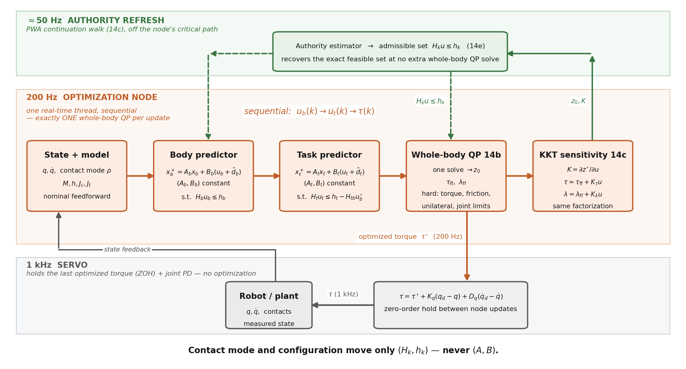
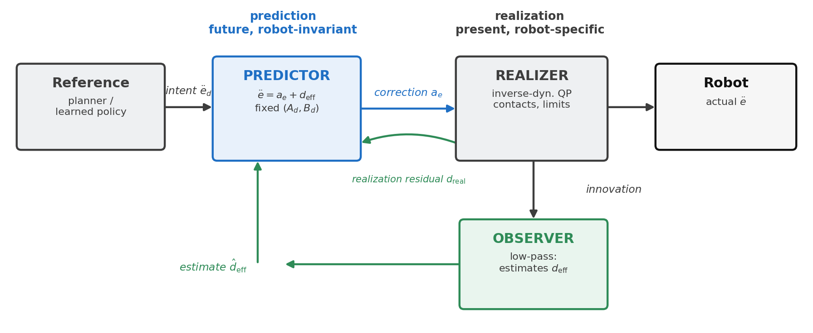
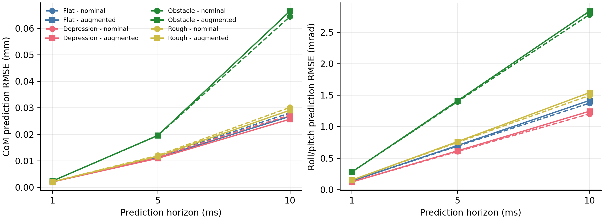
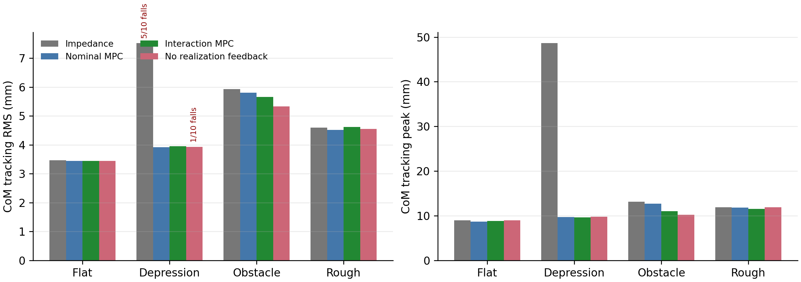
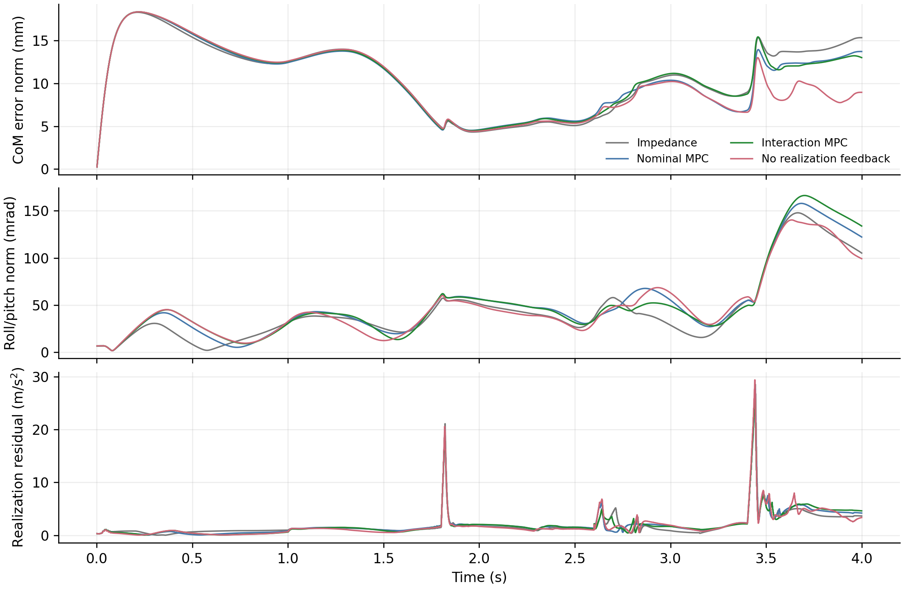
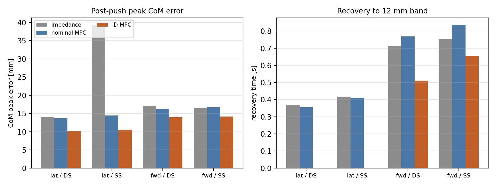
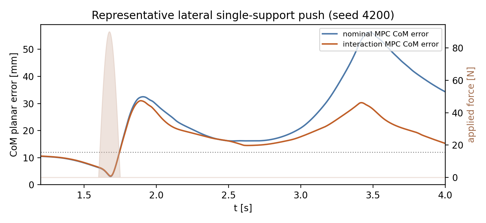
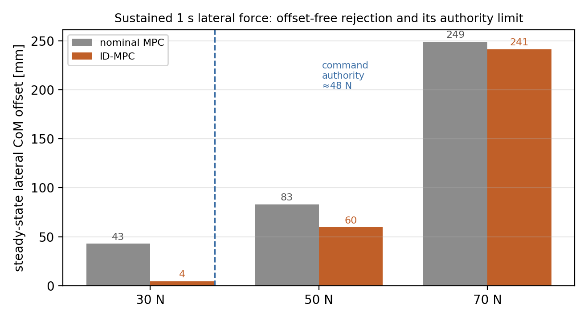
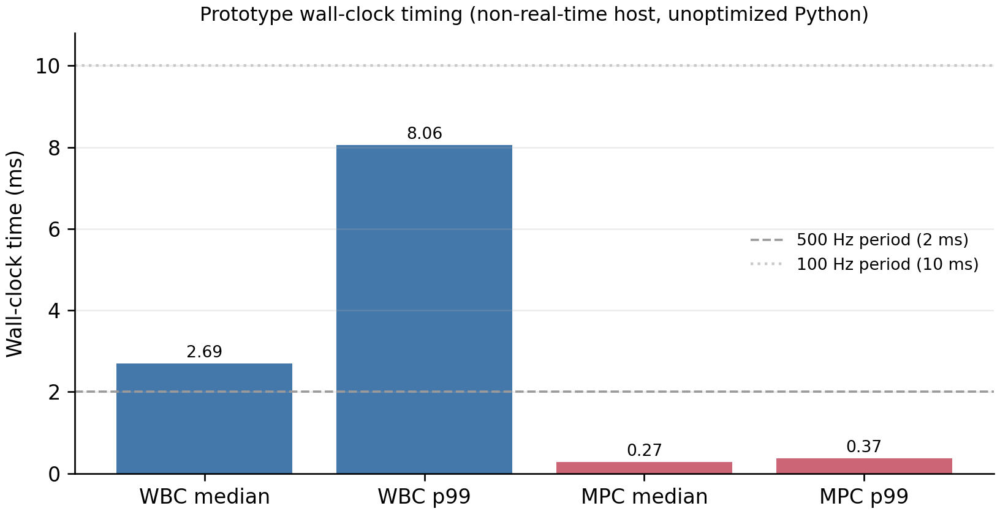

# Interaction Dynamics: A Configuration-Invariant Predictive Model for Humanoid Locomotion under Terrain and External Disturbances

**Yongyan Cao**

---

## Abstract

Locomotion is disturbed both by terrain-mediated contact mismatch — uneven height, early or late touchdown, support-force redistribution — and by external body forces such as pushes. We argue that these are one problem: *interaction dynamics*. Rather than embedding terrain, contact, and force states into the predictive model, we represent their observable motion effect — together with constrained-realization error and model residual — as a single interaction residual $d_{\rm eff}$ acting on a task model $\ddot e=a_e+d_{\rm eff}$ whose exact zero-order-hold matrices are, for the normalized requested-task coordinates under one modeling assumption, provably fixed across gait phase, terrain, and push. This turns interaction into a predictive *state* on a fixed shared model rather than a property to be re-modeled per contact. A model-predictive controller (Interaction-Dynamics MPC, ID-MPC) then chooses the task-acceleration correction $a_e$; a low-pass estimator of the measured task-acceleration residual propagates it over the horizon; and a separate inverse-dynamics/contact QP realizes the command subject to the instantaneous robot and contact constraints. The controller replans no footsteps and embeds no full nonlinear dynamics in the horizon.

We evaluate three controllers on a torque-actuated Unitree G1 simulation using the same walking reference and realizer — task impedance, nominal MPC, and ID-MPC — across two paired studies (four conditions $\times$ three controllers $\times$ ten seeds each). In an uneven-terrain study (flat, a 20 mm depression, a 20 mm obstacle, and a frozen rough surface), residual augmentation improves 10 ms CoM prediction by 3.6--5.7% on three terrains (and slightly worsens it on the obstacle) and reduces obstacle peak CoM error by 19.8% relative to nominal MPC, with flat-ground, depression, and rough RMS essentially unchanged (within 3%). In an external-push study — phase-locked $90$ N, $150$ ms torso pushes hidden from the estimator, gated on measured single- or double-support contact across two directions — ID-MPC lowers post-push peak CoM error in every condition (14--27% relative to nominal MPC), most in the vulnerable lateral single-support case (14.4 to 10.6 mm), and returns to a 12 mm error band far faster than the baselines; fall counts in the hardest condition are similar across the MPC controllers and are a secondary outcome. The 100 Hz MPC meets its measured deadline, and the shared inverse-dynamics QP runs on a preserved 500 Hz simulated schedule whose wall-clock optimization is left to future work. Together the studies show that one canonical residual-acceleration model predicts and compensates two distinct interaction classes, with the clearest benefit under external pushes.

**Index Terms** - interaction dynamics, uneven-terrain locomotion, external-push rejection, humanoid robots, model predictive control, disturbance estimation, whole-body control.

---

## I. Introduction

Walking is a continuous physical interaction between a robot, the terrain, and — when present — external forces on the body. A motion planner may prescribe dynamically reasonable body and foot trajectories, yet the forces realized at execution can differ from their nominal values because terrain height, compliance, friction, and contact timing are imperfectly known, and an external push or pull adds an unmodeled body wrench. A lower foothold delays load transfer; a higher foothold advances impact; a compliant or low-friction patch redistributes the support wrench; a torso push injects a transient acceleration. These mismatches first appear in contact, proprioceptive, and inertial measurements and then drive body-position and orientation error.

Existing locomotion controllers address this problem through several complementary mechanisms. Reduced-order MPC efficiently replans body motion and contact forces; whole-body inverse dynamics enforces instantaneous multibody and contact constraints; impedance control absorbs interaction through compliant tracking error; full-order NMPC represents richer coupled dynamics; and learning-based policies can provide strong empirical terrain robustness. The gap addressed here is narrower. These approaches do not necessarily expose terrain/contact mismatch as an explicit, configuration-invariant interaction input whose near-future effect can be predicted and cancelled in the coordinates used for precise body tracking.

The proposed framework retains the external motion planner and fast whole-body controller. It inserts an interaction-prediction layer between them. Let $y$ denote selected locomotion-task coordinates, such as lateral/vertical body position and roll/pitch, and let $e=y-y_d$ be their tracking error. After nominal dynamic compensation, the task-level model is

$$
\begin{aligned}
\ddot e
&=a_e+d_{\rm eff},\\
d_{\rm eff}
&=d_{\rm int}+d_{\rm real}+d_{\rm mod},
\end{aligned}
\tag{1}
$$

where $a_e$ is the acceleration correction selected by MPC. The term $d_{\rm int}$ is the task-acceleration effect of contact-force, timing, terrain, compliance, and friction mismatch; $d_{\rm real}$ is the acceleration request not realized by the constrained WBC; and $d_{\rm mod}$ contains normalization, state-estimation, and unmodeled-dynamics error. The estimator need not identify these sources uniquely to control their combined effect, although measured contact forces provide an interpretable component. The main state remains $x=[e^\top,\dot e^\top]^\top$ rather than being enlarged with contact force, foot position, and mode variables. Consequently, the exact-ZOH pair $(A_d,B_d)$ remains the fixed double-integrator pair, while robot and environment dependence is isolated in $d_{\rm eff}$, task constraints, and the high-rate realization map.

This separation is important for both precision and compliance. Conventional impedance absorbs a persistent interaction through a nonzero tracking deflection. The ID-MPC instead estimates the equivalent acceleration and predicts its effect over the horizon. When the cancelling acceleration remains realizable, the steady condition $a_{e,\infty}+\hat d_{{\rm eff},\infty}=0$ permits zero tracking bias without requiring an infinitely stiff task. The controller does not directly command an unknown terrain force; it shapes the body response by choosing constrained task acceleration.

The paper therefore asks:

> **Can one configuration-invariant interaction model predict and compensate the observable motion effect of two distinct disturbance classes — terrain-mediated contact mismatch and external body pushes — and improve precise body tracking during walking when the motion plan and high-rate WBC are held fixed?**

The contributions are:

1. **Interaction as a predictive state on a fixed shared model.** We show (Theorem 1) that for the normalized requested-task coordinates the selected body tasks share one exact-ZOH transition pair that is provably invariant across gait phase, terrain, and contact mode, and that terrain, contact timing, external force, and realization error all enter a single interaction residual $d_{\rm eff}$ rather than the model. A non-vacuity argument, confirmed by the experiments, establishes that this is a falsifiable modeling claim rather than a free relabelling.
2. **Interaction estimation and prediction.** A low-pass estimator of the measured task-acceleration residual converts emerging contact and proprioceptive mismatch into a horizon disturbance sequence, without claiming pre-contact knowledge of unseen terrain.
3. **Constrained interaction compensation.** An offset-free MPC selects smooth task-acceleration corrections while retaining the same prediction matrices across configuration and contact phase.
4. **Controlled terrain and external-push evaluation.** Two paired three-controller benchmarks — an uneven-terrain study and a phase-locked torso-push study, each four conditions $\times$ three controllers $\times$ ten seeds — use the same external reference and constrained realizer, gate the push on measured contact phase, report prediction, tracking, and recovery outcomes per condition, and separate the simulated control schedule from measured wall-clock feasibility.

Figure 1 summarizes the multirate architecture. The external reference publishes nominal body, foot, and contact trajectories; the ID-MPC updates the acceleration correction at 100 Hz; the inverse-dynamics/contact QP is scheduled at 500 Hz; and torque is applied at the 1 kHz simulation rate. These are simulated update periods; Section IX-I reports their wall-clock measurements.

**Fig. 1.** Interaction prediction with high-rate whole-body realization.

---

## II. Related Work

Reduced-order locomotion MPC predicts center-of-mass and orientation motion while optimizing contact forces over a gait schedule, carrying friction, unilateral contact, and support geometry inside the prediction horizon [2], [3], [8], [13]. This replans body motion efficiently but embeds contact and support variables in the predictive model. The present framework instead predicts only the fixed double-integrator task dynamics and pushes contact, terrain, and realization effects into an estimated disturbance, so the prediction matrices never change with configuration or contact phase.

Whole-body inverse dynamics and hierarchical QPs [4], [5], [7], [9] enforce instantaneous multibody dynamics, rigid contact, task priorities, and actuator limits. They are retained here unchanged as the high-rate realizer that maps a requested task acceleration to feasible joint torques and contact forces, not as a second predictive model. Operational-space impedance and admittance control [6], [11], [12] absorb interaction through compliant tracking deflection. The interaction layer proposed here differs in that it estimates the equivalent interaction acceleration and predicts its near-future effect, so a persistent interaction can be cancelled without a permanent tracking offset (Section VI).

Full-order nonlinear MPC represents richer coupled dynamics at higher computational cost, and learning-based policies can provide strong empirical terrain robustness at the cost of model transparency and explicit constraint handling. Closest to our setting is unified whole-body MPC for locomotion and manipulation [10], which optimizes a single predictive model spanning both; we instead predict only the fixed interaction dynamics while the full contact-constrained dynamics act at the current sample as a feasibility projection. Across these lines, existing locomotion controllers improve locomotion primarily by replanning motion, adapting contact forces, or increasing model fidelity. Our objective is orthogonal: to expose *interaction itself* as the predictive state on a fixed shared model, and to insert this representation between an existing planner and an existing whole-body controller without replacing either.

Offset-free tracking through an augmented constant-disturbance observer is a classical tool for rejecting persistent matched disturbances [16]. The normalized integrator interaction model, its offset-free regulation, and its impedance interpretation for fixed-base contact tasks were developed in [1]. This paper carries that construction onto a floating base during locomotion: the disturbance now aggregates terrain, contact-timing, realization, and model residuals in selected body-task coordinates, and it is evaluated against nominal-MPC and impedance baselines on uneven ground. The centroidal model [8], [17], whole-body inverse dynamics [9], and the integrating-disturbance observer [16] are prior tools; the contribution is their combination into a fixed-model interaction predictor for precise uneven-ground body tracking, with an honest three-controller evaluation on a Unitree G1 in MuJoCo [15].

---

## III. Locomotion Interaction Dynamics

The floating-base dynamics are

$$
q=[q_b^\top,q_j^\top]^\top,\qquad
M(q)\ddot q+h(q,\dot q)=S^\top\tau+J_c^\top\lambda+w_{\rm ext},
\tag{2}
$$

with rigid active contacts

$$
J_c\ddot q+\dot J_c\dot q=0,
\tag{3}
$$

where $q_b$ is the floating base, $q_j$ the actuated joints, $\lambda$ stacks contact wrenches, and $w_{\rm ext}$ collects external interaction forces. The locomotion front end separates into a motion planner that decides *where* to walk, a gait scheduler that resolves this into support phases, step indices, and touchdown events, and a reference generator that turns that schedule into dynamically consistent nominal body, DCM/CoM, swing-foot, and contact references; a high-rate whole-body controller (Section VII) then realizes task requests subject to (2)–(3) and the physical limits. The interaction layer sits between the reference generator and the realizer and modifies neither — it depends on the gait schedule only through the references it receives, so it is independent of how the schedule is produced. (In the evaluated system the reference generator is indexed by simulation time; indexing it instead by gait phase and measured touchdown, $\xi_d(k,\phi)$ rather than $\xi_d(t)$, is a hybrid-system refinement discussed in Section X.)

Let $y$ collect the selected locomotion-task coordinates — here CoM position and body roll/pitch — and let $e=y-y_d$ be their tracking error against the planned reference.

**Assumption 1 (task-acceleration normalization).** On the operating set the selected task has an invertible, well-conditioned interaction inertia $M_p(q,\rho)$ and constrained dynamics $M_p\ddot y+\mu_p=F^{\rm act}+F^{\rm ext}$. The realizer's nominal feedforward cancels the modeled bias and injects the desired task acceleration plus a correction $a_e$, $F^{\rm act}=\mu_p+M_p(\ddot y_d+a_e)+\delta$, where $\delta$ is the realization discrepancy (the realized minus the requested generalized force) and $F^{\rm ext}$ the external interaction wrench.

**Theorem 1 (contact-mode invariance of the requested model).** Let a controlled task have error coordinate $e$ of relative degree $r$, and let $\mathcal M$ be a set of contact modes for which Assumption 1 holds with the *same* requested coordinate. Then for every mode $\rho\in\mathcal M$ the realized error obeys the canonical model (1),

$$
\ddot e=a_e+d_{\rm eff},\qquad
d_{\rm eff}=d_{\rm int}+d_{\rm real}+d_{\rm mod},
\tag{4}
$$

with interaction effect $d_{\rm int}=M_p^{-1}F^{\rm ext}$, realization effect $d_{\rm real}=M_p^{-1}\delta$, and model residual $d_{\rm mod}$; and its exact zero-order-hold transition pair is the **same** matrix pair $(A_d,B_d)$ for every $\rho\in\mathcal M$ — the ZOH of the order-$r$ integrator chain, a function of the sample period $\Delta t$ and $r$ **alone**. Consequently the robot mechanics $M_p(q,\rho),\mu_p$, the contact geometry, and the environment enter only $d_{\rm eff}$ and the admissible-command set, never $(A_d,B_d)$: a contact switch $\rho\to\rho'$ changes $(M_p,\mu_p,d_{\rm eff},\widehat{\mathcal U})$ but leaves the prediction matrices invariant.

*Proof.* Substituting the feedforward $F^{\rm act}=\mu_p+M_p(\ddot y_d+a_e)+\delta$ into the constrained dynamics $M_p\ddot y+\mu_p=F^{\rm act}+F^{\rm ext}$ cancels $\mu_p$, and left-multiplying by $M_p^{-1}$ gives $\ddot e=\ddot y-\ddot y_d=a_e+M_p^{-1}(F^{\rm ext}+\delta)=a_e+d_{\rm eff}$. The input-to-error map $a_e\mapsto\ddot e$ is therefore the identity **in every mode $\rho\in\mathcal M$**, independent of $M_p$, $\mu_p$, and $\rho$. Its exact-ZOH sampling is the order-$r$ integrator pair, whose entries are polynomials in $\Delta t$ only (for $r=2$, $A_d=\big[\begin{smallmatrix}I&\Delta t\,I\\0&I\end{smallmatrix}\big]$, $B_d=\big[\begin{smallmatrix}\frac12\Delta t^2I\\\Delta t\,I\end{smallmatrix}\big]$). No mode-dependent quantity can appear in $(A_d,B_d)$ because none appears in the map it discretizes; every such quantity is absorbed, *by construction*, into $F^{\rm act}$ — hence into the recovery map, the admissible set, and $d_{\rm eff}$. $\square$

**Remark (the decomposition is falsifiable, not vacuous).** Isolating all robot and environment dependence in $d_{\rm eff}$ is a modeling *choice*, and it would be empty if $d_{\rm eff}$ could absorb any effect for free. It cannot: the task is regulated without steady-state error only when the cancelling request $a_e=-d_{\rm eff}$ is admissible and realizable by the constrained realizer (Sections VII and VIII). When it is not — for instance a force beyond the command authority — the effect is not hidden in $d_{\rm eff}$ but surfaces as an un-rejected residual or a loss of balance. The claim is therefore testable, and Section IX delineates where it holds: a $30$ N sustained force within the command authority is rejected to a $4$ mm steady error, while a $70$ N force exceeds that authority and is not (Section IX-G). Invariance of $(A_d,B_d)$ buys a fixed predictor; it does not buy unconditional rejection.

This is the organizing idea of the paper: robot and environment dependence is isolated in the estimated disturbance $d_{\rm eff}$, the task constraints, and the high-rate realization map, while the predictor keeps one fixed model across configuration and contact phase. The estimator (Section V) need not separate $d_{\rm int}$, $d_{\rm real}$, and $d_{\rm mod}$ to control their sum, although measured contact force gives an interpretable component. Figure 2 places this interaction-prediction block between the planner and the realizer.

**Fig. 2.** The interaction-prediction layer sits between the motion planner and the whole-body realizer, estimating $d_{\rm eff}$ and choosing the task-acceleration correction $a_e$ on the fixed model (4).

---

## IV. Canonical Task Model and Normalization

Two physical arguments reduce the selected body-task coordinates to a fixed double integrator with a disturbance input.

*Center of mass.* With CoM $c$, mass $m$, active-contact forces $f_i$, and signed gravitational-acceleration vector $g$,

$$
m\ddot c=\sum_{i\in\mathcal C_\rho}f_i+mg+w_c ,
\tag{5}
$$

where $w_c$ lumps the external and unmodeled load. For $e_c=c-c_d$ the planner-consistent desired resultant is $F_c^{\rm des}=m(\ddot c_d-g)+m\,a_{e,c}$; writing the realized contact resultant as $\sum_i f_i=F_c^{\rm des}+\delta_c$ with the realization discrepancy $\delta_c$ (realized minus desired, as in Assumption 1),

$$
\ddot e_c=a_{e,c}+d_c,\qquad
d_c=m^{-1}w_c+m^{-1}\delta_c ,
\tag{6}
$$

so the CoM error is a double integrator whose disturbance splits into an interaction part $m^{-1}w_c$ and a realization part $m^{-1}\delta_c$, exactly as in (4).

*Roll and pitch.* The body orientation error is regulated as a double integrator in roll/pitch with the same disturbance structure, the effective rotational inertia folded into $M_p$ and any moment mismatch absorbed into $d_{\rm eff}$. Consistent with the evaluation, we treat roll/pitch as simulated body-task coordinates and do not interpret them as a hardware centroidal-angular-momentum measurement.

Stacking the selected coordinates and holding $a_e$ and $d_{\rm eff}$ over each interval, the exact-ZOH model at sample period $\Delta t$ is

$$
x_{k+1}=A_dx_k+B_d\big(a_{e,k}+d_{{\rm eff},k}\big),\qquad
x=[e^\top,\dot e^\top]^\top,
\tag{7}
$$

$$
A_d=\begin{bmatrix}I&\Delta t\,I\\0&I\end{bmatrix},\qquad
B_d=\begin{bmatrix}\tfrac12\Delta t^2I\\\Delta t\,I\end{bmatrix}.
\tag{8}
$$

The pair $(A_d,B_d)$ is the fixed double integrator; mass, inertia, contact geometry, and contact phase enter only the recovery of $F_c^{\rm des}$ and the realizer's feasible set, never $(A_d,B_d)$. Under a scheduled contact sequence the recovery map is re-formed per mode while $(A_d,B_d)$ stay unchanged, and the recovery gap is logged as the realization residual $d_{\rm real}$ of Section VII.

---

## V. Interaction Estimation and Prediction

The disturbance $d_{\rm eff}$ is not commanded; on the fixed model (7) it equals $\ddot e-v$, so it becomes observable as soon as the task-error acceleration is measured. We estimate it per channel by low-pass filtering the finite-differenced task-error acceleration minus the applied correction:

$$
\hat d_{{\rm eff},k}=(1-\alpha)\,\hat d_{{\rm eff},k-1}
+\alpha\big(\hat{\ddot e}_k-a_{e,k}\big),\qquad
\hat{\ddot e}_k=\frac{\dot e_k-\dot e_{k-1}}{\Delta t_{\rm w}} ,
\tag{9}
$$

with cutoff $\alpha=1-e^{-2\pi f_{\rm bw}\Delta t_{\rm w}}$ ($f_{\rm bw}=3$ Hz at the $2$ ms realizer step); the low-pass is used because a finite-difference acceleration is noisy even in simulation. Because $\hat{\ddot e}-v$ is exactly the measured minus the commanded task acceleration, the estimate aggregates the matched interaction, realization, and model effects into a single effect without needing to separate them; the filter is an *effect* estimator, not a source identifier, and measured contact force enters only as an interpretable diagnostic. A matched realization residual is therefore indistinguishable from an external interaction at the same channel and is absorbed into $\hat d_{\rm eff}$.

Over the MPC horizon the residual is propagated as a constant,

$$
\hat d_{k+i|k}=\hat d_{k|k},\qquad i=0,\dots,N-1 .
\tag{10}
$$

This is deliberately not a terrain preview: it extrapolates the currently observed mismatch forward rather than forecasting unseen terrain. Section IX-D audits this one-step-persistent rollout against the nominal $\hat d=0$ model. The estimator is phase-invariant, so a contact phase change enters as a change of the measured disturbance, not of the estimator.

---

## VI. Constrained Interaction-Dynamics MPC

The correction $a_e$ is chosen by an offset-free MPC on the fixed model (7):

$$
\begin{aligned}
\min_{a_{e,0},\dots,a_{e,N-1}}\quad&
\sum_{j=0}^{N-1}\Big(\|x_j\|_Q^2+\|a_{e,j}+\hat d_k\|_R^2\Big)+\|x_N\|_S^2\\
\text{s.t.}\quad&
x_{j+1}=A_dx_j+B_d\big(a_{e,j}+\hat d_k\big),\\
&a_{e,\min}\le a_{e,j}\le a_{e,\max}.
\end{aligned}
\tag{11}
$$

Penalizing $\|a_{e,j}+\hat d_k\|$ rather than $\|a_{e,j}\|$ is what makes the regulation offset-free: for a constant estimated disturbance the cost-minimizing steady state is $a_{e,\infty}=-\hat d_{{\rm eff},\infty}$, so the cancelling correction incurs no penalty and the task error can reach zero without an infinitely stiff task gain. This is the interaction alternative to impedance, which instead accepts a persistent deflection proportional to the interaction. The bounds $[a_{e,\min},a_{e,\max}]$ are fixed acceleration limits, not a per-sample capability set; the physical limits are enforced downstream by the realizer, and an infeasible correction appears as a realization residual rather than a predictor constraint violation.

Only the first correction $a_{e,k}^\star$ is applied, and the horizon is re-solved at the next MPC update. Because $(A_d,B_d,Q,R,S)$ never change, the condensed MPC Hessian is constant and (11) is a small fixed-size QP, independent of robot configuration and contact phase.

---

## VII. Whole-Body Realization

The realizer executes the requested task acceleration $\ddot y_d+a_{e,k}^\star$ at the current sample. It is an instantaneous inverse-dynamics/contact QP, not a second predictor. Let $\tau_{\rm ref}$ be a regularization torque (previous command or gravity compensation), $J_y$ the task Jacobian, and $\mathcal F_\rho$ the polyhedral friction set for the active mode:

$$
\begin{aligned}
\min_{\ddot q,\tau,\lambda}\quad&
\|J_y\ddot q+\dot J_y\dot q-(\ddot y_d+a_{e,k}^\star)\|_{W_t}^2
+\|J_c\ddot q+\dot J_c\dot q\|_{W_c}^2
+\|\tau-\tau_{\rm ref}\|_{W_\tau}^2\\
\text{s.t.}\quad&
M\ddot q+h=S^\top\tau+J_c^\top\lambda,\\
&\lambda\in\mathcal F_\rho,\quad \tau_{\min}\le\tau\le\tau_{\max}.
\end{aligned}
\tag{12}
$$

Body, contact, and swing-foot accelerations are tracked as weighted least-squares objectives, while the floating-base dynamics, friction and unilateral-force limits, and torque bounds are hard constraints. The body and swing-foot objectives being soft, an unrealizable request produces a measurable task-acceleration slack $s_{\rm task}=J_y\ddot q+\dot J_y\dot q-(\ddot y_d+a_{e,k}^\star)$ rather than a hard infeasibility. With the measured task acceleration $\ddot y^{\rm meas}$, the realization residual

$$
d_{{\rm real},k}\approx\ddot y^{\rm meas}_k-\big(\ddot y_d+a_{e,k}^\star\big)
\tag{13}
$$

is finite-differenced and folded into the measured task acceleration of (9). The realizer enforces the floating-base dynamics, friction, unilateral-force, and torque limits as hard constraints and tracks the contact and body accelerations as weighted objectives; it is the layer that keeps the executed motion physically admissible regardless of the predictor. Rigid-contact acceleration equalities and one-step joint-position limits are available in an exact-realization mode but are not used in the evaluated configuration. With a friction-pyramid approximation (12) is a convex QP solvable by operator splitting [14]; exact Coulomb cones make it a second-order cone program.

The realizer runs at the high (simulated $500$ Hz) rate with step $\Delta t_{\rm w}$ ($2$ ms) and the MPC at $100$ Hz ($\Delta t=10$ ms of (8)), and the applied torque is held between realizer updates. Section IX-I reports the measured wall-clock cost of this QP, which does not yet meet the simulated schedule.

Locomotion proceeds through scheduled contact phases, and the realizer's contact mode $\rho$ is updated from the planner's schedule. Because the predictor and estimator are phase-invariant, a phase change enters only through the re-formed recovery map and through the measured disturbance; the evaluation uses the planner's scheduled transitions directly. A hardware implementation of (9)–(13) also requires generalized velocity from a filtered estimate rather than raw encoder differences, and the phase lag and noise of that estimate must be included in the observer and closed-loop robustness evaluation; they are not removed by the update rate alone.

---

## VIII. Properties and Scope

The construction inherits the fixed-model offset-free property of [1] and adds the qualification that the disturbance is now an aggregate effect on a floating base.

**Offset-free regulation (conditional).** Fix a contact phase and suppose the effective disturbance is constant and matched, the residual estimator (9) converges so that $\hat d\to d_{\rm eff}$, and the cancelling correction $a_e=-d_{\rm eff}$ lies within the fixed bounds and remains realizable by (12). Then the offset-free MPC (11) drives the task error to zero: the matched interaction and realization effects are cancelled together, so exact realization $d_{\rm real}=0$ is not required — only that the residual be matched, constant, and realizable.

**Bounded mismatch.** If the nominal requested-model loop is input-to-state stable as in [1] and the unmatched residual is bounded, $\sup_k\lVert d_{\rm eff}-d_{\rm matched}\rVert\le\varepsilon$, then the realized error inherits the nominal transient plus an ultimate bound proportional to $\varepsilon$. Bounded corrections do not by themselves establish recursive feasibility, contact stability, or fall avoidance; those remain properties of the plan and the realizer.

**What the model does not claim.** The predictor is exact only for the normalized task under ideal feedforward and zero realization error. In execution, state-estimation delay, contact compliance, velocity filtering, impact dynamics, realizer task trade-offs, actuator dynamics, and terrain mismatch all enter $d_{\rm eff}$, and the estimator observes their sum only after it becomes measurable. There is no terrain preview and no per-sample feasibility certificate. Section IX measures where this compact model helps, where it is neutral, and where it slightly hurts.

---

## IX. Environmental-Interaction Experiments

The evaluation tests whether one canonical residual-acceleration model explains two distinct interaction classes — terrain-mediated contact mismatch and externally applied body force — under an identical walking plan and constrained realizer. Every controller receives the same nominal walking trajectory, contact schedule, initial state, and seed and uses the same state estimator, contact logic, inverse-dynamics/contact QP, torque limits, friction model, and solver settings. Only the task-space correction law changes. Two full-physics benchmarks anchor the evaluation — a terrain study (four terrains $\times$ three controllers $\times$ ten seeds; Sections IX-D and IX-E) and an external-push study (four direction/phase conditions $\times$ three controllers $\times$ ten seeds; Section IX-F) — 240 torque-level runs in all, with zero QP fallbacks; falls are reported per cell as a secondary outcome. Two focused studies then probe the boundaries of the mechanism: a sustained-force study on the reduced interaction model (Section IX-G), which isolates the offset-free property that the falling walker cannot hold at torque level, and a step-height/combined-disturbance physics vignette (Section IX-H).

### A. Multirate Experimental Architecture

All trials use the Unitree G1 MuJoCo model (MuJoCo 3.10.0) with 1 ms integration and torque application. Simulated updates are scheduled at 500 Hz for the whole-body QP and estimator and at 100 Hz for the MPC. The external reference supplies nominal body, swing-foot, and contact trajectories and is not modified by terrain feedback. The 500 Hz value is therefore the simulated schedule, not a demonstrated wall-clock rate; measured computation is reported in Section IX-I.

The WBC enforces floating-base dynamics, active-contact acceleration, unilateral force, friction, and torque constraints. Body and swing-foot objectives remain soft, so an unrealizable request produces a measurable acceleration residual rather than a hard-task infeasibility. The interaction layer neither changes the contact schedule nor selects footsteps. The controlled vector is CoM position plus roll and pitch; the paper does not interpret this simulated attitude channel as a hardware centroidal-momentum measurement.

The locomotion planner, contact schedule, and whole-body realization stack are shared by all evaluated controllers, and the interaction layer modifies only the body-task acceleration command. To isolate interaction-prediction performance from long-horizon gait-stabilization effects — the shared locomotion stack's long-horizon robustness is a separate problem, outside this paper's scope (Section X) — the comparisons are conducted over a fixed evaluation window in which the shared locomotion infrastructure remains repeatable for every controller.

### B. Compared Controllers

Three controllers are compared:

1. **Task impedance:** fixed body and swing-foot feedback generates acceleration requests for the shared WBC. This baseline accommodates terrain interaction through compliant tracking error.
2. **Nominal MPC:** the same double-integrator MPC, horizon, cost, acceleration bounds, planner, and WBC as the proposed controller, but with $\hat d_{\rm eff}=0$. This isolates the value of residual estimation and prediction.
3. **Interaction-Dynamics MPC (ID-MPC):** the proposed residual-augmented predictor uses the estimated $\hat d_{\rm eff}$ of (9)–(10) over the horizon.

Controller parameters are frozen across evaluation terrains. No method receives terrain height, future contact force, or replanning. The interaction estimate uses only acceleration residuals that have already become observable; no oracle sequence is used.

### C. Terrain and Trial Protocol

The four physical terrain models are:

| terrain | definition | purpose |
|---|---|---|
| flat | nominal surface | estimator and tracking control |
| unilateral depression | one planned foothold $20$ mm below nominal | delayed contact and reduced early support force |
| unilateral obstacle | one planned foothold $20$ mm above nominal | early impact and load transfer |
| frozen rough sequence | left patch $+15$ mm and right patch $-20$ mm | repeated interaction mismatch |

The same 4 s flat-ground reference is replayed over all terrains. Seeds 4200--4209 perturb the simulation consistently across controllers, giving ten paired trials in every terrain/controller cell. We report these four fixed amplitudes; a terrain-height failure-boundary sweep was not run and is not implied by the results.

### D. Interaction-Prediction Experiment

At each estimator update, the nominal model ($\hat d=0$) and constant-residual model ($\hat d_{k+i|k}=\hat d_{k|k}$) are rolled forward from the same measured state using the same recorded future command sequence but no future measured output. This is an offline dynamics-model audit, not a deployable oracle forecast. To avoid confounding prediction quality with controller-dependent trajectories, Fig. 3 evaluates both predictors on the ten nominal-MPC trials for each terrain.

**Fig. 3.** Interaction-augmented versus nominal prediction.

At 10 ms, residual augmentation reduces median CoM prediction RMSE from 0.0281 to 0.0267 mm on flat ground (4.6%), from 0.0272 to 0.0257 mm in the depression (5.7%), and from 0.0301 to 0.0291 mm on rough ground (3.6%). It slightly worsens obstacle CoM prediction (0.0644 to 0.0665 mm, $-3.2\%$) and worsens roll/pitch prediction by 2--3% on every terrain. The absolute changes are small — order $0.001$ mm at $10$ ms — so we treat this open-loop prediction audit as corroborating rather than headline evidence: the benefit is a modest, CoM-channel effect on three of four terrains after the residual becomes observable, not a universal benefit and not terrain preview. That the obstacle's closed-loop tracking still improves (Table I) while its open-loop prediction does not underlines that the two are different measurements.

### E. Uneven-Ground Tracking and Interaction Response

Table I reports medians across the ten seeds. Fig. 4 visualizes the same CoM metrics and fall counts, while Fig. 5 shows the frozen obstacle trial at seed 4200. Peak contact force, contact impulse, torque utilization, requested and realized acceleration, and realization residual remain in the authoritative JSON/NPZ record; they are diagnostic outcomes rather than selected headline wins.

| terrain | controller | CoM RMS (mm) | CoM peak (mm) | roll/pitch RMS (mrad) | falls/10 |
|---|---|---:|---:|---:|---:|
| flat | impedance | 3.468 | 8.987 | 22.08 | 0 |
|  | nominal MPC | 3.446 | 8.703 | 25.70 | 0 |
|  | ID-MPC | 3.488 | 8.936 | 25.03 | 0 |
| depression | impedance | 7.524 | 48.676 | 143.30 | 5 |
|  | nominal MPC | 3.916 | 9.671 | 24.14 | 0 |
|  | ID-MPC | 3.944 | 9.713 | 25.61 | 0 |
| obstacle | impedance | 5.927 | 13.134 | 44.95 | 0 |
|  | nominal MPC | 5.800 | 12.706 | 50.20 | 0 |
|  | ID-MPC | **5.427** | **10.188** | 52.25 | 0 |
| rough | impedance | 4.590 | 11.895 | 21.64 | 0 |
|  | nominal MPC | 4.511 | 11.850 | 26.44 | 0 |
|  | ID-MPC | 4.499 | 11.737 | 25.65 | 0 |

**Table I.** Paired uneven-ground tracking results (cell medians over ten seeds).

**Fig. 4.** Uneven-ground tracking summary.

**Fig. 5.** Representative obstacle response (seed 4200).

Relative to nominal MPC, ID-MPC changes median CoM peak error by +2.7%, +0.4%, $-19.8\%$, and $-1.0\%$ on flat, depression, obstacle, and rough terrain, and median CoM RMS by +1.2%, +0.7%, $-6.4\%$, and $-0.3\%$. The single clear terrain effect is the obstacle, where ID-MPC lowers the peak from 12.71 to 10.19 mm; the sub-3% changes on flat, depression, and rough terrain are within seed variability. The strongest system-level contrast is the depression, where impedance falls in five trials while both nominal MPC and ID-MPC complete all ten, confirming the value of predictive correction over the impedance baseline. The sharper separation between residual augmentation and nominal MPC appears under the external pushes of Section IX-F, where the interaction is larger and more observable.

### F. External-Push Study

To test the second interaction class, a phase-locked external wrench is applied to the torso during walking. A half-sine force of $90$ N peak and $150$ ms duration ($8.6$ N$\cdot$s impulse) is applied once the target gait phase is confirmed by *measured* foot contact — exactly one foot in contact for single support, both for double support — held for a $60$ ms dwell, and no earlier than $1.6$ s. Gating on measured rather than planned contact is essential: every trial's onset contact is verified, and all single-support pushes land with one measured foot on the ground. The wrench perturbs only the plant; it is logged at $1$ kHz for ground truth but is hidden from the estimator and every controller. Four conditions cross push direction (lateral, forward) with gait phase (double and single support); three controllers and ten paired seeds give $120$ trials. Recovery time is the first post-onset instant at which the CoM planar error returns below a frozen $12$ mm band and stays there for $200$ ms.

| condition | controller | CoM peak (mm) | CoM RMS (mm) | recovery (s) | recovered/10 | falls/10 |
|---|---|---:|---:|---:|---:|---:|
| lateral, DS | impedance | 14.1 | 4.4 | 0.37 | 10 | 0 |
|  | nominal MPC | 13.6 | 4.0 | 0.36 | 10 | 1 |
|  | ID-MPC | **10.1** | **3.1** | **0.00** | 10 | 0 |
| lateral, SS | impedance | 39.3 | 11.4 | 0.42 | 5 | 5 |
|  | nominal MPC | 14.4 | 4.4 | 0.41 | 8 | 2 |
|  | ID-MPC | **10.6** | **3.1** | **0.00** | 7 | 3 |
| forward, DS | impedance | 17.1 | 6.3 | 0.71 | 10 | 0 |
|  | nominal MPC | 16.3 | 6.2 | 0.77 | 10 | 0 |
|  | ID-MPC | **14.0** | **5.2** | **0.51** | 10 | 0 |
| forward, SS | impedance | 16.5 | 6.4 | 0.75 | 10 | 0 |
|  | nominal MPC | 16.7 | 6.5 | 0.84 | 10 | 0 |
|  | ID-MPC | **14.2** | **5.6** | **0.66** | 10 | 0 |

**Table II.** External-push response (cell medians over ten seeds). Recovery is the median over recovering seeds and is reported with the number of seeds that recover. "Recovered" (CoM error re-enters the $12$ mm band for $200$ ms) and "falls" are independent criteria evaluated over the trial, so a seed that transiently re-enters the band and later loses balance is counted in both — hence the single lateral-DS nominal fall despite ten recoveries.

ID-MPC reduces the median post-push peak CoM error relative to nominal MPC in every condition — by $26\%$ (lateral SS, $14.4\to10.6$ mm), $26\%$ (lateral DS), $15\%$ (forward SS), and $14\%$ (forward DS) — and lowers post-push RMS correspondingly. Its recovery is also faster in every condition: in the three conditions where all three controllers recover it re-enters the $12$ mm band in $\le0.66$ s versus $0.36$–$0.84$ s for the baselines, and in the lateral cases its surviving seeds barely leave the band at all ($\le0.001$ s median). The advantage is largest in the vulnerable lateral single-support case, where impedance reaches a $39.3$ mm peak and falls in five of ten seeds while ID-MPC holds $10.6$ mm.

The benefit is in error magnitude and recovery speed, not fall avoidance. Fall counts in the hardest condition (lateral single support) are similar and noisy across the MPC controllers — nominal MPC falls twice and ID-MPC three times in ten seeds — and no controller recovers every seed there; we therefore do not claim a fall-rate advantage and report falls as a secondary outcome. We also do not attribute the gains to whole-body constraint activation: across the push trials the peak torque utilization reaches $0.89$ (median $0.66$) and the benchmark does not log active-set membership, so a large realization residual is not evidence of hard-constraint saturation.

**Fig. 6.** Post-push peak CoM error and recovery time by controller across the four push conditions.

**Fig. 7.** Representative lateral single-support push: CoM planar error for nominal MPC and ID-MPC, with the applied-force pulse shaded.

### G. Sustained-Force Rejection and the Authority Limit

The transient push of Section IX-F is a full torque-level result, but a *sustained* force cannot be studied there: the shared gait does not sustain long-horizon walking (Section X), so a 1 s constant push cannot be reliably applied and observed to steady state on the walking robot. To isolate the offset-free property predicted by Theorem 1 under a persistent force, we exercise the same reduced CoM/body interaction model on which ID-MPC operates — a two-dimensional lateral CoM/body model — under a 1 s constant lateral force during a 1.2 m/s forward reference, with ten paired seeds injecting lateral process noise. This is a controlled demonstration of the mechanism on the interaction model itself, not a torque-level physics result; it complements, and does not replace, the full-physics transient study above.

| force | controller | steady offset (mm) | peak (mm) | recovered/10 |
|---|---|---:|---:|---:|
| 30 N | nominal MPC | 42.8 | 56.7 | 0 |
|  | **ID-MPC** | **4.2** | **4.4** | **10** |
| 50 N | nominal MPC | 83.0 | 120.2 | 0 |
|  | ID-MPC | 59.6 | 85.6 | 0 |
| 70 N | nominal MPC | 249.2 | 546.4 | 0 |
|  | ID-MPC | 241.5 | 531.7 | 0 |

**Table III.** Sustained 1 s lateral force on the reduced CoM/body model (cell medians over ten seeds). "Recovered" is the fraction of seeds whose lateral error returns below a 15 mm band.

The command authority of the reduced model is $\approx48$ N ($1.4$ m/s$^2\times34$ kg). The sweep tracks the three regimes of Theorem 1's realizability condition exactly. **Within authority (30 N):** ID-MPC rejects the constant force nearly offset-free — the steady lateral error drops from $42.8$ to $4.2$ mm (a $10\times$ reduction) and it is the only controller to re-enter the band, because the residual estimator converges to the constant disturbance and the cancelling command $a_e=-\hat d_{\rm eff}$ is admissible. **Just past authority (50 N):** ID-MPC is still better ($59.6$ vs $83.0$ mm) but the command saturates and a residual offset remains. **Beyond authority (70 N):** both hold $\approx245$ mm — the cancelling command is inadmissible, so no observer can help, exactly as the falsifiability remark after Theorem 1 states. Nominal MPC, lacking the disturbance feedforward, holds a droop proportional to the force throughout.

**Fig. 8.** Steady-state lateral CoM offset under a sustained force; ID-MPC is offset-free within the command authority ($\approx48$ N) and degrades to the nominal droop beyond it.

### H. Step Height and a Combined Disturbance

To probe contact-transition strength at torque level, a short (4 s) physics vignette walks the foot onto a unilateral step down (a depression) swept at 20, 30, and 40 mm, and adds a combined case with a lateral push over a raised right lane. Ten paired seeds, ID-MPC vs nominal MPC. Because the short window fixes the raised-lane interaction geometry, a matching step-up height sweep reduces to the Table I obstacle result and is not repeated here.

| case | height | nominal (falls, peak mm) | ID-MPC (falls, peak mm) |
|---|---|---|---|
| step down | 20 mm | 0/10, 9.7 | 0/10, 9.7 |
| step down | 30 mm | 0/10, 10.6 | 0/10, 10.6 |
| step down | 40 mm | 0/10, 11.7 | 0/10, 11.6 |
| raised lane **+** lateral push | — | 0/10, 12.7 (RMS 5.8) | 0/10, **10.2 (RMS 5.3)** |

**Table IV.** Step-down sweep and combined raised-lane-plus-push (physics, 4 s window; cell medians over ten seeds).

Both controllers stay upright across the step-down sweep, with near-identical peaks (9.7–11.7 mm) that grow gently with depth; ID-MPC is neither better nor worse than nominal MPC here. This is itself worth noting: an earlier random-walk disturbance observer destabilized ID-MPC on the 40 mm step-down (8/10 falls), whereas the single low-pass residual estimator used throughout is robust through 40 mm — a reason the confounded ablation was removed. In the combined raised-lane-plus-push case ID-MPC lowers the peak CoM error from 12.7 to 10.2 mm ($-20\%$) and RMS from 5.8 to 5.3 mm, consistent with the push study. The vignette therefore corroborates the main results at torque level — the mechanism helps modestly where the interaction is informative and is otherwise neutral — without introducing a new failure mode.

### I. Computational and Reproducibility Evaluation

Timing is measured on a general-purpose workstation under a standard, non-real-time operating system in an unoptimized Python implementation; it is a prototype measurement on a non-real-time host, not a deployment result, and is representative rather than reproducible from run to run. Across the terrain trials a representative profile has a WBC median near 2.8 ms with a median trial p99 near 7.7 ms, while the 100 Hz MPC has a median of trial medians near 0.3 ms and a median p99 near 0.4 ms. Occasional large single WBC samples coincide with operating-system scheduling spikes rather than compute cost, which is exactly why a non-real-time host is not a fair basis for a hard-deadline claim. The dominant WBC cost is Python matrix assembly rather than the QP solve, so a compiled sparse solver with warm-starting on a real-time target is the expected route to the 2 ms budget. The push study uses the identical multirate loop and exhibits the same profile. We therefore preserve the 500 Hz simulated schedule for every controller and treat real-time realization as an implementation task rather than a claim of this paper.

**Fig. 9.** Prototype wall-clock timing on a general-purpose, non-real-time host in unoptimized Python. The dashed lines mark the 500 Hz and 100 Hz schedule periods for context, not hard deadlines.

The authoritative artifacts are `code/results/uneven_ground_benchmark.json`, `code/results/external_push_benchmark.json`, `code/results/sustained_push_benchmark.json` (reduced-model, Section IX-G), and `code/results/platform_vignette.json` (physics, Section IX-H); representative 1 kHz logs are stored as compressed NPZ files. `make_uneven_ground_figures.py`, `make_external_push_figures.py`, and `make_sustained_push_figure.py` generate Figs. 3–9, and `verify_interaction_paper_claims.py` recomputes the reported medians from the committed JSON and checks the experimental configuration — measured onset contact for every push, the soft-realizer setting, the three-controller matrix, and the per-cell fall counts — as well as complete seed/cell matrices and zero QP fallbacks, before reporting PASS.

---

## X. Limitations

The proposed controller is not a terrain-aware motion planner. It follows an externally supplied body, foot, and contact reference and therefore cannot choose a safer foothold, change step timing arbitrarily, or route around terrain that makes the nominal plan infeasible. The uneven-ground experiments intentionally retain the same flat-ground plan to isolate interaction compensation. Failure beyond the tested terrain amplitude may reflect the limits of that plan or of the shared WBC rather than the double-integrator representation alone.

Nor is the framework a complete locomotion stabilizer, and it modifies no locomotion decision — not foot placement, gait timing, or the contact schedule. Diagnostic experiments ruled out several implementation-level explanations for the long-horizon walking failures observed outside the evaluation window. The shared stack tracks its own lateral divergent-component-motion (DCM) reference accurately (about $4$ mm RMS on flat ground), and its DCM recursion, CoM-from-DCM reconstruction, and phase-relative capture-point error were each verified correct, so the failure is not a DCM tracking or reference-construction defect. The nominal references were originally indexed by simulation time; a touchdown-synchronized reference provider that advances the gait phase with measured contact eliminated reference–contact chatter and increased forward progression but did not extend walking duration, so reference phase indexing is a genuine but non-dominant limitation. The residual failure is also not joint-torque saturation (utilization stays well below its bound); the balance-correcting lateral CoM acceleration the controller demands is simply not realizable in single support. Its precise mechanism — among center-of-pressure/support authority, centroidal-momentum regulation, footstep adaptation, and other hybrid-locomotion effects — is not uniquely identified here, and these components of the shared locomotion infrastructure are outside the scope of the proposed interaction layer. Because the shared stack's long-horizon behavior is common to every controller, the primary comparisons are conducted over a fixed evaluation window in which it remains repeatable.

The residual estimator does not uniquely identify terrain force, realization error, and model mismatch. It estimates their combined observable effect in selected task-acceleration coordinates. Measured contact force can explain part of that signal, but without exteroceptive terrain sensing the controller cannot know an unseen depression or obstacle before interaction begins. Its prediction is near-future extrapolation after mismatch becomes observable, relative to waiting for a large body-tracking error to develop.

The fixed double-integrator predictor is exact only for the normalized requested task under ideal feedforward and zero realization error. In execution, state-estimation delay, contact compliance, velocity filtering, impact dynamics, WBC task tradeoffs, actuator dynamics, and model mismatch enter $d_{\rm eff}$. Offset-free tracking is conditional on residual-estimator convergence and on the required cancelling acceleration remaining realizable. Bounded acceleration commands do not by themselves prove recursive feasibility, contact stability, or fall avoidance.

The evaluation is limited to selected body tasks, 4 s trials, four fixed terrain models, ten seeds, and a body-priority realization policy on one simulated humanoid. It does not establish equivalent performance for long-distance walking, running, terrain amplitudes beyond the 40 mm probed in Section IX-H, deformable ground, arbitrary low friction, simultaneous manipulation, or other robots. No terrain-height failure sweep was run for the primary four-terrain benchmark — the step vignette of Section IX-H sweeps 20/30/40 mm separately — and no hardware experiment was performed. MuJoCo contact and idealized torque actuation do not reproduce hardware bandwidth, sensing noise, delay, transmission compliance, or all impact effects.

The push study uses a single frozen impulse ($90$ N, $150$ ms) at four direction/phase conditions and does not sweep impulse magnitude to a rejection boundary or claim a maximum rejectable push. The applied wrench is hidden from every evaluated controller; the measured-wrench feedforward and oracle-wrench rollout permitted by the design are diagnostics, not deployable baselines, and footstep replanning and capture-step recovery remain disabled. Post-push prediction is near-future extrapolation after the disturbance is observable, not anticipation of the push.

The WBC timing is reported as a prototype measurement on a general-purpose, non-real-time host in unoptimized Python, not a deployment result; its near-$2.8$ ms median and $7.7$ ms p99, and the occasional operating-system scheduling spike, reflect Python matrix assembly and host jitter rather than a fundamental limit of the formulation. The experiments preserve a 500 Hz simulated update schedule for all controllers. A compiled sparse solver, warm-starting, and a real-time target are the natural path to meeting that schedule on hardware, and confirming it is left to an implementation study.

Finally, the benefit is condition-specific. On terrain, residual augmentation improves short-horizon CoM prediction on three terrains and reduces obstacle peak tracking error, with sub-3% RMS changes on flat, depression, and rough terrain and a slight prediction worsening on the obstacle. Under external pushes the benefit is clearer — lower post-push peak error and faster recovery in every direction/phase condition — and we report it per condition rather than pooling it into a single number. It is an error-magnitude and recovery-speed benefit, not a fall-rate one: in the hardest condition the MPC controllers' fall counts are similar and noisy. These observations bound the contribution as a condition-specific augmentation that is strongest where the interaction is large, rather than a universal uneven-terrain or push-recovery guarantee.

---

## XI. Conclusion

This paper argued that terrain-mediated contact mismatch and external body force are one phenomenon — physical interaction — whose observable effect can be carried as a single residual on a fixed predictive model. The central object is therefore not a controller but a *representation*: an interaction-dynamics model $\ddot e=a_e+d_{\rm eff}$ whose transition matrices are, for the normalized requested-task coordinates, provably fixed across gait phase, terrain, and push (Theorem 1), with all robot and environment dependence confined to $d_{\rm eff}$, the admissible-command set, and the realizer. ID-MPC is one controller realized on this representation; the residual estimator and the whole-body realizer are the other two blocks, and the predict–realize–observe interface of Figure 2 is not specific to locomotion.

Two paired three-controller Unitree G1 studies show what this separation does and does not provide across two interaction classes. On terrain, constant-residual augmentation improves 10 ms CoM prediction by 3.6--5.7% on three of four terrains (and slightly worsens it on the obstacle) and reduces obstacle peak tracking error by 19.8% relative to nominal MPC, with flat, depression, and rough RMS essentially unchanged (within 3%). Under phase-locked external pushes the same model performs more clearly: ID-MPC lowers post-push peak CoM error in every direction/phase condition (14--27% relative to nominal MPC), most in the vulnerable lateral single-support case, and returns to the error band faster than the baselines; fall counts in the hardest condition are similar across the MPC controllers, so the gain is in error magnitude and recovery speed rather than fall rate. The experiment therefore supports one canonical residual-prediction mechanism across both interaction classes as a useful augmentation whose benefit is largest where the interaction is largest.

The framework is accordingly intended for regimes where interaction is strong enough that prediction becomes informative — dynamic pushes and large contact transitions — with mild terrain a corroborating rather than a headline case, which is why the clearest gains appear under the pushes. The shared inverse-dynamics/contact QP is experimental infrastructure rather than a contribution of this paper; its Python latency on a non-real-time host is dominated by matrix assembly, and a compiled solver on a real-time target is the expected route to the 500 Hz schedule. Future work should improve residual-source separation and real-time realization, then test longer walks, a terrain-height sweep, and hardware. Because the representation and the predict–realize–observe interface are not specific to this robot or interaction class, the same construction is a natural target for other strongly interacting systems — dexterous manipulation, surgical and continuum robots — where the mechanics change but the interaction-dynamics model does not.

---

## References

[1] Y. Cao and J. Tang, "Toward Interaction Dynamics: A Predictive Framework for Safe Physical Human-Robot Interaction," 2026, arXiv:2606.08281.

[2] J. Di Carlo, P. M. Wensing, B. Katz, G. Bledt, and S. Kim, "Dynamic locomotion in the MIT Cheetah 3 through convex model-predictive control," in *Proc. IEEE/RSJ IROS*, pp. 1–9, 2018.

[3] D. Kim, J. Di Carlo, B. Katz, G. Bledt, and S. Kim, "Highly dynamic quadruped locomotion via whole-body impulse control and model predictive control," in *Proc. IEEE/RSJ IROS*, pp. 4656–4663, 2019.

[4] C. D. Bellicoso, C. Gehring, J. Hwangbo, P. Fankhauser, and M. Hutter, "Perception-less terrain adaptation through whole body control and hierarchical optimization," in *Proc. IEEE-RAS Humanoids*, pp. 558–564, 2016.

[5] T. Koolen *et al.*, "Design of a momentum-based control framework and application to the humanoid robot Atlas," *Int. J. Humanoid Robotics*, vol. 13, no. 1, 2016.

[6] O. Khatib, "A unified approach for motion and force control of robot manipulators: The operational space formulation," *IEEE J. Robotics Autom.*, vol. 3, no. 1, pp. 43–53, 1987.

[7] L. Sentis and O. Khatib, "Synthesis of whole-body behaviors through hierarchical control of behavioral primitives," *Int. J. Humanoid Robotics*, vol. 2, no. 4, pp. 505–518, 2005.

[8] D. E. Orin, A. Goswami, and S.-H. Lee, "Centroidal dynamics of a biped robot," *Autonomous Robots*, vol. 35, no. 2–3, pp. 161–176, 2013.

[9] L. Righetti, J. Buchli, M. Mistry, and S. Schaal, "Inverse dynamics control of floating-base robots with external constraints: A unified view," in *Proc. IEEE ICRA*, pp. 1085–1090, 2011.

[10] J.-P. Sleiman, F. Farshidian, M. V. Meduri, and M. Hutter, "A unified MPC framework for whole-body dynamic locomotion and manipulation," *IEEE Robot. Autom. Lett.*, vol. 6, no. 3, pp. 4688–4695, 2021.

[11] N. Hogan, "Impedance control: An approach to manipulation—Parts I, II, III," *ASME J. Dyn. Syst. Meas. Control*, vol. 107, no. 1, pp. 1–24, 1985.

[12] A. Albu-Schäffer, C. Ott, and G. Hirzinger, "A unified passivity-based control framework for position, torque and impedance control of flexible joint robots," *Int. J. Robotics Research*, vol. 26, no. 1, pp. 23–39, 2007.

[13] R. Grandia, F. Jenelten, S. Yang, F. Farshidian, and M. Hutter, "Perceptive locomotion through nonlinear model-predictive control," *IEEE Trans. Robotics*, vol. 39, no. 5, pp. 3402–3421, 2023.

[14] B. Stellato, G. Banjac, P. Goulart, A. Bemporad, and S. Boyd, "OSQP: An operator splitting solver for quadratic programs," *Math. Program. Comput.*, vol. 12, no. 4, pp. 637–672, 2020.

[15] E. Todorov, T. Erez, and Y. Tassa, "MuJoCo: A physics engine for model-based control," in *Proc. IEEE/RSJ IROS*, pp. 5026–5033, 2012.

[16] Y.-Y. Cao, Z. Lin, and D. G. Ward, "Anti-windup design of output tracking systems subject to actuator saturation and constant disturbances," *Automatica*, vol. 40, no. 7, pp. 1221–1228, Jul. 2004.

[17] D. E. Orin and A. Goswami, "Centroidal momentum matrix of a humanoid robot: Structure and properties," in *Proc. IEEE/RSJ IROS*, pp. 653–659, 2008.
