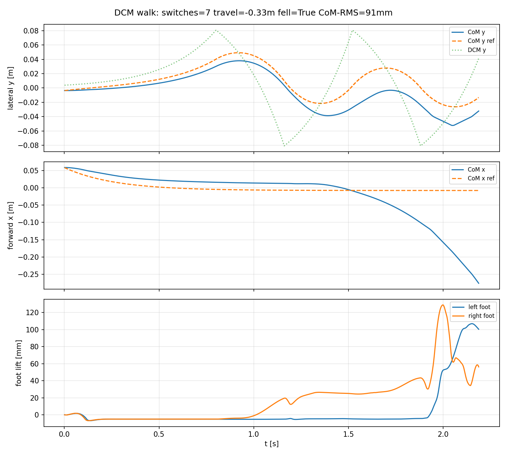

# Interaction Dynamics for Floating-Base Whole-Body Manipulation

**Yongyan Cao**

---

## Abstract

Floating-base loco-manipulation is commonly controlled through separate models for centroidal balance, whole-body inverse dynamics, and end-effector interaction. This paper takes a prediction–realization view: body- and task-level interaction *requests* are predicted in canonical residual-acceleration coordinates, while the full contact-constrained robot dynamics are used only to *realize* those requests at the current sample. For each port, model feedforward yields a normalized requested dynamics $\ddot e = u+d,$ where $u$ is a residual acceleration and $d$ an estimated interaction disturbance (the body port additionally carries a first-order centroidal angular-momentum channel, so no rigid-body attitude approximation is required). A whole-body inverse-dynamics QP then projects the body-wrench and task-acceleration requests onto the feasible set defined by rigid contacts, friction, center-of-pressure, joint, and actuator constraints, and the mismatch between requested and realized port dynamics is retained explicitly as a *realization residual* rather than hidden in the prediction model. The task port recovers through the full floating-base contact-consistent apparent inertia; the body port recovers translation through centroidal force balance and rotation through centroidal angular-momentum balance, with attitude supplied by an outer reference. A disturbance-augmented predictor yields conditional offset-free regulation when the cancelling interaction request is physically feasible. On a torque-actuated Unitree G1 model, the formulation demonstrates that robot dependence is confined to the recovery — the canonical predictor is unchanged while the task apparent inertia varies by more than an order of magnitude across a kinematic sweep — together with offset-free dual-port disturbance rejection under faithful recovery, anticipatory compensation of planned external loads (while internal arm momentum is shown to be compensated natively by the unified realizer), oracle-free contact-event detection, and explicit, bounded degradation when physical constraints are active. A final experiment demonstrates the layer riding a base that executes its own weight-shift, cutting a planned load's lateral tracking error by $2.4\times$ without disturbing the base motion. The contribution is not a replacement locomotion controller but a representation-and-realization interface for adding predictable, constraint-aware physical interaction on top of an existing whole-body locomotion stack.

**Index Terms** - interaction dynamics, centroidal MPC, whole-body control, floating-base robots, loco-manipulation, physical human-robot interaction, model predictive control.

---

## I. Introduction

Humanoid robots must regulate two physical interfaces at once. Their feet exchange forces with the environment to maintain balance and locomotion, while their hands exchange forces with people, tools, and objects to accomplish a task. Existing stacks usually assign these interfaces to different mathematical objects: a centroidal or single-rigid-body MPC plans contact forces, a whole-body QP maps those forces to joint commands, and an impedance-like controller regulates the hand. This decomposition is practical, but it hides the fact that both interfaces are manifestations of the same interaction-dynamics problem.

The question addressed here is not whether another whole-body control architecture can be assembled. It is whether floating-base manipulation admits the same normalized interaction-dynamics representation previously derived for fixed-base systems in [1]. If the answer is yes, then the balance controller and the manipulation controller need not be viewed as unrelated modules. They can be treated as two ports of one predictive representation, with robot-specific mechanics appearing only when the normalized commands are recovered as physical wrenches.

At the body port, the controlled interaction is the relation between centroidal motion and the net contact wrench. At the task port, it is the relation between end-effector motion and task wrench. In both cases, known dynamics and desired acceleration can be placed in feedforward, leaving a residual acceleration input:

$$
\text{physical wrench}
=\text{model feedforward}+\text{interaction inertia}\times u.
\tag{1}
$$

The resulting error model is the interaction-dynamics backbone established in [1]. The floating-base case is nontrivial because contact geometry, support changes, friction, center-of-pressure limits, actuator saturation, and arm-body reactions all affect whether a normalized acceleration can be realized. The central claim of this paper is therefore a prediction-realization separation principle: only interaction dynamics are predicted over a horizon, while robot dynamics are used at the current sample to project interaction requests onto the feasible whole-body dynamics. In this view, the full robot dynamics do not become a second prediction model; they define the instantaneous feasible set onto which normalized interaction commands are realized.

This leads naturally, but secondarily, to a dual predictive controller. The balance and task ports use the same canonical exact-ZOH predictor structure — the task port a double integrator, the body port a double integrator on the CoM error together with a first-order integrator on the centroidal angular momentum — and the body port recovers residual acceleration as a centroidal wrench while the task port recovers it as a contact-consistent task wrench. A whole-body interaction realizer then enforces the rigid-body dynamics and instantaneous feasibility constraints. Thus the architecture follows from the representation rather than serving as the paper's main premise.

The contributions are organized around this separation. First, the paper formulates floating-base balance and manipulation as two interaction ports that instantiate the normalized model of [1]. Second, it derives the centroidal and contact-consistent task recoveries showing that mass, centroidal inertia, contact mode, and task inertia do not alter the prediction matrices. Third, it localizes contact geometry, friction, center-of-pressure, actuator limits, and whole-body dynamics to recovery and instantaneous feasibility, clarifying exactly where floating-base constraints enter. Fourth, it realizes the representation as a split or coupled dual-MPC controller and specifies a Unitree G1 evaluation for offset rejection, arm-body coupling, support switching, active constraints, and Kalman-based event detection. The scope is deliberately bounded: while full torque-level, long-horizon locomotion stability under the G1's wide default stance remains an independent, orthogonal challenge left to specialized gait schedulers, this work validates the unified predictive interaction-dynamics *interface* — its dual-MPC signal flow and constraint-aware realization — under static and dynamic-base interaction, not a walking controller.

The central separation is therefore between prediction and physical realization. Level 1 and Level 3 are predictors: they optimize future residual accelerations for the body and task interaction dynamics. Level 2 is a realizer: it has no future state, no prediction horizon, and no future cost. It solves only the current-sample feasibility problem that maps the two interaction requests into generalized torques. Table I summarizes the roles.

| Level | Role | Mathematical object | Time scale |
|---|---|---|---|
| Level 1: body interaction port | Predict body-environment interaction | Interaction-dynamics MPC | Future |
| Level 2: whole-body interaction realizer | Realize interaction physically | Instantaneous constrained inverse-dynamics QP | Present |
| Level 3: task interaction port | Predict hand-task interaction | Interaction-dynamics MPC | Future |

**Fig. 1.** Floating-base whole-body manipulation represented as two normalized interaction-dynamics ports. The shared prediction object supplies the same constant exact-ZOH predictor to the body and task MPCs through folded dashed connections. The two MPCs produce residual-acceleration commands, which are converted into centroidal and task wrenches before entering the whole-body interaction realizer. The realizer is not an MPC; it is an instantaneous inverse-dynamics QP that projects the interaction requests onto feasible generalized torque commands for the Unitree G1/MuJoCo plant. The measured state, contacts, and wrenches feed directly into the Kalman disturbance estimator. The green dashed path denotes the optional arm-reaction preview used by the coupled realization.

---

## II. Related Work and Positioning

Centroidal and single-rigid-body MPC methods [2], [3], [8], [13] predict center-of-mass and body orientation while optimizing contact forces over a gait schedule. Their strength is horizon-wide treatment of friction, unilateral contact, and support geometry. The body-port controller retains these physical constraints but changes the decision coordinates from raw contact forces to a normalized residual acceleration plus a contact-wrench recovery.

Whole-body inverse dynamics and hierarchical QPs [4], [5], [7], [9] enforce rigid contacts, task priorities, and actuator limits. They remain essential here. The whole-body layer is not replaced by another predictive model; it is the instantaneous interaction realizer that maps a desired body-interaction wrench and a desired task-interaction acceleration to feasible generalized forces.

Operational-space impedance, admittance, and task-space MPC [6], [11], [12] regulate the end-effector port. Their apparent inertia generally depends on configuration and support. Residual-acceleration coordinates remove this inertia from the prediction dynamics while retaining it in force recovery.

Learning-based and data-driven pipelines are increasingly used to *generate* whole-body references: reinforcement-learning policies and human-demonstration retargeting engines produce rich, contact-consistent kinematic trajectories at a scale that hand-authored planners cannot match. These methods answer a complementary question — *what* motion to perform — but a kinematic reference, however expressive, does not by itself guarantee that the motion is executable under real contact forces, actuator limits, and unexpected physical interaction. Executing such trajectories on a physical humanoid still requires a local, model-based layer that enforces constraints and supplies reactive compliance when the environment pushes back. The present framework is exactly that layer: it takes a whole-body reference — hand-authored or learned — and provides the predictive interaction-dynamics interface and constraint-aware realization that turn complex kinematic intent into safe torque-level physical execution, rather than competing with the generator.

Closest in spirit is unified whole-body MPC for combined locomotion and manipulation [10], which optimizes a single predictive whole-body model. The present work differs in the prediction-realization split: only the two normalized interaction dynamics are predicted, while the full contact-constrained rigid-body dynamics act at the current sample as a feasibility projection rather than as a second predictive model. The normalized model, offset-free regulation, stability conditions, and impedance-limit interpretation belong to [1]; the standard centroidal model [8], [17], whole-body inverse dynamics [9], and the integrating-disturbance observer [16] are prior tools. This paper contributes their floating-base integration, anticipatory coupling, constraint realization, and empirical evaluation on a Unitree G1 in MuJoCo [15].

**Positioning.** We do not propose a locomotion controller and do not compete with the production gait stack that ships on platforms such as the Unitree G1. The contribution is an *interaction-dynamics layer* that sits on top of a mature balance/locomotion base: it predicts the two normalized interaction ports, anticipates cross-port and external-contact effects, and emits a centroidal-wrench and CoM-residual correction that the underlying base — or, when the base is idle, the standing whole-body realizer of Section VI — turns into feasible joint commands. The representation and realization claims (Section X, H1–H5) are evaluated in fixed support, where they are cleanest, and one experiment (H6) demonstrates the layer riding a moving base that commands its own weight-shift — both in the double-support regime where the whole-body realizer is sound, with no stepping. The locomotion-compatibility probes of Appendix A show only that the same realizer remains well-posed across contact-mode switches, not that this paper solves dynamic walking.

---

## III. Floating-Base Interaction Dynamics

Let

$$
q=[q_b^\top,q_j^\top]^\top,\qquad
M(q)\ddot q+h(q,\dot q)=S^\top\tau+J_c^\top\lambda+J_t^\top F_h,
\tag{2}
$$

where $q_b$ is the floating-base coordinate, $q_j$ contains actuated joints, $\lambda$ stacks contact wrenches, and $F_h$ is an external task wrench. Rigid active contacts satisfy

$$
J_c\ddot q+\dot J_c\dot q=0.
\tag{3}
$$

The controller uses two controlled ports. The body port is defined by CoM position and body-orientation errors, and the task port is defined by Cartesian end-effector tracking error. The active contact mode $\rho$ changes the contact Jacobian and feasible wrench set. Following [1], it does not change the normalized prediction pair used below.

---

## IV. Body Interaction Port

### A. Centroidal Normalization

Let $c$ be the CoM, $m$ the robot mass, $f_i$ the force at active contact $i$, and $g$ the signed gravitational-acceleration vector (so $mg$ is the weight). With lumped disturbance $w_c$,

$$
m\ddot c=\sum_{i\in\mathcal C_\rho}f_i+mg+w_c.
\tag{4}
$$

For $e_c=c-c_d$, define the desired resultant

$$
F_c^{\rm des}=m(\ddot c_d-g)+m u_c.
\tag{5}
$$

When the recovered contact forces satisfy $\sum_i f_i=F_c^{\rm des}$,

$$
\ddot e_c=u_c+d_c,\qquad d_c=m^{-1}w_c.
\tag{6}
$$

The rotational channel is expressed directly in centroidal **angular-momentum** coordinates, which avoids identifying the locked-inertia angular velocity with a rigid-body attitude rate. Let $k_G=A_G(q)\dot q$ be the centroidal angular momentum, with $A_G$ the angular block of the centroidal momentum matrix, and let $M_c$ be the net contact moment about the CoM. Then

$$
\dot k_G=M_c+w_\theta,
\tag{7}
$$

where $w_\theta$ lumps unmodeled moments. For the angular-momentum error $e_h=k_G-k_{G,d}$, define the desired net moment

$$
M_c^{\rm des}=\dot k_{G,d}+u_\theta.
\tag{8}
$$

When the recovered contacts realize $M_c=M_c^{\rm des}$,

$$
\dot e_h=u_\theta+d_\theta,\qquad d_\theta=w_\theta,
\tag{9}
$$

a **first-order** integrator. Unlike an attitude parametrization, (9) is exact under exact moment recovery: no locked-inertia-to-attitude approximation is introduced. When a desired attitude is required, it is supplied through the reference $k_{G,d}$ by an outer regulator (for example $k_{G,d}=-K_\theta\,\log(RR_d^\top)^\vee$); the local validity of that attitude map is then a property of the outer loop, not of the port dynamics. The two body channels therefore differ in order — a second-order integrator on the CoM error and a first-order integrator on the angular-momentum error — rather than being forced into a common attitude double integrator.

Crucially, neither the requested translational relation (6) nor the requested rotational relation (9) is the true plant: the recovered resultant force and net moment are realized by the whole-body layer only up to a **realization residual** (Section VI), which is retained explicitly rather than folded silently into $d$. Writing that residual as $r_b=[r_c^\top,r_h^\top]^\top$, the physically realized body port obeys

$$
\ddot e_c=u_c+d_c+r_c,\qquad
\dot e_h=u_\theta+d_\theta+r_h,
\tag{6$'$}
$$

with $r_b=0$ exactly when the requested centroidal wrench and moment are feasibly recovered. Stacking the second-order CoM channel and the first-order angular-momentum channel,

$$
x_b=[e_c^\top,\dot e_c^\top,e_h^\top]^\top,\quad
u_b=[u_c^\top,u_\theta^\top]^\top,\quad
d_b=[d_c^\top,d_\theta^\top]^\top,
$$

and applying the exact-ZOH construction of [1] to the requested model at period $T_b$ gives

$$
x_{b,k+1}=A_bx_{b,k}+B_b(u_{b,k}+d_{b,k}+r_{b,k}),
\tag{10}
$$

$$
A_b=
\begin{bmatrix}I_3&T_bI_3&0\\0&I_3&0\\0&0&I_3\end{bmatrix},
\qquad
B_b=
\begin{bmatrix}\tfrac12T_b^2I_3\\T_bI_3\\T_bI_3\end{bmatrix}.
\tag{11}
$$

The pair $(A_b,B_b)$ is constant; mass, centroidal inertia, contact locations, and contact mode appear only in wrench recovery and constraints.

**Proposition 1 (canonical body-port representation).** For a fixed active contact mode, the *requested* body-port dynamics are the canonical model (10) with the constant exact-ZOH pair (11): a double integrator on the CoM error and a first-order integrator on the centroidal angular-momentum error. The translational channel follows exactly from centroidal force balance (4)–(6); the rotational channel follows exactly from centroidal angular-momentum balance (7)–(9), with no attitude approximation. Mass, centroidal inertia, contact locations, friction, and center-of-pressure limits enter only the recovery map and the feasible input set, not $(A_b,B_b)$. The realized body port equals the requested model up to the realization residual $r_b$ of Section VI, and coincides with it when $r_b=0$.

**Proof.** Substituting the recovered resultant (5) into (4) gives (6); substituting the recovered moment (8) into (7) gives (9). Stacking yields a block-diagonal continuous-time generator (double integrator $\oplus$ first-order integrator) whose exact zero-order hold is (11) — the first-order block $\dot e_h=u_\theta+d_\theta$ discretizes exactly as $e_{h,k+1}=e_{h,k}+T_b(u_{\theta,k}+d_{\theta,k})$. The quantities $m$, $A_G$, $p_i$, $\rho$ convert $u_b$ into a centroidal wrench and contact forces through the recovery (12)–(15); the gap between requested and recovered wrench/moment is the residual $r_b$ defined in Section VI. $\square$

### B. Contact-Wrench Recovery and MPC

For stacked contact forces $f=[f_1^\top,\ldots,f_{n_c}^\top]^\top$, define

$$
\mathcal G_\rho(c,p_i)f=
\begin{bmatrix}
\sum_i f_i\\
\sum_i(p_i-c)\times f_i
\end{bmatrix}.
\tag{12}
$$

The desired centroidal wrench is

$$
W_b^{\rm des}(u_b)=
\begin{bmatrix}
m(\ddot c_d-g)+mu_c\\
\dot k_{G,d}+u_\theta
\end{bmatrix}.
\tag{13}
$$

Recovery enforces

$$
\mathcal G_\rho f=W_b^{\rm des}(u_b)+s_W,
\tag{14}
$$

where $s_W$ is a penalized wrench slack used only when exact realization is infeasible. This slack *is* the body-port realization residual of (6$'$): its force part maps to $r_c=m^{-1}s_W^{\rm (force)}$ and its moment part to $r_h=s_W^{\rm (moment)}$. We keep $r_b$ explicit rather than folding it into the disturbance $d_b$: $d_b$ is the external/model disturbance the observer is meant to cancel, whereas $r_b$ is a physical-infeasibility residual that no residual-acceleration input can remove. Equations (6), (9), and (10) are exact when recovery is exact ($r_b=0$) and hold with a logged residual otherwise. Each active contact additionally satisfies unilateral-force, friction-pyramid/cone, and center-of-pressure constraints; these, together with the joint-torque limits, are imposed by the realizer at the current sample (Section VI), not predicted over the body horizon. Under a scheduled contact sequence the recovery map $\mathcal G_{\rho_j}$ is re-formed per mode while $(A_b,B_b)$ remain unchanged.

Under the prediction–realization separation, the body MPC predicts only the normalized interaction dynamics; the contact forces $f$, the friction/CoP/unilateral sets $\mathcal F_\rho$, and the joint-torque limits are **not** carried in its horizon. They are imposed at the current sample by the whole-body realizer (Section VI). The recovery map (12)–(14) therefore acts once, at the present state and mode, to convert the first optimized residual acceleration $u_{b,0}$ into a centroidal wrench and contact forces; it does not appear inside the rollout.

What the horizon *does* respect is a conservative inner approximation of the residual accelerations the realizer can produce. At the current sample the realizer returns a polytope

$$
\widehat{\mathcal U}_{b,k}=\{\,u:\;H_{b,k}\,u\le h_{b,k}\,\},
\tag{14b}
$$

obtained by mapping the active friction, center-of-pressure, and torque limits into residual-acceleration coordinates — a box on $\|\Lambda_b u\|$ is the simplest conservative choice — and held fixed over the short horizon. The body MPC is then the purely normalized problem

$$
\begin{aligned}
\min_{U_b}\quad&
\sum_{j=0}^{N_b-1}
\left(
\|x_{b,j}\|_{Q_b}^2+
\|u_{b,j}+\hat d_{b,k}\|_{R_b}^2
\right)
+\|x_{b,N_b}\|_{P_b}^2\\
\text{s.t.}\quad&
x_{b,j+1}=A_bx_{b,j}+B_b(u_{b,j}+\hat d_{b,k}),\\
&u_{b,j}\in\widehat{\mathcal U}_{b,k}.
\end{aligned}
\tag{15}
$$

No robot-specific dynamics enter the state transition or the cost; the only footprint of the physics in the predictor is the frozen feasible set $\widehat{\mathcal U}_{b,k}$. Exact contact-force, friction, CoP, and torque feasibility — and the realization residual $r_b$ — are produced instantaneously by the realizer (22). This is the clean form of the separation: normalized prediction over a horizon, physical projection at the current sample. The task port (Section V) is organized identically, with its own feasible set $\widehat{\mathcal U}_{t,k}$.

The input-centered penalty is essential: for a constant estimated disturbance the cancelling equilibrium is $u_b=-\hat d_b$, so penalizing $\|u_b+\hat d_b\|$ rather than $\|u_b\|$ avoids reintroducing a steady-state offset.

---

## V. Task Interaction Port

The task port is not derived from a fixed-base arm model. In (2), $M(q)$ is the full floating-base mass matrix, including the unactuated base and all actuated joints, and $J_{c,\rho}$ is the active whole-body contact Jacobian. Using the contact-consistent inverse associated with mode $\rho$,

$$
\bar M_\rho^{-1}
=M^{-1}-M^{-1}J_{c,\rho}^\top
(J_{c,\rho}M^{-1}J_{c,\rho}^\top)^{-1}
J_{c,\rho}M^{-1},
\tag{16}
$$

the task inertia is

$$
\Lambda_t=(J_t\bar M_\rho^{-1}J_t^\top)^{-1}.
\tag{17}
$$

Thus $\Lambda_t$ already contains the floating-base, stance-contact, and arm-body inertial coupling induced by the full constrained system. The construction does not claim that the arm is dynamically isolated from the base; it only expresses the realized task acceleration in residual-acceleration coordinates after the current contact constraints have been imposed. Base reactions that are predictable from the planned task wrench are handled by the coupled body-port preview in Section VII, while unmodeled coupling and recovery error are collected in $d_t$ and in the realization residuals reported by (22).

Projecting the constrained rigid-body dynamics into the task coordinates gives the contact-consistent task-space dynamics

$$
\Lambda_t\,\ddot x_t+\mu_{t,\rho}=F_t^{\rm act}+F_h+r_{t,\rm dyn},
\tag{17b}
$$

where $\mu_{t,\rho}=\bar J_t^\top h-\Lambda_t\dot J_t\dot q$ collects Coriolis, centrifugal, and gravity terms, $F_t^{\rm act}$ is the task-space wrench *actually* produced by the joint torques, $F_h$ is the external task wrench, and $r_{t,\rm dyn}$ lumps contact-consistency and higher-priority null-space couplings. For $e_t=x_t-x_{t,d}$, the controller **requests** the wrench

$$
F_t^{\rm cmd}=F_{t,\rm ff}+\Lambda_tu_t,\qquad
F_{t,\rm ff}=\Lambda_t\ddot x_{t,d}+\mu_{t,\rho},
\tag{18}
$$

equivalently the acceleration request $\ddot x_t^{\rm req}=\ddot x_{t,d}+u_t$. Let $\ddot x_t^{\rm real}$ be the acceleration the whole-body realizer actually imposes, and define the **realization residual**

$$
r_t=\ddot x_t^{\rm real}-\ddot x_t^{\rm req}.
\tag{18b}
$$

Substituting (18) into (17b): when the requested wrench is realized exactly ($F_t^{\rm act}=F_t^{\rm cmd}$, $r_t=0$) the nominal acceleration cancels and $\ddot e_t=u_t+\Lambda_t^{-1}F_h+d_{\rm model}$. In general the realized task port is

$$
\ddot e_t=u_t+d_{h,t}+r_t,\qquad
d_{h,t}=\Lambda_t^{-1}F_h+d_{\rm model},
\tag{19}
$$

with $d_{h,t}$ the external/model disturbance the observer is meant to cancel and $r_t$ the physical-infeasibility residual — kept distinct rather than both dumped into a single lumped term. The requested model $\ddot e_t^{\rm req}=u_t+d_{h,t}$ discretizes by exact ZOH as

$$
x_{t,k+1}=A_tx_{t,k}+B_t(u_{t,k}+d_{h,t,k}+r_{t,k}),
\tag{20}
$$

with $(A_t,B_t)$ the canonical exact-ZOH double integrator of (11), dimension three.

**Proposition 2 (contact-consistent task port).** For a fixed active contact mode with $J_{c,\rho}M^{-1}J_{c,\rho}^\top$ and $J_t\bar M_\rho^{-1}J_t^\top$ nonsingular on the operating set, the *requested* end-effector port is the canonical model (20) with a constant exact-ZOH pair; configuration and contact mode enter through $\Lambda_t$, the feedforward $\mu_{t,\rho}$, and the feasible set, not through $(A_t,B_t)$. The realized port equals the requested model up to $r_t$, and coincides with it when $r_t=0$.

**Proof.** The constrained inverse (16), formed from the full floating-base mass matrix, restricts admissible accelerations to directions compatible with the active rigid contacts, giving the contact-consistent apparent inertia $\Lambda_t$ (17). Substituting the commanded wrench (18) into the constrained task dynamics (17b) cancels the nominal terms and leaves (19); the exact ZOH of the requested part is (20). The gap $r_t$ between requested and realized task acceleration is the realizer residual $s_t$ of (22). $\square$

Like the body port, the task MPC is normalized-only — it minimizes $\sum_j\!\big(\|x_{t,j}\|_{Q_t}^2+\|u_{t,j}+\hat d_{t,k}\|_{R_t}^2\big)+\|x_{t,N_t}\|_{P_t}^2$ subject to $x_{t,j+1}=A_tx_{t,j}+B_t(u_{t,j}+\hat d_{t,k})$ and $u_{t,j}\in\widehat{\mathcal U}_{t,k}$. The feasible set

$$
\widehat{\mathcal U}_{t,k}=\{\,u:\ \|F_{t,\rm ff,k}+\Lambda_{t,k}u\|_\infty\le F_{\max},\ \|\tau_{{\rm base},k}+J_t^\top(F_{t,\rm ff,k}+\Lambda_{t,k}u)\|_\infty\le\tau_{\max}\,\}
\tag{21}
$$

is a conservative box on the recovered *total* task wrench and the affine-in-$u$ arm-torque surrogate ($\tau_{{\rm base},k}$ the frozen gravity/Coriolis-plus-balance bias), evaluated at the current state/mode and frozen over the short horizon; it bounds the total commanded wrench, not the corrective increment. Exact torque and contact feasibility is still enforced instantaneously by the realizer (22). The only object reused across samples is the canonical predictor $(A_t,B_t)$; $\Lambda_t$, $\mu_{t,\rho}$, and $\widehat{\mathcal U}_{t,k}$ are recomputed each sample. Fast configuration changes, near-singular task Jacobians, and box approximations create recovery mismatch, which appears as $d_{h,t}$ and $r_t$ rather than as a certified robust-stability guarantee.

---

## VI. Whole-Body Interaction Realizer

The two MPCs output a desired body interaction request and a desired task interaction request. These enter the realizer in their natural coordinates: the body request as a centroidal wrench $W_b^{\rm des}$ realized by the contact forces, and the task request as the desired end-effector acceleration $\ddot x_{t,d}+u_t^\star$ realized by the joint torques. Under *exact, unconstrained* recovery this acceleration request and the commanded task wrench $F_t^{\rm cmd}$ correspond through $\Lambda_t$; the correspondence is **not** one-to-one once torque saturation, friction/CoP limits, or a higher-priority balance task are active, precisely because the realizer must then trade the request off against those constraints and reports the shortfall as the residual $s_t=r_t$. Imposing the task as an acceleration and letting the realizer expose $s_t$ is therefore the honest form. This asymmetry with the body port is deliberate: the body wrench is what the unilateral, friction, and CoP constraints act on, whereas the task objective is most directly imposed as an acceleration. This middle layer does not predict future robot states and is therefore not an MPC. Its role is physical realization: at the current sample, it projects the two interaction requests onto the set of generalized accelerations, contact wrenches, and joint torques that satisfy the floating-base dynamics and constraints. It is therefore better understood as a projection operator from interaction space to the robot-feasible torque set, not as another controller that plans robot motion over time.

Let $S_j$ select the actuated joint coordinates from $q$, and let $\tau_{\rm ref}$ be a nominal torque used only for regularization, such as the previous command or a gravity-compensating inverse-dynamics torque. With polyhedral friction pyramids, the whole-body interaction realizer is the convex instantaneous inverse-dynamics QP

$$
\begin{aligned}
\min_{\ddot q,\tau,\lambda,s_b,s_t}\quad&
\|s_b\|_{W_b}^2
+\|s_t\|_{W_t}^2
+\|\tau-\tau_{\rm ref}\|_{W_\tau}^2\\
\text{s.t.}\quad&
M\ddot q+h=S^\top\tau+J_c^\top\lambda+J_t^\top F_h,\\
&J_c\ddot q+\dot J_c\dot q=0,\\
&\mathcal G_\rho\lambda+s_b=W_b^{\rm des},\\
&J_t\ddot q+\dot J_t\dot q+s_t=\ddot x_{t,d}+u_t^\star,\\
&\lambda\in\mathcal F_\rho,\quad
\tau_{\min}\le\tau\le\tau_{\max},\\
&q_{j,\min}+\epsilon\le
S_j(q+\Delta t\dot q+\tfrac12\Delta t^2\ddot q)
\le q_{j,\max}-\epsilon.
\end{aligned}
\tag{22}
$$

The external task wrench $F_h$ appearing in the dynamics row is the value measured at the current sample (from a force/torque sensor, or the observer estimate $\Lambda_t\hat d_t$ when no sensor is available); it is a known constant within the instantaneous QP, not a decision variable. The variables are the generalized acceleration $\ddot q$, joint torque $\tau$, active contact wrench vector $\lambda$, body-wrench realization residual $s_b$, and task-acceleration realization residual $s_t$. The first two equality constraints enforce rigid-body dynamics and active-contact consistency at the present sample. The next two constraints define the projection residuals: $s_b$ measures the part of the body-port wrench request that cannot be realized by the active contact wrench, and $s_t$ measures the part of the task-port acceleration request that cannot be realized simultaneously with the other constraints. The final joint-limit row uses a one-step constant-acceleration feasibility check; without the $\frac12\Delta t^2\ddot q$ term, the row would not depend on the QP decision variable and would only check the current state.

With a friction-pyramid approximation, $\mathcal F_\rho$ is polyhedral and (22) is a standard convex QP solvable by an operator-splitting method such as [14]. If exact Coulomb friction cones are used instead, the same realization layer becomes a second-order cone program. Balance feasibility can be made hard by fixing $s_b=0$ or soft by assigning a large $W_b$; task tracking is usually softened through $s_t$ when the two interaction requests conflict. The realizer reports $s_b$, $s_t$, and active constraint margins back to the disturbance estimators and upper layers. These residuals are evidence that the requested interaction acceleration was not physically realizable at the current sample, rather than prediction errors from a second whole-body MPC.

---

## VII. External-Wrench and Internal-Momentum Preview

The split controller solves the body MPC (15) and the task MPC independently; whatever the arm does reaches the body port only after it is observed, and is rejected reactively through $d_b$. The coupled controller instead previews the *planned* effect of the arm on the centroidal dynamics. Two physically distinct effects must be kept separate, because conflating them double-counts forces.

**External task wrench.** When the hand exchanges a real contact force with the environment — pushing, carrying, leaning on a rail — the environment reaction $F_h^{\rm plan}$ (and moment $M_h^{\rm plan}$) enters the *whole-robot* centroidal-momentum balance as a genuine external wrench, with known centroidal contribution

$$
W_{G,h}^{\rm ext}=
\begin{bmatrix}
F_h^{\rm plan}\\
(x_h-c)\times F_h^{\rm plan}+M_h^{\rm plan}
\end{bmatrix}.
\tag{23}
$$

The body port previews it by adding $-W_{G,h}^{\rm ext}$ to the desired centroidal wrench (13) over the horizon, so the contacts are pre-loaded before $d_b$ has to build up.

**Internal arm motion.** A fast *free-space* reach exerts no external force on the robot. The operational-space control wrench $F_t^{\rm ctrl}=F_{t,\rm ff}+\Lambda_t u_t$ acts through joint torques and is *internal*; it must **not** be inserted into the centroidal balance as an external $-F_t^{\rm ctrl}$, because internal actuation cannot change the total centroidal momentum and doing so double-counts. The genuine base reaction is the rate of change of centroidal momentum carried by the arm. Partitioning the centroidal momentum matrix into base, leg, and arm columns in $h_G=A_G(q)\dot q$, the planned arm motion contributes

$$
\dot h_{G,\rm arm}^{\rm plan}
=A_{G,\rm arm}(q)\,\ddot q_{\rm arm}^{\rm plan}
+\dot A_{G,\rm arm}(q,\dot q)\,\dot q_{\rm arm}^{\rm plan},
\tag{23b}
$$

which the body port previews by $W_{b,\rm preview}=-\dot h_{G,\rm arm}^{\rm plan}$ from (23b). In both cases the preview is affine in the arm plan, so it changes only the lifted input map or linear constraint rows of the body MPC, not the state matrix $(A_b,B_b)$; the intent is identical — compensate a predictable centroidal disturbance before observer feedback is required — but the source (external contact force vs. internal momentum redistribution) is made explicit. These two sources are not equally binding on the realizer of Section VI, however. The internal-momentum term (23b) is *already* accounted for by the whole-body QP: its center-of-mass objective drives the full $J_{\rm com}\ddot q$ — spanning arm and legs — to the commanded value, so a planned arm swing is compensated natively by the shared CoM Jacobian without any explicit preview. The external wrench (23), by contrast, is a genuinely unmodeled load: the QP does not see it, so without preview it reaches the body port only through the disturbance observer, which lags. The evaluation (Section X, H3) therefore contrasts both cases, and finds that preview is essential for the external wrench and redundant for the internal momentum.

A single stacked QP is possible when both horizons share a grid; a simpler alternative retains two QPs and passes the planned arm wrench/momentum sequence to the body port. No equivalence between weighted and strict lexicographic priority is assumed; hard balance constraints, explicit task slacks, and logged realization residuals define the actual priority.

---

## VIII. Kalman Estimation and Contact Events

Following the integrating-disturbance principle for zero steady-state error under persistent disturbances [16], and its instantiation in [1], each normalized model is augmented by a constant disturbance state:

$$
\begin{bmatrix}x_{k+1}\\d_{k+1}\end{bmatrix}
=
\begin{bmatrix}A&B\\0&I\end{bmatrix}
\begin{bmatrix}x_k\\d_k\end{bmatrix}
+
\begin{bmatrix}B\\0\end{bmatrix}u_k
+
\begin{bmatrix}0\\I\end{bmatrix}w_k.
\tag{24}
$$

Here $w_k$ drives the disturbance random walk; process noise acting directly on $x_k$ would be modeled by a separate state-noise term. The body observer estimates a six-dimensional residual wrench acceleration; the task observer estimates a three-dimensional residual acceleration. Offset-free regulation requires detectability, estimator convergence for a constant disturbance, and feasibility of the cancelling input.

The feedforward and recovery terms require generalized velocity. On hardware, $\dot q$ should not be obtained by raw encoder differencing inside the high-rate loop. The intended implementation uses filtered velocity estimates, for example a low-pass or observer-based differentiator feeding the rigid-body model, with the remaining phase lag and noise absorbed by the disturbance state and by the realization residuals. This filtering is an implementation requirement, not a theoretical replacement for torque-level validation.

A contact event creates an innovation because the assumed recovery set no longer matches the plant. This motivates a detector based on normalized innovation statistics:

$$
\eta_k=\nu_k^\top S_k^{-1}\nu_k.
\tag{25}
$$

A mode change is declared only after $\eta_k$ exceeds a calibrated threshold for $n_d$ consecutive samples and a candidate contact is geometrically plausible. This is safer than claiming that the aggregate disturbance alone uniquely identifies a particular foot: without additional kinematic information, different external wrenches can be indistinguishable at the centroidal port.

---

## IX. Relation to the Fixed-Base Theory

The normalized predictor, nominal offset-free regulation, and impedance interpretation are taken directly from [1] and are not re-proved here. It is essential, however, that [1] characterizes the *requested* interaction dynamics $\ddot e=u+d$; the physically realized closed loop additionally carries the realization residual $r$ and the active-set evolution of the whole-body realizer. Stability and offset-free behavior of the realized, constrained interconnection therefore do not follow from the fixed-base results by themselves. We state three conditional results that make the dependence explicit.

**Proposition 3 (faithful realization).** If the realization residual vanishes, $r_i\equiv0$ — the requested port wrench, moment, and acceleration are exactly recovered within the feasible set — then the realized port dynamics coincide with the canonical requested model of Propositions 1–2, and every requested-model property inherited from [1] holds for the realized port.

**Proposition 4 (conditional offset-free regulation).** Fix a contact mode and suppose the realizer admits a locally constant active set and realizes the requested port acceleration with a *constant matched* residual $r^\star$, so the effective disturbance $d^{\rm eff}=d+r^\star$ is constant. If the augmented observer is detectable, its estimate $\hat d^{\rm eff}$ converges, and the cancelling input $u=-\hat d^{\rm eff}$ lies in the feasible set $\widehat{\mathcal U}_k$, then the regulated port reaches zero steady-state error. When the active set switches, or the residual is state-dependent, only *bounded* regulation is claimed: the observer tracks $d^{\rm eff}$ but cannot null a residual that no feasible input can cancel. This is exactly the mechanism behind the H2 result — offset-free regulation appears only once the recovery is faithful ($r^\star$ small and matched), and degrades when it is not.

**Proposition 5 (ultimate boundedness under a bounded residual).** Suppose the whole-body realizer keeps the realization residual uniformly bounded on the operating set, $\sup_i \sup_k \lVert r_{i,k}\rVert \le \varepsilon$, and that the nominal requested-model closed loop of [1] is input-to-state stable (ISS) with respect to its disturbance input. Then, treating $r$ as an exogenous input in $\ddot e = u + d + r$, the realized augmented error state is ultimately bounded, with ultimate bound $\mathcal{O}(\varepsilon)$ (a class-$\mathcal{KL}$ transient plus a class-$\mathcal{K}$ gain on $\varepsilon$); as $\varepsilon\to 0$ Proposition 3 is recovered. This is the sense in which the prediction–realization split insulates the predictor: the configuration- and contact-dependent mechanics enter only through $r$, so as long as the realizer is *feasible with margin* — no persistent torque saturation, friction-cone or CoP violation, or ill-conditioned $\Lambda_t$/$A_G$ — the residual is bounded and the error state stays bounded. The bound $\varepsilon$ is not assumed blindly: the observer innovations and the active-constraint margins reported in Section X are precisely the online monitors of it, and a certificate that the realizer *guarantees* a given $\varepsilon$ over a prescribed operating envelope (rather than observing it a posteriori) is the robust-feasibility question left open below.

Several conditions are specific to this floating-base realization and must be checked independently. The centroidal momentum matrix $A_G$ and the task apparent inertia $\Lambda_t$ are assumed finite and well-conditioned on the operating set; the body rotational channel is regulated in angular-momentum coordinates, so no attitude chart enters the port dynamics — a local orientation chart is used only when an outer loop converts a desired attitude into the angular-momentum reference $k_{G,d}$. The cancelling residual accelerations and moments must be realizable by contact wrenches and joint torques within the physical constraints. Any recovery residual from the whole-body interaction realizer is treated as part of the disturbance model, and estimator convergence is considered only for contact modes that are correctly modeled or correctly detected. Thus citation of [1] does not by itself prove recursive feasibility of the contact-constrained G1 controller.

Constant $(A,B)$ removes model switching from the normalized state dynamics, but the feasible input set still switches with contact mode. Stability under arbitrary switching does not follow automatically. A certified switching claim would require either recursive feasibility for the scheduled mode sequence with a terminal set and terminal cost, or a common Lyapunov certificate for the actual constrained feedback regions. Until such a certificate is completed, the paper reports bounded empirical switching performance rather than certified arbitrary-switching stability.

Finally, the body and task ports are not two independent linear systems in closed loop. The realizer (22) is a single active-set-dependent, piecewise-affine projection of *both* requests onto the feasible generalized-force set; when the requests conflict or a constraint activates, the residuals $s_b,s_t$ couple the ports. The two ideal per-port models therefore compose into the physical closed loop only through that projection, and certifying the coupled constrained interconnection — not merely each requested port in isolation — remains open. The experiments consequently report the realized residuals and active-constraint margins directly, rather than asserting inherited closed-loop stability.

---

## X. Unitree G1 Evaluation

The evaluation uses a Menagerie-derived Unitree G1 model as the common plant. The comparisons are organized around hypotheses rather than around the software layers themselves. This is important because the paper's claim is representation-level: both interaction ports should share the same predictor, while the floating-base mechanics appear in recovery. H1–H5 are reported below and all hold on the standing torque-actuated G1 (H2 offset-free regulation is demonstrated on the full realizer, not only at the representation level), and H6 demonstrates the interaction layer on a moving base that commands its own weight-shift; only the sustained-walking form of the benchmark depends on the dynamic-gait realizer and remains future work.

| Hypothesis | Comparison | Primary Evidence | Status |
|---|---|---|---|
| H1: normalized prediction is port-independent | conventional centroidal MPC vs. centroidal interaction MPC | same $(A,B)$, command equivalence, $\Lambda_t$ variation | evaluated (Table II) |
| H2: disturbance estimation gives offset-free dual-port regulation | no observer vs. body/task Kalman observers | steady-state hand and CoM error under persistent force | evaluated (Table III): offset-free at the representation level and on the standing G1 realizer |
| H3: preview compensates what the realizer does not model | split vs. coupled prediction, external load vs. internal arm momentum | CoM peaks during each planned reaction | evaluated (Table IV) |
| H4: contact events can be detected without an oracle | detected event vs. scripted-oracle event | latency, missed events, false positives | evaluated (Table V) |
| H5: constraints belong to recovery | constrained vs. unconstrained recovery | friction, torque violations and tracking slack | evaluated (Table VI) |
| H6: interaction layer adds value on a moving base | layer off vs. on, while the base weight-shifts | lateral base-tracking error under a planned load | evaluated (Table VII) |

The controller set is C0 joint-PD/operational-space PD, C1 conventional force-input centroidal MPC, C2 dual interaction MPC without observers, C3 split dual interaction MPC with body/task observers, C4 coupled dual interaction MPC with arm-reaction preview, and C5 the oracle-contact upper bound. Randomized studies use fixed seeds and paired disturbances; failed and fallen trials remain in the success denominator. A claim of dynamic walking interaction is reserved for the torque-actuated inverse-dynamics benchmark with randomized pushes and Kalman/event detection active.

### Results for H1 (Port-Independent Prediction)

H1 is a representation-level claim and is validated directly. First, the two *double-integrator* channels — the planar CoM double integrator of the body port (the CoM block of Proposition 1) and the hand double integrator of the task port — are the *same* constant exact-ZOH pair: measured against the closed-form (11), $\max\|A-A_\text{ZOH}\|=\max\|B-B_\text{ZOH}\|=0$ for both ports; only the dimension differs. Second, the body port's *angular-momentum* channel of Proposition 1 is checked in its own right: the normalized first-order integrator $\dot e_h=u_\theta+d_\theta$ has discrete pair $(A_\theta,B_\theta)=(I,T I)$, which equals the exact-ZOH first-order integrator to machine precision and is configuration-independent, while the centroidal rotational inertia $I_G(q)$ that the moment recovery must invert varies over the same arm sweep (eigenvalues $[2.4,6.9,8.5]\to[2.7,7.1,8.7]$ kg·m², $\approx$11%) — the momentum-channel analogue of the $\Lambda_t$ result. Third, the normalized centroidal MPC (decision = residual acceleration) and a conventional force-input centroidal MPC (decision = CoM force, matched weights $R_f=R/m^2$) are the same feedback map: over 2000 random states and disturbances the maximum command difference is $7.5\times10^{-6}$, i.e., the reparametrization is lossless. Fourth, over a 36-point right-arm kinematic sweep the contact-consistent task inertia $\Lambda_t$ (17) varies from $0.33$ to $13.1$ kg on its diagonal — up to $3840\%$ — while the predictor $(A_t,B_t)$ stays exactly constant. All configuration and contact dependence therefore lives in recovery, not in prediction, which is the H1 claim (Fig. 2, left).

| H1 evidence | Quantity | Result |
|---|---|---|
| Shared predictor across ports (double-integrator channels) | $\max\|A-A_\text{ZOH}\|$, $\max\|B-B_\text{ZOH}\|$ (body & task) | $0.0$ |
| Angular-momentum channel is constant exact-ZOH | $\max\|A_\theta-A_\text{ZOH}\|$, $\max\|B_\theta-B_\text{ZOH}\|$; $I_G(q)$ over sweep | $0.0$; $I_G$ varies $\approx$11%, $(A_\theta,B_\theta)$ constant |
| Normalized $\equiv$ force-input centroidal MPC | $\max\|u_\text{norm}-u_\text{force}\|$, 2000 states | $7.5\times10^{-6}$ |
| Configuration confined to recovery | $\mathrm{diag}(\Lambda_t)$ range over arm sweep | $0.33$–$13.1$ kg (up to $3840\%$), $(A_t,B_t)$ constant |

**Table II.** H1 evidence: the normalized predictor is port-independent and configuration-invariant — for both the double-integrator channels and the body port's angular-momentum channel — while all robot-specific mechanics (task inertia $\Lambda_t$, centroidal inertia $I_G$) appear only in recovery.

### Results for H2 (Offset-Free Dual-Port Regulation)

H2 is tested in two settings. First, at the *representation level*, where the recovery is faithful so that $\ddot e=u+d$ holds exactly by construction (using the G1 mass for the body port and the contact-consistent $\Lambda_t$ for the task port), a sustained disturbance is applied and the steady-state error is compared with the disturbance observer disabled and enabled. The observer estimate converges to the true disturbance and the offset is removed. Second, the same test is run on the *full torque-actuated G1 realizer* of (22): the body-port residual acceleration is realized by driving the whole-body CoM linear acceleration to $\ddot c_d+u_c$ (equivalently, allocating the centroidal wrench $m(\ddot c_d-g)+m u_c$ across the contacts through the inverse-dynamics QP), and the task-port residual acceleration is realized as the end-effector acceleration $\ddot x_{t,d}+u_t$. With this faithful recovery in place, $\ddot e=u+d$ holds on the robot and the observer becomes consistent with the plant, so offset-free regulation carries over to the full realizer for both ports:

| Port | Setting | Sustained disturbance | No observer | With observer | Reduction |
|---|---|---|---:|---:|---:|
| Body (CoM) | representation | 12 N pelvis force | 125.0 mm | 1.4 mm | 90$\times$ |
| Task (hand) | representation | 8 N hand force | 18748 mm | 89 mm | 211$\times$ |
| Body (CoM) | full G1 realizer | 12 N pelvis force | 44.9 mm | 2.7 mm | 17$\times$ |
| Task (hand) | full G1 realizer | 8 N hand force | 151.3 mm | 30.9 mm | 4.9$\times$ |

**Table III.** H2, representation level and full torque-actuated G1 realizer. The large no-observer task figures reflect the small task apparent inertia ($\Lambda_t\!\approx\!0.4$ kg laterally), which turns an 8 N force into a large normalized acceleration disturbance; the offset-free observer removes it in both settings, and neither port falls on the robot. The smaller reduction ratios on the robot reflect that the whole-body QP already holds a partial baseline offset without the observer, not a weaker cancellation.

An earlier realizer that mapped the body residual acceleration to an approximate posture *tilt* rather than to a centroidal wrench did **not** achieve this: the observer then degraded the CoM error (48 mm without observer, 137 mm with it) and the task port fell, because $\ddot e=u+d$ was not faithfully realized and the offset-free observer was inconsistent with the plant. Replacing the posture-tilt heuristic with the CoM-acceleration/centroidal-wrench recovery above is precisely what makes H2 hold on the robot; it confirms the paper's thesis that offset-free regulation is a property of the normalized representation that transfers to the robot exactly when recovery is faithful. The remaining production step is dynamic-gait recovery (Section X), where the contact set switches during walking.

**Fig. 2.** (a) H1: the task apparent inertia $\mathrm{diag}(\Lambda_t)$ over the arm sweep (left) with the constant $(A,B)$ and the command-equivalence residual annotated (right). (b) H2 on the full torque-actuated G1 realizer: CoM error (left) and hand error (right) under a sustained force with the observer disabled vs enabled — the observer removes the steady-state offset and neither port falls.

The three fixed-support hypotheses H3–H5 follow directly. All are realized by the torque-actuated whole-body QP (22). Its fixed-support push-rejection behavior, together with *locomotion-compatibility* probes that lie outside the interaction-dynamics claim of this paper — a root-assisted walking visualization and torque-level stepping across contact-mode switches — is collected in Appendix A.

### Results for H3 (Preview Compensates What the Realizer Does Not Model)

H3 tests the coupled realization of Section VII in *both* of its forms and contrasts them. On the standing torque-actuated G1, we apply two planned cross-port reactions of comparable magnitude ($\approx$45 N) during $1$–$3$ s and compare split (reactive rejection through the body observer) against coupled (preview fed into the body-port command). In the **external-wrench** case (23) a fast oscillating interaction load $F_h^{\rm plan}$ (45 N at 1.6 Hz) acts on the body and the coupled controller previews $-F_h^{\rm plan}/m$; in the **internal-momentum** case (23b) a fast right-arm swing (shoulder pitch/roll and elbow at 1.2 Hz, *no* external force) redistributes centroidal momentum and the coupled controller previews the induced CoM reaction $-\dot l_{G,\rm arm}/m = -J_{\rm com}[:,{\rm arm}]\,\ddot q_{\rm arm}$:

| Reaction (planned, $\approx$45 N) | Split peak / RMS | Coupled peak / RMS | Peak reduction |
|---|---:|---:|---:|
| External wrench (23), unmodeled by QP | 37.7 / 20.9 mm | 22.1 / 11.9 mm | $1.7\times$ |
| Internal arm momentum (23b) | 9.2 / 7.1 mm | 15.2 / 9.5 mm | $0.6\times$ |

**Table IV.** H3: peak and RMS lateral CoM excursion during a planned cross-port reaction, split vs. coupled prediction (Fig. 3a). The preview helps for the external wrench, which the whole-body QP does not model, but *not* for the internal arm momentum: the QP's CoM objective already drives the full $J_{\rm com}\ddot q$ across arm and legs, so an equal-magnitude arm swing produces a $4\times$ smaller uncompensated transient (9.2 vs 37.7 mm) with no preview, and adding the external-style preview only perturbs a CoM command the shared Jacobian is already satisfying. Preview therefore belongs to what the realizer does not model — external contact loads — while internal-momentum coupling is handled natively by the unified realizer.

### Results for H4 (Contact Events Detected Without an Oracle)

H4 tests the innovation-based detector of Section VIII. A sequence of lateral brace-contact onsets and offsets (six events) is applied to the standing G1; each creates an unmodeled wrench, so the body CoM disturbance observer's normalized innovation $\eta_k=\nu_k^\top S_k^{-1}\nu_k$ spikes. A change detector declares an event when $\eta_k$ exceeds a calibrated threshold (mean $+6\sigma$ of a quiet window) for three consecutive samples, with a refractory interval; the detector never reads the event schedule, which serves only as the oracle for scoring:

| Metric | Value |
|---|---:|
| True contact events | 6 |
| Detected | 6 |
| Missed | 0 |
| False positives | 0 |
| Mean / max detection latency | 56 / 58 ms |

**Table V.** H4: contact-event detection from the body observer innovation, scored against the scripted-event oracle. All six onsets/offsets are detected with no misses or false positives at $\sim$56 ms latency (Fig. 3b). The latency is the time for the CoM disturbance to register in the innovation; a task-port observer or direct force sensing would reduce it further.

**Fig. 3.** (a) H3: lateral CoM excursion, split vs. coupled preview, for an external interaction load (left) and an equal-magnitude internal arm swing (right). Preview lowers the external-load excursion; the internal-momentum excursion is already small (native QP compensation) and preview does not reduce it. (b) H4: the normalized innovation (NIS) over the trial with the calibrated threshold; green dotted lines are oracle contact events, orange lines are detections.

### Results for H5 (Constraints Belong to Recovery)

H5 tests that friction cones, unilateral contact, and joint-torque limits are enforced in the recovery realizer (22), not in the normalized predictor. Under a sustained 45 N lateral push on the standing G1, we compare **constrained** recovery (friction pyramid and torque limits active in the QP, $\mu=0.5$) with **unconstrained** recovery (both dropped), measuring the constraint violations of the *recovered* — QP-commanded — contact forces and joint torques:

| Recovery | Friction-pyramid violation | Torque-limit violation | CoM error | Fall |
|---|---:|---:|---:|:--:|
| Constrained | 0.3 N | 0.06 N·m | 6.8 mm | no |
| Unconstrained | 900 N | 945 N·m | — | yes (0.51 s) |

**Table VI.** H5: constraint violations of the recovered wrench/torque, constrained vs. unconstrained recovery (Fig. 4). With the constraints in recovery the recovered forces stay inside the friction pyramid and the torques inside the actuator limits (violations at the solver tolerance) and the robot rejects the push with a small bounded CoM error — the tracking *slack* that a hard constraint trades for feasibility. Without them the recovery commands contact forces $\sim$900 N outside the friction cone and torques $\sim$945 N·m over the actuator limit, which are not physically realizable, and the robot collapses in half a second. The constraints therefore do real work, and they live entirely in the instantaneous recovery — the predictor $(A,B)$ is identical in both runs.

**Fig. 4.** H5: friction-pyramid violation (left) and torque-limit violation (right) of the recovered forces/torques over the push, constrained vs. unconstrained recovery. Constrained recovery stays at zero (feasible); unconstrained recovery diverges to hundreds of newtons / newton-metres of violation.

### Results for H6 (Interaction Layer on a Moving Base)

H1–H5 hold the base fixed. H6 is the direct test of the paper's positioning: that the contribution is an interaction-dynamics *layer* that rides on a base doing its own motion and adds predictable physical interaction, without a locomotion controller of its own. The base commands its own center-of-mass trajectory — a $\pm$50 mm forward/backward weight-shift at 0.25 Hz, feasible inside the support polygon and standing in for what a balance/locomotion base would command — while a planned lateral interaction load (45 N at 1.6 Hz, e.g. a pushed/pulled object or carried load reacted at the trunk) disturbs the CoM. The body port tracks the base reference through the normalized MPC; the interaction layer, when *on*, previews the planned load's centroidal effect $-F_h^{\rm plan}/m$ (23), while *off* it leaves the same load to the body observer. The comparison is made on the lateral axis, where the load acts and the preview corrects; the forward axis carries the base's own motion. Throughout, the G1 stays in double support and neither run falls.

| Interaction layer | Lateral base-tracking RMS / peak | Forward base-tracking RMS |
|---|---:|---:|
| Off (observer only) | 24.4 / 45.5 mm | 35.6 mm |
| On (load preview) | 10.3 / 21.8 mm | 35.4 mm |
| Reduction | $2.4\times$ / $2.1\times$ | $\approx 1\times$ |

**Table VII.** H6: lateral CoM tracking error of the base's own reference during the planned load, interaction layer off vs. on (Fig. 5). The layer cuts the lateral load-induced tracking error by $2.4\times$ while leaving the base's forward weight-shift tracked essentially identically ($35.6$ vs $35.4$ mm) — it adds interaction rejection on the axis the load excites without disturbing the base's commanded motion. This is the interaction value-add on a moving base, in the double-support regime where the whole-body realizer is sound; on a stationary base the same preview recovers the $2.9\times$ figure of H3.

**Fig. 5.** H6: lateral base-reference CoM tracking error, interaction layer off vs. on, during a planned lateral trunk load (shaded window, right panel) while the base executes its own forward weight-shift. The layer keeps the CoM on the base's lateral reference; without it the planned load bleeds into a growing tracking error.

---

## XI. Limitations

The body rotational channel is regulated in centroidal angular-momentum coordinates through $A_G,\dot A_G$; recovering a desired *attitude* from it requires an outer loop and a local orientation chart. Contact-force recovery remains mode and geometry dependent. The contact-consistent task inertia can become ill-conditioned near singular task configurations or weak support modes, and simple Cartesian force boxes may underrepresent the corresponding joint-torque amplification. The task and body recovery maps are refreshed at each sample and frozen only over the short solve; the paper does not claim an ISS bound for arbitrary horizon-wide variation of $\Lambda_t$, $A_G$, or the contact geometry. Such variation is logged through observer innovation and realization residuals and remains a target for a future robust certificate.

The contact detector observes model inconsistency and requires kinematic gating; it is not guaranteed to uniquely identify arbitrary external contact. The whole-body interaction realizer can make a requested interaction acceleration infeasible. Hardware deployment also requires filtered velocity estimates and actuator-aware torque smoothing, since raw encoder differentiation would inject high-frequency noise into feedforward and inverse dynamics. This paper does not contribute a locomotion controller: all quantitative claims are made in fixed support, and the walking-adjacent studies of Appendix A are compatibility probes, not dynamic-walking validation. They do isolate, however, the boundary of the standing realizer: with an upright torso the ankle center-of-pressure caps the horizontal CoM acceleration near $0.9$ m/s$^2$, so in single support on a wide stance the CoP saturates and a DCM reference diverges after a few switches unless a hip/angular-momentum strategy and capture-point step-timing/placement adaptation are supplied by the locomotion base beneath the interaction layer. Finally, MuJoCo validation does not replace torque-controlled G1 hardware experiments.

---

## XII. Conclusion

This paper formulates floating-base balance and task interaction as an *interaction-dynamics layer* built on a mature locomotion base. Two normalized interaction ports — a centroidal body port and a task port — are predicted, while mass, centroidal inertia, contact-consistent task inertia, friction, and actuator limits are localized to a whole-body realization that acts at the current sample as a feasibility projection. The body port carries a CoM double integrator together with a first-order centroidal angular-momentum channel; the task port carries a configuration-invariant double integrator. The organizing principle is that interaction dynamics should be *predicted* while full robot dynamics should be *realized* instantaneously, keeping the realization residual explicit. Six hypotheses are examined on the torque-actuated G1. The predictor is port-independent and configuration-invariant, on both the double-integrator channels and the new angular-momentum channel (H1 — constant exact-ZOH predictors while $\Lambda_t$ varies up to $3840\%$ and the centroidal inertia $I_G$ varies over an arm sweep, and lossless equivalence to a conventional force-input MPC); offset-free dual-port regulation transfers from the representation to the full standing realizer once the body port is recovered as a faithful centroidal wrench rather than a posture tilt (H2 — CoM error 44.9$\to$2.7 mm, hand error 151$\to$31 mm, no falls); preview compensates precisely what the whole-body QP does not model (H3 — a planned external load is anticipated for a $1.7\times$ smaller lateral CoM transient, while an equal-magnitude internal arm swing is already compensated natively by the unified realizer and needs no preview); contact events are detected without an oracle (H4); physical constraints are enforced by recovery, not by the predictor (H5); and the layer adds interaction rejection on a *moving* base, cutting a planned load's lateral base-tracking error by $2.4\times$ while leaving the base's own weight-shift untouched (H6). The remaining work is deployment on a full locomotion base and on torque-controlled G1 hardware, where the interaction layer would emit its centroidal-wrench and CoM-residual correction to a production gait stack rather than to the standing/weight-shifting realizer used here; Appendix A reports the fixed-support and contact-switch probes that motivate that path.

---

## References

[1] Y. Cao and J. Tang, "Toward Interaction Dynamics: A Predictive Framework for Safe Physical Human-Robot Interaction," 2026, arXiv:2606.08281.

[2] J. Di Carlo, P. M. Wensing, B. Katz, G. Bledt, and S. Kim, "Dynamic locomotion in the MIT Cheetah 3 through convex model-predictive control," in *Proc. IEEE/RSJ IROS*, pp. 1–9, 2018.

[3] D. Kim, J. Di Carlo, B. Katz, G. Bledt, and S. Kim, "Highly dynamic quadruped locomotion via whole-body impulse control and model predictive control," in *Proc. IEEE/RSJ IROS*, pp. 4656–4663, 2019.

[4] C. D. Bellicoso, C. Gehring, J. Hwangbo, P. Fankhauser, and M. Hutter, "Perception-less terrain adaptation through whole body control and hierarchical optimization," in *Proc. IEEE-RAS Humanoids*, pp. 558–564, 2016.

[5] T. Koolen *et al.*, "Design of a momentum-based control framework and application to the humanoid robot Atlas," *Int. J. Humanoid Robotics*, vol. 13, no. 1, 2016.

[6] O. Khatib, "A unified approach for motion and force control of robot manipulators: The operational space formulation," *IEEE J. Robotics Autom.*, vol. 3, no. 1, pp. 43–53, 1987.

[7] L. Sentis and O. Khatib, "Synthesis of whole-body behaviors through hierarchical control of behavioral primitives," *Int. J. Humanoid Robotics*, vol. 2, no. 4, pp. 505–518, 2005.

[8] D. E. Orin, A. Goswami, and S.-H. Lee, "Centroidal dynamics of a biped robot," *Autonomous Robots*, vol. 35, no. 2–3, pp. 161–176, 2013.

[9] L. Righetti, J. Buchli, M. Mistry, and S. Schaal, "Inverse dynamics control of floating-base robots with external constraints: A unified view," in *Proc. IEEE ICRA*, pp. 1085–1090, 2011.

[10] J.-P. Sleiman, F. Farshidian, M. V. Meduri, and M. Hutter, "A unified MPC framework for whole-body dynamic locomotion and manipulation," *IEEE Robot. Autom. Lett.*, vol. 6, no. 3, pp. 4688–4695, 2021.

[11] N. Hogan, "Impedance control: An approach to manipulation—Parts I, II, III," *ASME J. Dyn. Syst. Meas. Control*, vol. 107, no. 1, pp. 1–24, 1985.

[12] A. Albu-Schäffer, C. Ott, and G. Hirzinger, "A unified passivity-based control framework for position, torque and impedance control of flexible joint robots," *Int. J. Robotics Research*, vol. 26, no. 1, pp. 23–39, 2007.

[13] R. Grandia, F. Jenelten, S. Yang, F. Farshidian, and M. Hutter, "Perceptive locomotion through nonlinear model-predictive control," *IEEE Trans. Robotics*, vol. 39, no. 5, pp. 3402–3421, 2023.

[14] B. Stellato, G. Banjac, P. Goulart, A. Bemporad, and S. Boyd, "OSQP: An operator splitting solver for quadratic programs," *Math. Program. Comput.*, vol. 12, no. 4, pp. 637–672, 2020.

[15] E. Todorov, T. Erez, and Y. Tassa, "MuJoCo: A physics engine for model-based control," in *Proc. IEEE/RSJ IROS*, pp. 5026–5033, 2012.

[16] Y.-Y. Cao, Z. Lin, and D. G. Ward, "Anti-windup design of output tracking systems subject to actuator saturation and constant disturbances," *Automatica*, vol. 40, no. 7, pp. 1221–1228, Jul. 2004.

[17] D. E. Orin and A. Goswami, "Centroidal momentum matrix of a humanoid robot: Structure and properties," in *Proc. IEEE/RSJ IROS*, pp. 653–659, 2008.

---

## Appendix A: Locomotion-Compatibility Probes

The claims of this paper are made in fixed support. This appendix collects two studies that lie *outside* the interaction-dynamics claim but probe whether the same body-port predictor and whole-body realizer remain well posed once the contact set changes. Neither is offered as dynamic-walking validation; both are compatibility checks that also delimit the standing realizer's authority.

**A.1 Root-assisted walking visualization.** A dual-MPC visualization on the position-actuated G1 model drives the floating base kinematically while the body reference is produced by the normalized centroidal MPC and the right hand by a normalized task MPC. For a trapezoidal command ramping to $1.2$ m/s (0–1 s), cruising (1–9 s), and decelerating (9–10 s), the robot renders visible one-foot swing phases across 15 support switches (Table A1, Fig. A1). Because the base is kinematically assisted, the forward distance matches the command by construction; the informative quantities are the foot-lift, CoM-height, and torso-attitude ranges under the active MPC command layers. This artifact verifies the model, rendering pipeline, MPC command-layer integration, and gait-command interface — not torque-level walking.

| Commanded distance | 10.8 m |
|---|---:|
| Forward distance (by construction) | 10.800 m |
| Support switches | 15 |
| Left / right foot lift | 8.3 / 8.3 cm |
| Min. CoM height | 0.752 m |
| Max. \|roll\|,\|pitch\| | 0.030 rad |

**Table A1.** Deterministic dual-MPC root-assisted walking visualization on the position-actuated G1 MuJoCo model.

**Fig. A1.** Root-assisted G1 walking visualization: CoM forward motion vs. the 10.8 m trapezoidal-speed reference (top), left/right foot height (second), torso roll/pitch (third), and the scheduled support sequence (bottom).

**A.2 Torque-level stepping across contact-mode switches.** The faithful centroidal-wrench recovery that makes H2 hold in fixed support was then carried into a stepping gait to test whether it survives contact-mode switches. The body port is unchanged; only the reference becomes walk-feasible. A divergent-component-of-motion (DCM) layer generates a dynamically feasible CoM trajectory from a footstep plan and backward DCM recursion (LIPM $\ddot c=\omega^2(c-p_{\rm zmp})$, ZMP inside the stance foot), which the same normalized centroidal MPC tracks. This carries the recovery through **seven contact-mode switches** while the body observer keeps the CoM on the DCM reference (Fig. A2).

Closing the loop with the standard center-of-pressure/DCM stabilizer (Englsberger law)
$$p_{\rm cmd}=p_{\rm ref}+\left(1+\tfrac{k_{\rm dcm}}{\omega}\right)(\xi-\xi_{\rm ref}),\qquad \xi=c+\dot c/\omega, \tag{A1}$$
with $p_{\rm cmd}$ clamped to the support polygon and $\ddot c=\omega^2(c-p_{\rm cmd})$ realized by the same recovery, did not yield sustained walking, and it isolates the binding limit as single-support **actuation authority** rather than estimation or reference bandwidth: with an upright torso the CoM accelerates only through the ankle CoP, whose $\pm6$ cm range caps $\ddot c$ at $\omega^2\times0.06\approx0.9$ m/s$^2$, below what the G1's $\pm14$ cm wide stance demands, so the CoP saturates and the DCM diverges after about five switches. Adding the two components standard in locomotion but orthogonal to the interaction contribution — a hip/angular-momentum strategy (a separate relaxable torso-attitude weight) and capture-point step adaptation ($u_{\rm next}=\xi_{\rm eos}-b_{\rm nom}$, clamped to kinematic limits) — carries the recovery through the switches but still completes only about two adapted steps before the wide-stance lateral balance and the co-tuning of initiation, step timing, placement limits, and hip relaxation exceed what was reachable here.

| Torque stepping gate (DCM ref) | Switches before fall |
|---|---:|
| Contact-switch command | 5 (fall 2.041 s) |
| Walking command | 8 (fall 1.889 s) |
| DCM-tracked reference (no explicit stabilizer) | 7 |

**Table A2.** Torque-level stepping across contact-mode switches on the faithful recovery. The recovery survives several switches; sustained continuous walking on the G1's wide default stance is a dedicated locomotion effort, separable from the interaction-dynamics representation and left as future work.

**Fig. A2.** DCM walking layer on the faithful recovery: measured CoM vs. the DCM-planned reference (top: lateral, showing the $\pm14$ cm sway and the residual single-support tracking lag; middle: forward), and left/right foot lift (bottom) over the contact-mode switches.
