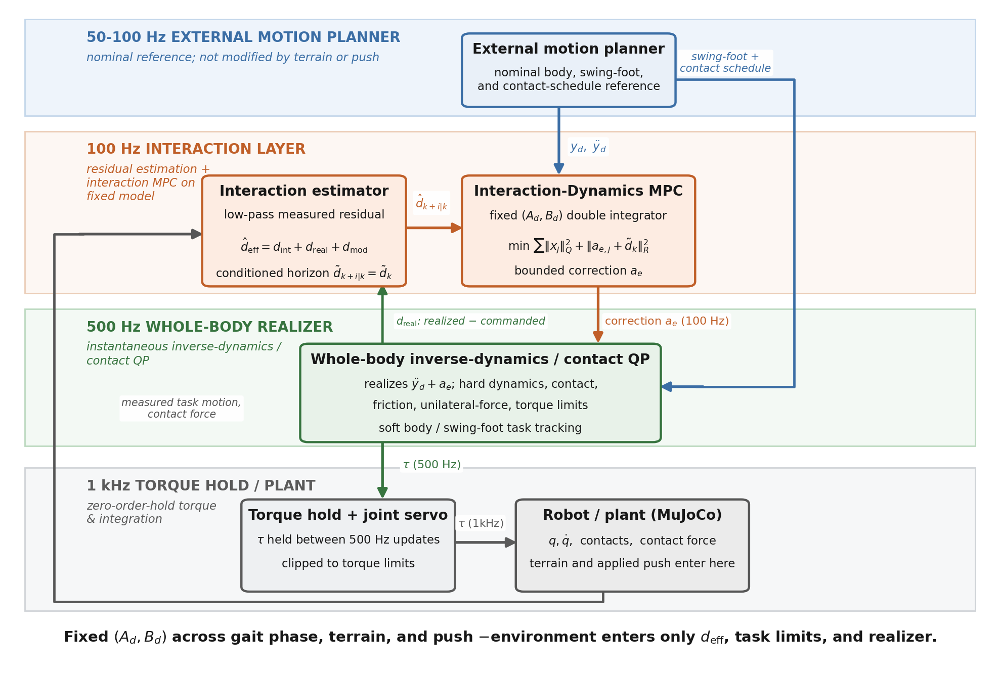
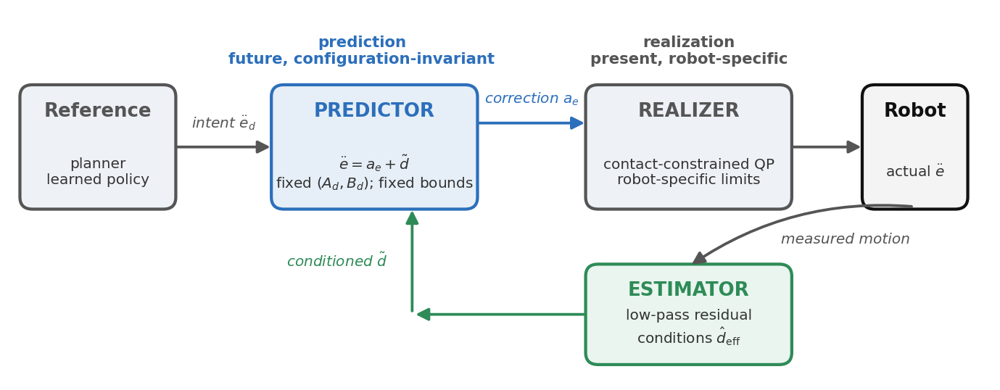
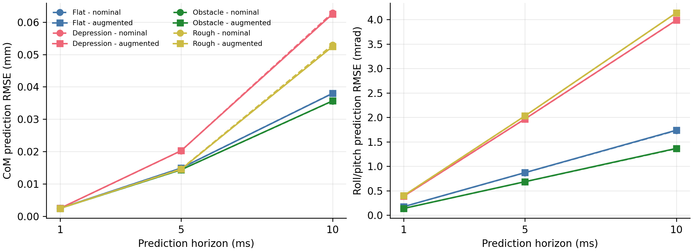
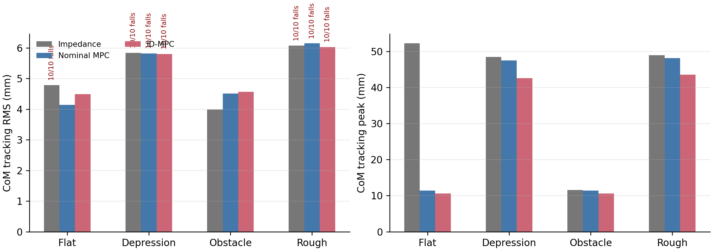
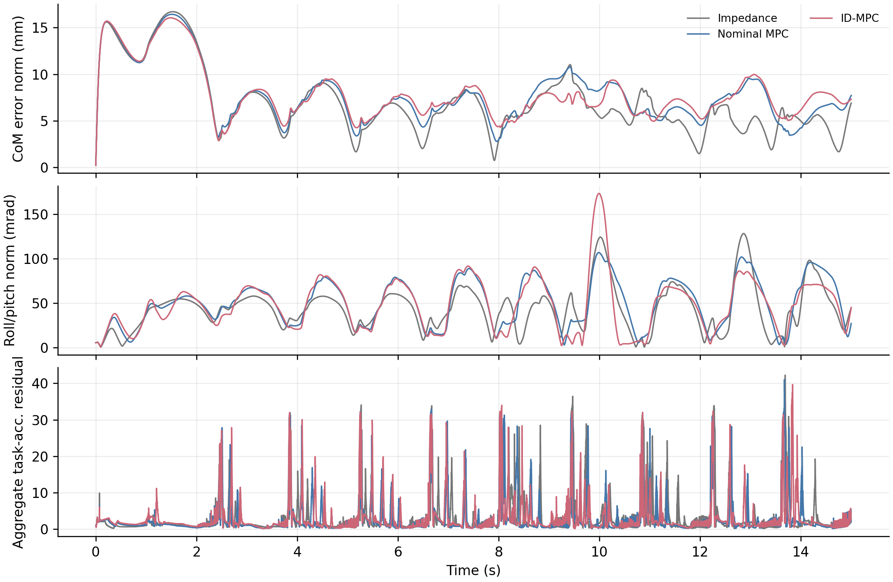
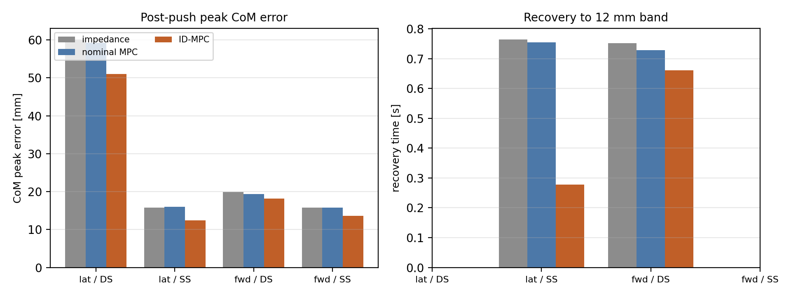
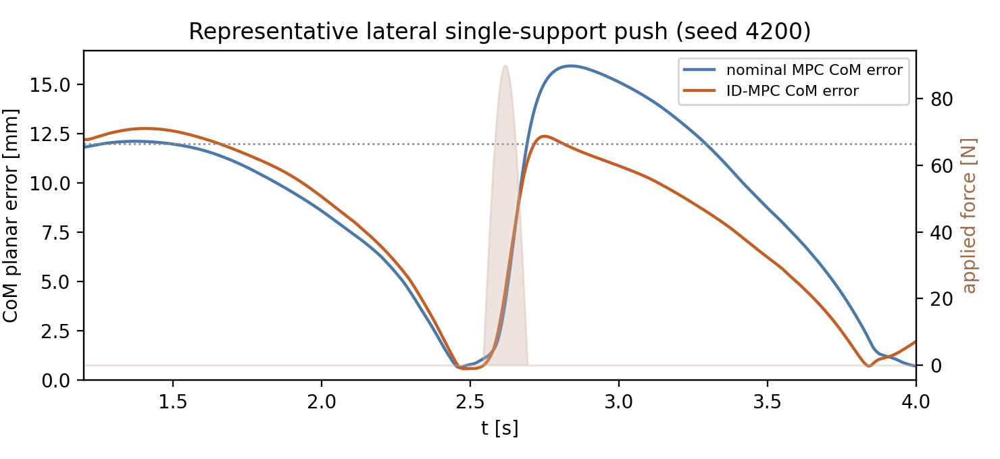
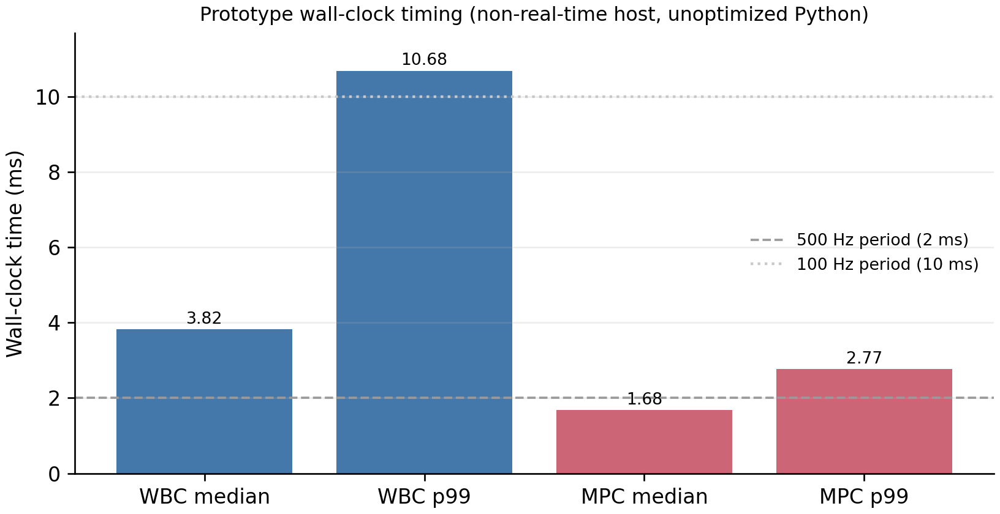

# Interaction Dynamics: A Configuration-Invariant Predictive Model for Humanoid Locomotion under Terrain and External Disturbances

**Yongyan Cao**

---

## Abstract

Humanoid locomotion is shaped by two recurring interaction classes: terrain-mediated contact mismatch and external forces applied to the body. This paper represents their observable task-space effect, together with realization and model mismatch, as an interaction residual $d_{\rm eff}$ on the normalized requested-task model $\ddot e=a_e+d_{\rm eff}$. For these coordinates, the exact zero-order-hold pair is fixed across robot configuration and contact mode; contact-dependent mechanics remain in the residual and in a separate high-rate whole-body realizer. Interaction-Dynamics MPC (ID-MPC) estimates the measured acceleration residual and selects a bounded task-acceleration correction at 100 Hz, while a 500 Hz inverse-dynamics/contact QP enforces floating-base dynamics, contact, friction, and torque limits. A paired study comprising 240 torque-level Unitree G1 simulations evaluates four terrain conditions and four measured-phase push conditions under a shared motion plan and realizer. Both MPC controllers complete every flat and raised-obstacle trial without QP fallback. Relative to nominal MPC, ID-MPC reduces median peak CoM error by 7.0% on the raised obstacle and by 6.2--22.6% across the four push conditions; in the lateral single-support case, median recovery time decreases from 0.754 to 0.278 s. These results show that a compact, configuration-invariant interaction model can add repeatable transient attenuation to an existing locomotion stack without placing full multibody dynamics in the prediction horizon.

**Index Terms** - interaction dynamics, uneven-terrain locomotion, external-push rejection, humanoid robots, model predictive control, disturbance estimation, whole-body control.

---

## I. Introduction

Walking is a continuous physical interaction among the robot, its support surface, and external forces on the body. Even when a planner supplies dynamically consistent body, foot, and contact trajectories, the realized motion can depart from that plan: terrain height and contact timing alter load transfer, friction and compliance reshape the support wrench, and a push injects an unmodeled body acceleration. These effects are different in origin but share an important control signature—they become observable as a mismatch between requested and measured task acceleration.

Locomotion control already provides powerful mechanisms for handling such mismatch. Reduced-order MPC plans body motion and contact forces efficiently; full-order nonlinear MPC captures richer coupling; whole-body inverse dynamics realizes motion subject to multibody and contact constraints; and impedance control supplies compliant local response. We pursue a complementary question: can the *observable effect of interaction itself* be represented by one small predictive model that remains unchanged as configuration and support mode evolve? Such a representation would allow an interaction layer to be added between an existing planner and whole-body controller without rebuilding a contact-dependent prediction model at every gait transition.

Let $y$ collect selected locomotion-task coordinates and $e=y-y_d$ their tracking error. After nominal task-space compensation, we write

$$
\begin{aligned}
\ddot e
&=a_e+d_{\rm eff},\\
d_{\rm eff}
&=d_{\rm int}+d_{\rm real}+d_{\rm mod},
\end{aligned}
\tag{1}
$$

where $a_e$ is the correction selected by MPC. The residual combines the task-acceleration effect of physical interaction $d_{\rm int}$, constrained-realization error $d_{\rm real}$, and remaining model or estimation mismatch $d_{\rm mod}$. The state stays $x=[e^\top,\dot e^\top]^\top$; contact forces, foot positions, and mode variables are not added to the horizon. Under the requested-task normalization, the exact-ZOH pair $(A_d,B_d)$ is the same double-integrator pair across contact modes, while the robot mechanics and environment remain in $d_{\rm eff}$, the command limits, and the high-rate realization map.

This separation turns interaction compensation into a compact predictive-control problem. ID-MPC filters the measured task-acceleration residual, propagates its conditioned value over the short horizon, and chooses a bounded correction. The inverse-dynamics/contact QP then realizes that request using the active contacts. The resulting architecture preserves the motion plan and whole-body constraint handling while giving terrain mismatch and external pushes a common predictive interface.

The contributions are:

1. **A configuration-invariant requested-task model.** Theorem 1 shows that the normalized locomotion tasks share one exact-ZOH transition pair across configuration and contact mode; terrain, contact timing, external force, and realization mismatch enter the interaction residual and realizer rather than the prediction matrices.
2. **A measured interaction predictor.** A low-pass task-acceleration-residual estimator converts already-observable physical mismatch into a conditioned horizon sequence without requiring terrain preview or force-source classification.
3. **A multirate predictive-realization architecture.** A 100 Hz residual-augmented MPC selects bounded, slew-limited task corrections, and a 500 Hz inverse-dynamics/contact QP realizes them under floating-base, friction, unilateral-contact, and torque constraints.
4. **Paired terrain-and-push validation.** A 240-trial protocol verifies future terrain contact and measured support phase. ID-MPC lowers obstacle peak error and the peak response in every tested push condition while using the same planner, realizer, and controller settings as the baselines.

Figure 1 summarizes the multirate architecture. The external reference publishes nominal body, foot, and contact trajectories; the ID-MPC updates the acceleration correction at 100 Hz; the inverse-dynamics/contact QP is scheduled at 500 Hz; and torque is applied at the 1 kHz simulation rate. These are simulated update periods; Section IX-G reports their wall-clock measurements.

**Fig. 1.** Interaction prediction with high-rate whole-body realization.

---

## II. Related Work

Reduced-order locomotion MPC uses centroidal or simplified rigid-body dynamics to optimize center-of-mass motion and contact forces over a gait schedule [2], [3], [8], [13], building on the centroidal momentum matrix formulation that connects linear CoM motion to whole-body angular momentum [17], while unified whole-body MPC extends prediction to coupled locomotion and manipulation [10]. These methods place contact forces, support geometry, or full-body variables inside the horizon and are well suited to motion and force replanning. Our interaction layer is complementary: the external plan is retained, and the horizon contains only the normalized requested-task error and an estimated residual. Contact-dependent mechanics are handled by the instantaneous realizer, leaving the predictor matrices fixed.

Whole-body inverse dynamics and hierarchical optimization map motion objectives to feasible generalized acceleration, torque, and contact wrench while enforcing floating-base dynamics and physical limits [4], [5], [7], [9]. We use this established machinery as the high-rate realization interface rather than as the paper's predictive model. The separation is architectural: the interaction MPC decides a task-acceleration correction, and the whole-body QP resolves the current contact-dependent realization.

Operational-space control and impedance methods shape interaction through task inertia, damping, and compliant deflection [6], [11], [12]. Their local mechanical interpretation is valuable for contact, whereas persistent force generally appears as a tracking offset. Offset-free control augments a predictive model with a disturbance estimate so that a realizable matched bias can be rejected [16]. The fixed-base interaction-dynamics framework in [1] applied this idea to physical human-robot interaction, using a configuration-independent state transition while retaining robot dependence in its input realization. The present work specializes the requested input to normalized task acceleration, making both exact-ZOH matrices fixed, and extends the residual to floating-base locomotion, contact transitions, terrain-mediated mismatch, and body pushes.

The resulting contribution is not a replacement for centroidal planning, whole-body optimization, or impedance control. It is a common predictive interface among them: centroidal references define the desired motion, the residual model predicts the observable interaction effect, and the contact QP realizes the corrected request. The experiments isolate that interface on a Unitree G1 in MuJoCo [15] by holding the planner and realizer constant across all three compared controllers.

---

## III. Locomotion Interaction Dynamics

The floating-base dynamics are

$$
q=[q_b^\top,q_j^\top]^\top,\qquad
M(q)\ddot q+h(q,\dot q)=S^\top\tau+J_c^\top\lambda+w_{\rm ext},
\tag{2}
$$

with rigid active contacts

$$
J_c\ddot q+\dot J_c\dot q=0,
\tag{3}
$$

where $q_b$ is the floating base, $q_j$ the actuated joints, $\lambda$ stacks contact wrenches, and $w_{\rm ext}$ collects external interaction forces. The locomotion front end separates into a motion planner that decides *where* to walk, a gait scheduler that resolves this into support phases, step indices, and touchdown events, and a reference generator that turns that schedule into dynamically consistent nominal body, DCM/CoM, swing-foot, and contact references; a high-rate whole-body controller (Section VII) then realizes task requests subject to (2)–(3) and the physical limits. The interaction layer sits between the reference generator and the realizer and modifies neither — it depends on the gait schedule only through the references it receives, so it is independent of how the schedule is produced. (In the evaluated system the reference generator is indexed by simulation time; indexing it instead by gait phase and measured touchdown, $\xi_d(k,\phi)$ rather than $\xi_d(t)$, is a hybrid-system refinement discussed in Section X.)

Let $y$ collect the selected locomotion-task coordinates — here CoM position and body roll/pitch — and let $e=y-y_d$ be their tracking error against the planned reference.

**Assumption 1 (task-acceleration normalization).** On the operating set the selected task has an invertible, well-conditioned interaction inertia $M_p(q,\rho)$ and constrained dynamics $M_p\ddot y+\mu_p=F^{\rm act}+F^{\rm ext}$. The realizer's nominal feedforward cancels the modeled bias and injects the desired task acceleration plus a correction $a_e$, $F^{\rm act}=\mu_p+M_p(\ddot y_d+a_e)+\delta$, where $\delta$ is the realization discrepancy (the realized minus the requested generalized force) and $F^{\rm ext}$ the external interaction wrench.

**Theorem 1 (contact-mode invariance of the requested model).** Let a controlled task have error coordinate $e$ of relative degree $r$, and let $\mathcal M$ be a set of contact modes for which Assumption 1 holds with the *same* requested coordinate. Then for every mode $\rho\in\mathcal M$ the realized error obeys the canonical model (1),

$$
\ddot e=a_e+d_{\rm eff},\qquad
d_{\rm eff}=d_{\rm int}+d_{\rm real}+d_{\rm mod},
\tag{4}
$$

with interaction effect $d_{\rm int}=M_p^{-1}F^{\rm ext}$, realization effect $d_{\rm real}=M_p^{-1}\delta$, and model residual $d_{\rm mod}$; and its exact zero-order-hold transition pair is the **same** matrix pair $(A_d,B_d)$ for every $\rho\in\mathcal M$ — the ZOH of the order-$r$ integrator chain, a function of the sample period $\Delta t$ and $r$ **alone**. Consequently the robot mechanics $M_p(q,\rho),\mu_p$, the contact geometry, and the environment enter only $d_{\rm eff}$ and the admissible-command set, never $(A_d,B_d)$: a contact switch $\rho\to\rho'$ changes $(M_p,\mu_p,d_{\rm eff},\widehat{\mathcal U})$ but leaves the prediction matrices invariant.

*Proof.* Substituting the feedforward $F^{\rm act}=\mu_p+M_p(\ddot y_d+a_e)+\delta$ into the constrained dynamics $M_p\ddot y+\mu_p=F^{\rm act}+F^{\rm ext}$ cancels $\mu_p$, and left-multiplying by $M_p^{-1}$ gives $\ddot e=\ddot y-\ddot y_d=a_e+M_p^{-1}(F^{\rm ext}+\delta)=a_e+d_{\rm eff}$. The input-to-error map $a_e\mapsto\ddot e$ is therefore the identity **in every mode $\rho\in\mathcal M$**, independent of $M_p$, $\mu_p$, and $\rho$. Its exact-ZOH sampling is the order-$r$ integrator pair, whose entries are polynomials in $\Delta t$ only (for $r=2$, $A_d=\big[\begin{smallmatrix}I&\Delta t\,I\\0&I\end{smallmatrix}\big]$, $B_d=\big[\begin{smallmatrix}\frac12\Delta t^2I\\\Delta t\,I\end{smallmatrix}\big]$). No mode-dependent quantity can appear in $(A_d,B_d)$ because none appears in the map it discretizes; every such quantity is absorbed, *by construction*, into $F^{\rm act}$ — hence into the recovery map, the admissible set, and $d_{\rm eff}$. $\square$

**Remark (the decomposition is falsifiable, not vacuous).** Isolating all robot and environment dependence in $d_{\rm eff}$ is a modeling *choice*, and it would be empty if $d_{\rm eff}$ could absorb any effect for free. It cannot: cancellation requires that the estimated effect be matched, sufficiently persistent, admitted by the conditioning rule, and realizable by the constrained realizer. Otherwise the effect surfaces as tracking residual or loss of balance. Invariance of $(A_d,B_d)$ buys a fixed requested-model predictor; it does not buy unconditional rejection.

This is the organizing idea of the paper: robot and environment dependence is isolated in the estimated disturbance $d_{\rm eff}$, the task constraints, and the high-rate realization map, while the predictor keeps one fixed model across configuration and contact phase. The estimator (Section V) need not separate $d_{\rm int}$, $d_{\rm real}$, and $d_{\rm mod}$ to control their sum, although measured contact force gives an interpretable component. Figure 2 places this interaction-prediction block between the planner and the realizer.

**Fig. 2.** The interaction-prediction layer sits between the motion planner and the whole-body realizer, estimating $d_{\rm eff}$ and choosing the task-acceleration correction $a_e$ on the fixed model (4).

---

## IV. Canonical Task Model and Normalization

Two physical arguments reduce the selected body-task coordinates to a fixed double integrator with a disturbance input.

*Center of mass.* With CoM $c$, mass $m$, active-contact forces $f_i$, and signed gravitational-acceleration vector $g$,

$$
m\ddot c=\sum_{i\in\mathcal C_\rho}f_i+mg+w_c ,
\tag{5}
$$

where $w_c$ lumps the external and unmodeled load. For $e_c=c-c_d$ the planner-consistent desired resultant is $F_c^{\rm des}=m(\ddot c_d-g)+m\,a_{e,c}$; writing the realized contact resultant as $\sum_i f_i=F_c^{\rm des}+\delta_c$ with the realization discrepancy $\delta_c$ (realized minus desired, as in Assumption 1),

$$
\ddot e_c=a_{e,c}+d_c,\qquad
d_c=m^{-1}w_c+m^{-1}\delta_c ,
\tag{6}
$$

so the CoM error is a double integrator whose disturbance splits into an interaction part $m^{-1}w_c$ and a realization part $m^{-1}\delta_c$, exactly as in (4).

*Roll and pitch.* The body orientation error is regulated as a double integrator in roll/pitch with the same disturbance structure, the effective rotational inertia folded into $M_p$ and any moment mismatch absorbed into $d_{\rm eff}$. Consistent with the evaluation, we treat roll/pitch as simulated body-task coordinates and do not interpret them as a hardware centroidal-angular-momentum measurement.

Stacking the selected coordinates and holding $a_e$ and $d_{\rm eff}$ over each interval, the exact-ZOH model at sample period $\Delta t$ is

$$
x_{k+1}=A_dx_k+B_d\big(a_{e,k}+d_{{\rm eff},k}\big),\qquad
x=[e^\top,\dot e^\top]^\top,
\tag{7}
$$

$$
A_d=\begin{bmatrix}I&\Delta t\,I\\0&I\end{bmatrix},\qquad
B_d=\begin{bmatrix}\tfrac12\Delta t^2I\\\Delta t\,I\end{bmatrix}.
\tag{8}
$$

The pair $(A_d,B_d)$ is the fixed double integrator; mass, inertia, contact geometry, and contact phase enter only the recovery of $F_c^{\rm des}$ and the realizer's feasible set, never $(A_d,B_d)$. Under a scheduled contact sequence the recovery map is re-formed per mode while $(A_d,B_d)$ stay unchanged. The implementation logs both the QP-predicted task acceleration and the finite-differenced measured task acceleration; the latter is used to form the aggregate requested-model residual of Section VII.

---

## V. Interaction Estimation and Prediction

The disturbance $d_{\rm eff}$ is not commanded; on the fixed model (7) it equals $\ddot e-a_e$, so it becomes observable as soon as the task-error acceleration is measured. We estimate it per channel by low-pass filtering the finite-differenced task-error acceleration minus the applied correction:

$$
\hat d_{{\rm eff},k}=(1-\alpha)\,\hat d_{{\rm eff},k-1}
+\alpha\big(\hat{\ddot e}_k-a_{e,k}\big),\qquad
\hat{\ddot e}_k=\frac{\dot e_k-\dot e_{k-1}}{\Delta t_{\rm w}} ,
\tag{9}
$$

with cutoff $\alpha=1-e^{-2\pi f_{\rm bw}\Delta t_{\rm w}}$ ($f_{\rm bw}=3$ Hz at the $2$ ms realizer step); the low-pass is used because a finite-difference acceleration is noisy even in simulation. Because $\hat{\ddot e}-a_e$ is exactly the measured minus the commanded task acceleration, the estimate aggregates the matched interaction, realization, and model effects into a single effect without needing to separate them; the filter is an *effect* estimator, not a source identifier, and measured contact force enters only as an interpretable diagnostic. A matched realization residual is therefore indistinguishable from an external interaction at the same channel and is absorbed into $\hat d_{\rm eff}$.

Over the MPC horizon the residual is propagated as a constant,

$$
\hat d_{k+i|k}=\hat d_{k|k},\qquad i=0,\dots,N-1 .
\tag{10}
$$

The evaluated controller conditions this estimate componentwise before it enters the horizon,

$$
\tilde d_k=\operatorname{sgn}(\hat d_k)
\min\!\left(\max\!\left(|\hat d_k|-0.30,0\right),0.50\right),
\tag{10a}
$$

and limits each applied command change to $|a_{e,k}-a_{e,k-1}|\le0.70$ in the corresponding task-acceleration units per 100 Hz update (m/s$^2$ for translation and rad/s$^2$ for attitude). These frozen protections suppress finite-difference and impact spikes; they also mean the implemented loop is not an exact constant-disturbance observer near zero. This is deliberately not a terrain preview: it extrapolates the currently observed mismatch forward rather than forecasting unseen terrain. The estimator is phase-invariant, so a contact phase change enters as a change of the measured disturbance, not of the estimator.

---

## VI. Constrained Interaction-Dynamics MPC

The correction $a_e$ is chosen by a residual-augmented MPC on the fixed model (7):

$$
\begin{aligned}
\min_{a_{e,0},\dots,a_{e,N-1}}\quad&
\sum_{j=0}^{N-1}\Big(\|x_j\|_Q^2+\|a_{e,j}+\tilde d_k\|_R^2\Big)+\|x_N\|_S^2\\
\text{s.t.}\quad&
x_{j+1}=A_dx_j+B_d\big(a_{e,j}+\tilde d_k\big),\\
&a_{e,\min}\le a_{e,j}\le a_{e,\max}.
\end{aligned}
\tag{11}
$$

In the unconditioned limit $\tilde d=\hat d$, penalizing $\|a_{e,j}+\tilde d_k\|$ rather than $\|a_{e,j}\|$ makes a realizable constant cancelling correction unpenalized. In the evaluated implementation, (10a) deliberately trades exact offset-free behavior for impact robustness: disturbances within the 0.30-unit task-acceleration deadband are handled by nominal feedback, and larger estimates contribute at most 0.50 unit of residual feedforward. The bounds $[a_{e,\min},a_{e,\max}]$ are fixed acceleration limits, not a per-sample capability set; physical limits are enforced downstream by the realizer, and an infeasible correction appears in the measured aggregate residual rather than as a predictor-constraint violation.

Only the first correction $a_{e,k}^\star$ is applied, and the horizon is re-solved at the next MPC update. Because $(A_d,B_d,Q,R,S)$ never change, the condensed MPC Hessian is constant and (11) is a small fixed-size QP, independent of robot configuration and contact phase.

---

## VII. Whole-Body Realization

The realizer executes the requested task acceleration $\ddot y_d+a_{e,k}^\star$ at the current sample. It is an instantaneous inverse-dynamics/contact QP, not a second predictor. Let $\tau_{\rm ref}$ be a regularization torque (previous command or gravity compensation), $J_y$ the task Jacobian, and $\mathcal F_\rho$ the polyhedral friction set for the active mode. Define the task and contact residuals as $r_y=J_y\ddot q+\dot J_y\dot q-(\ddot y_d+a_{e,k}^\star)$ and $r_c=J_c\ddot q+\dot J_c\dot q$. Thus all Cartesian acceleration objectives include the kinematic bias $\dot J\dot q$, and the QP is

$$
\begin{aligned}
\min_{\ddot q,\tau,\lambda}\quad&
\|r_y\|_{W_t}^2+\|r_c\|_{W_c}^2
+\|\tau-\tau_{\rm ref}\|_{W_\tau}^2\\
\text{s.t.}\quad&
M\ddot q+h=S^\top\tau+J_c^\top\lambda,\\
&\lambda\in\mathcal F_\rho,\quad \tau_{\min}\le\tau\le\tau_{\max}.
\end{aligned}
\tag{12}
$$

Body, contact, and swing-foot accelerations are tracked as weighted least-squares objectives, while the floating-base dynamics, friction and unilateral-force limits, and torque bounds are hard constraints. The body, active-contact, and swing-foot objectives are soft, so an unrealizable request produces task-acceleration slack rather than a hard infeasibility. With finite-differenced measured task acceleration $\hat{\ddot y}^{\rm meas}$, the aggregate requested-model residual is

$$
r_{{\rm eff},k}=\hat{\ddot y}^{\rm meas}_k-\big(\ddot y_d+a_{e,k}^\star\big),
\tag{13}
$$

which contains interaction, realization, differentiation, and model effects and is the signal filtered in (9). It must not be interpreted as isolated WBC slack. The QP-predicted task acceleration is logged separately for diagnosis. The realizer enforces floating-base dynamics, friction, unilateral-force, and torque limits as hard constraints and tracks contact and body accelerations as weighted objectives. Rigid-contact acceleration equalities and one-step joint-position limits are available in an exact-realization mode but are not used in the evaluated configuration. With a friction-pyramid approximation (12) is a convex QP solvable by operator splitting [14]; exact Coulomb cones make it a second-order cone program.

The realizer runs at the high (simulated $500$ Hz) rate with step $\Delta t_{\rm w}$ ($2$ ms) and the MPC at $100$ Hz ($\Delta t=10$ ms of (8)). The QP feedforward is held for 2 ms while a bounded joint servo updates the applied torque at 1 kHz. Section IX-G reports the measured wall-clock cost of the QP, which does not yet meet the simulated schedule.

Locomotion proceeds through scheduled contact phases, and the realizer's contact mode $\rho$ is updated from the planner's schedule. Because the predictor and estimator are phase-invariant, a phase change enters only through the re-formed recovery map and through the measured disturbance; the evaluation uses the planner's scheduled transitions directly. A hardware implementation of (9)–(13) also requires generalized velocity from a filtered estimate rather than raw encoder differences, and the phase lag and noise of that estimate must be included in the observer and closed-loop robustness evaluation; they are not removed by the update rate alone.

---

## VIII. Properties and Scope

The ideal construction inherits the fixed-model offset-free property of [1]; the evaluated conditioned implementation adds the floating-base aggregate residual and the bounded-bias qualification below.

**Ideal offset-free regulation; conditioned bounded bias.** Without the conditioning in (10a), fix a contact phase and suppose the effective disturbance is constant and matched, the estimator converges, and the cancelling correction lies within the fixed bounds and remains realizable by (12). Then the standard offset-free argument applies. For the evaluated conditioned controller, that conclusion does not hold exactly: the uncorrected acceleration is bounded by the 0.30-unit task-acceleration deadband plus estimation and realization error, while the 0.50-unit cap bounds how much residual feedforward is requested. The experiment therefore tests transient error reduction, not exact zero steady-state error.

**Bounded mismatch.** If the nominal requested-model loop is input-to-state stable as in [1] and the unmatched residual is bounded, $\sup_k\lVert d_{\rm eff}-d_{\rm matched}\rVert\le\varepsilon$, then the realized error inherits the nominal transient plus an ultimate bound proportional to $\varepsilon$. Bounded corrections do not by themselves establish recursive feasibility, contact stability, or fall avoidance; those remain properties of the plan and the realizer.

**What the model does not claim.** The predictor is exact only for the normalized requested task under ideal feedforward; the physical plant need not follow it exactly. In execution, state-estimation delay, contact compliance, velocity filtering, impact dynamics, realizer task trade-offs, actuator dynamics, and terrain mismatch all enter $d_{\rm eff}$, and the estimator observes their sum only after it becomes measurable. There is no terrain preview, source identification, per-sample feasibility certificate, or guarantee of continuous walking.

---

## IX. Environmental-Interaction Experiments

The evaluation tests whether one canonical residual-acceleration model explains terrain-mediated contact mismatch and externally applied body force under a shared walking plan and constrained realizer. Every controller receives the same reference construction, contact schedule, seed, state estimator, contact logic, inverse-dynamics/contact QP, torque limits, friction model, and solver settings; only the task-space correction law changes. Every result below comes from the paired campaign that passes the validity checker described in Section IX-G.

### A. Multirate Experimental Architecture

All trials use the Unitree G1 MuJoCo model (MuJoCo 3.10.0) with 1 ms integration and torque application. Simulated updates are scheduled at 500 Hz for the whole-body QP and estimator and at 100 Hz for the MPC. The external reference supplies nominal body, swing-foot, and contact trajectories and is not modified by terrain feedback. The 500 Hz value is therefore the simulated schedule, not a demonstrated wall-clock rate; measured computation is reported in Section IX-G.

The WBC enforces the floating-base dynamics, unilateral-force, friction, and torque limits as hard constraints, and tracks the active-contact and body accelerations as weighted objectives. Body and swing-foot objectives being soft, an unrealizable request produces a measurable acceleration residual rather than a hard-task infeasibility. The interaction layer neither changes the contact schedule nor selects footsteps. The controlled vector is CoM position plus roll and pitch; the paper does not interpret this simulated attitude channel as a hardware centroidal-momentum measurement.

The locomotion planner, contact schedule, and whole-body realization stack are shared by all evaluated controllers, and the interaction layer modifies only the body-task acceleration command. To isolate interaction-prediction performance from long-horizon gait-stabilization effects — the shared locomotion stack's long-horizon robustness is a separate problem, outside this paper's scope (Section X) — the comparisons are conducted over a fixed evaluation window in which the shared locomotion infrastructure remains repeatable for every controller.

### B. Compared Controllers

Three controllers are compared:

1. **Task impedance:** fixed body and swing-foot feedback generates acceleration requests for the shared WBC. This baseline accommodates terrain interaction through compliant tracking error.
2. **Nominal MPC:** the same double-integrator MPC, horizon, cost, acceleration bounds, planner, and WBC as the proposed controller, but with $\hat d_{\rm eff}=0$. This isolates the value of residual estimation and prediction.
3. **Interaction-Dynamics MPC (ID-MPC):** the proposed residual-augmented predictor uses the conditioned estimate $\tilde d_{\rm eff}$ of (9)–(10a) over the horizon.

Controller parameters are frozen across evaluation terrains, and the same 0.70-unit per-update command-slew limiter is applied to all three controllers. No method receives terrain height, future contact force, or replanning. The interaction estimate uses only acceleration residuals that have already become observable; no oracle sequence is used.

### C. Terrain and Trial Protocol

The four physical terrain models are:

| terrain | definition | purpose |
|---|---|---|
| flat | nominal surface | estimator and tracking control |
| unilateral depression | one planned foothold $20$ mm below nominal | delayed contact and reduced early support force |
| unilateral obstacle | one planned foothold $20$ mm above nominal | early impact and load transfer |
| frozen rough sequence | left patch $+15$ mm and right patch $-20$ mm | repeated interaction mismatch |

The same 15 s nominal flat-ground reference is replayed over all terrains. It uses 1.4 s steps, 1.0 s double support, 0.03 m step length, and an exact piecewise-linear ZMP transfer during the first 0.05 s of double support; the DCM recursion is recomputed for this finite transfer rather than assuming an instantaneous foot-to-foot ZMP jump. Before terrain comparisons are accepted, nominal MPC and ID-MPC must complete every flat trial, travel at least 0.18 m, and incur no QP fallback. Impedance is retained as a baseline and its flat-ground falls, if any, are reported rather than hidden by retuning. The obstacle is a finite right-foot patch spanning $x=0.22$--$0.34$ m; the validity checker requires no robot--patch contact during settling and a later measured contact in every obstacle trial. This prevents terrain height from being absorbed into the initial condition. Seeds 4200--4209 are paired across controllers.

### D. Interaction-Prediction Experiment

At each estimator update, the nominal model ($\tilde d=0$) and conditioned constant-residual model ($\tilde d_{k+i|k}=\tilde d_{k|k}$) are rolled forward from the same measured state using the same recorded future command sequence but no future measured output. This is an offline dynamics-model audit, not a deployable oracle forecast. To avoid confounding prediction quality with controller-dependent trajectories, both predictors are evaluated on the nominal-MPC trials for each terrain.

Prediction error is computed from finite-differenced measured task acceleration. QP-predicted acceleration is retained only as a diagnostic because the 1 kHz joint servo changes the applied torque after each 500 Hz QP solve. Figure 3 reports medians over the ten nominal-MPC trajectories per terrain. At 10 ms, conditioning the constant residual changes CoM prediction RMSE by $-0.08\%$ on flat ground, $-0.59\%$ in the depression, $+0.02\%$ on the obstacle, and $-1.16\%$ on rough ground (negative denotes improvement); roll/pitch changes remain within $0.31\%$. These near-overlapping curves show that the bounded, deadbanded residual is not a strong open-loop forecaster at this horizon. Prediction evidence is therefore corroborating only; the controller result below must not be attributed to a large model-forecast improvement.

**Fig. 3.** Nominal and conditioned-residual prediction errors.

### E. Uneven-Ground Tracking and Interaction Response

The primary outcomes are CoM RMS and peak error, roll/pitch RMS, falls, measured patch-contact time, QP fallbacks, and the aggregate measured-minus-commanded acceleration residual. Table I gives cell medians; error statistics terminate at the detected fall and are therefore not full-window comparisons in cells with falls. The validity checker confirms zero QP fallback, no obstacle contact during settling, and later measured obstacle contact in every obstacle trial.

| terrain | controller | CoM RMS (mm) | CoM peak (mm) | roll/pitch RMS (mrad) | falls/10 |
|---|---|---:|---:|---:|---:|
| flat | impedance | 4.782 | 52.204 | 66.89 | 10 |
|  | nominal MPC | **4.110** | 11.434 | 41.89 | 0 |
|  | ID-MPC | 4.508 | **10.636** | **39.81** | 0 |
| depression | impedance | 5.839 | 48.472 | **66.36** | 10 |
|  | nominal MPC | 5.821 | 47.506 | 68.53 | 10 |
|  | ID-MPC | **5.807** | **42.679** | 68.88 | 10 |
| obstacle | impedance | **3.989** | 11.564 | **34.32** | 0 |
|  | nominal MPC | 4.572 | 11.434 | 40.99 | 0 |
|  | ID-MPC | 4.567 | **10.636** | 40.06 | 0 |
| rough | impedance | **6.072** | 48.900 | **64.44** | 10 |
|  | nominal MPC | 6.166 | 48.325 | 66.92 | 10 |
|  | ID-MPC | 6.082 | **43.517** | 66.57 | 10 |

**Fig. 4.** Terrain tracking outcomes under the shared fixed plan.

On flat ground, nominal MPC and ID-MPC complete all ten 15 s trials and travel median distances of 0.228 and 0.231 m, respectively, whereas impedance falls in every trial. ID-MPC has a lower peak than nominal MPC (10.636 versus 11.434 mm) but a higher RMS error (4.508 versus 4.110 mm); it is therefore not a flat-ground tracking improvement. On the valid future obstacle, all controllers complete all trials. ID-MPC reduces median peak error by 7.0% relative to nominal MPC, while their RMS errors are essentially equal (4.567 versus 4.572 mm) and impedance has the lowest RMS. On the depression and rough sequence every controller falls, typically after reaching the terrain change. The smaller ID-MPC peak in those truncated records does not constitute fall prevention; it shows only pre-fall attenuation. Figure 5 exposes representative time histories rather than hiding these failures in aggregate bars.

**Fig. 5.** Representative future-obstacle interaction and tracking response.

### F. External-Push Study

To test the second interaction class, a phase-locked external wrench is applied to the torso during walking. A half-sine force of $90$ N peak and $150$ ms duration ($8.6$ N$\cdot$s impulse) is applied once the target gait phase is confirmed by *measured* foot contact — exactly one foot in contact for single support, both for double support — held for a $60$ ms dwell, and no earlier than $1.6$ s. Gating on measured rather than planned contact is essential: every trial's onset contact is verified, and all single-support pushes land with one measured foot on the ground. The wrench perturbs only the plant; it is logged at $1$ kHz for ground truth but is hidden from the estimator and every controller. Four conditions cross push direction (lateral, forward) with gait phase (double and single support); three controllers and ten paired seeds give $120$ trials. Recovery time is the first post-onset instant at which the CoM planar error returns below a frozen $12$ mm band and stays there for $200$ ms.

The accepted artifact contains exactly the three declared controllers and ten paired seeds per condition. Table II reports medians and fall counts. A dash in recovery means that the trajectory did not re-enter and remain within the 12 mm band during the evaluation window; it does not by itself mean a fall.

| push condition | peak CoM error: imp./nom./ID (mm) | ID vs. nominal | recovery: imp./nom./ID (s) | falls: imp./nom./ID |
|---|---:|---:|---:|---:|
| lateral, double support | 60.08 / 59.28 / **50.96** | $-14.0\%$ | -- / -- / -- | 10 / 10 / 10 |
| lateral, single support | 15.83 / 16.00 / **12.38** | $-22.6\%$ | 0.764 / 0.754 / **0.278** | 0 / 0 / 0 |
| forward, double support | 19.91 / 19.39 / **18.18** | $-6.2\%$ | 0.752 / 0.728 / **0.661** | 0 / 0 / 0 |
| forward, single support | 15.74 / 15.82 / **13.66** | $-13.7\%$ | -- / -- / -- | 0 / 0 / 0 |

ID-MPC reduces median peak error relative to nominal MPC in all four conditions. The clearest recoverable case is the lateral single-support push, where peak error decreases by 22.6% and median recovery time decreases from 0.754 to 0.278 s. Forward double-support recovery improves more modestly. All controllers fall under the lateral double-support push, and none satisfies the recovery-band definition for the forward single-support push despite zero falls. Thus the result is phase- and direction-dependent attenuation, not general push rejection.

**Fig. 6.** Post-push peak error and recovery to the 12 mm band.

**Fig. 7.** Representative measured-phase push response.

### G. Computational and Reproducibility Evaluation

Timing is measured on a general-purpose workstation under a standard, non-real-time operating system in an unoptimized Python implementation; it is a prototype measurement on a non-real-time host, not a deployment result. Across terrain trials, the median of per-trial WBC medians is 3.91 ms and the median WBC p99 is 10.89 ms, both exceeding the simulated 2 ms period. The corresponding MPC values are 0.31 and 0.45 ms, below the simulated 10 ms period. The 500 Hz WBC value is therefore a simulation schedule, not demonstrated wall-clock feasibility.

**Fig. 8.** Unoptimized non-real-time timing relative to simulated periods.

The authoritative terrain and push JSON files are stored with the code. The supplied evidence gate passes only if they use schema version 2, contain the exact three-controller paired matrices, record the frozen residual conditioning, show valid future obstacle contact, gate every push on the requested measured support phase, report zero QP fallback, and match the hashed no-root-assist video. The accepted terrain and push SHA-256 values begin da87a08b and 1b74c445, respectively; a machine-readable verification record accompanies the data.

---

## X. Limitations

The evaluation isolates interaction compensation by holding the body/foot reference and contact schedule fixed. ID-MPC therefore complements rather than replaces terrain-aware planning: if a foothold or timing choice makes the shared reference infeasible, changing the residual correction alone cannot create a new support strategy. This boundary is visible in the depression and rough-terrain trials and motivates integration with online foot placement and timing adaptation.

The estimated residual is intentionally an aggregate task-space effect. Terrain force, realization error, state-estimation error, compliance, and model mismatch can contribute to the same channel and are not uniquely identified. Moreover, the estimate becomes available only after the interaction affects measured motion; it supplies short-horizon compensation, not exteroceptive preview. The fixed model and ideal offset-free property consequently apply when task normalization is valid, estimation converges, and the cancelling correction remains realizable by the contact QP.

The reported study uses one Unitree G1 model, selected CoM and roll/pitch tasks, four terrain profiles, one push magnitude, and ten paired seeds per condition. MuJoCo torque actuation does not reproduce all hardware sensing, transmission, delay, and impact effects. The MPC meets its simulated 10 ms period in the prototype, whereas the unoptimized Python whole-body QP does not meet the scheduled 2 ms wall-clock deadline. Hardware evaluation will therefore require a compiled real-time implementation together with filtered state estimation.

Within this scope, the experiments establish repeatable peak-error attenuation under a shared plan and realizer. Broader terrain envelopes, push-magnitude sweeps, longer-distance locomotion, and coupling the interaction residual to step adaptation are the natural extensions of the present interface.

---

## XI. Conclusion

This paper introduced a configuration-invariant interaction representation for humanoid locomotion. Terrain-mediated contact mismatch, external body force, and realization error are expressed through one observable residual on the normalized requested-task model $\ddot e=a_e+d_{\rm eff}$. Theorem 1 establishes that its exact-ZOH matrices remain fixed across configuration and contact mode, while a separate inverse-dynamics/contact QP retains the full robot and support dependence. This separation yields a compact predict–realize–observe interface that can be inserted between an existing motion planner and whole-body controller.

The 240-trial torque-level evaluation used paired seeds, verified future terrain contact, measured-phase push gating, and identical planning and realization infrastructure across controllers. ID-MPC completed every flat and raised-obstacle trial, reduced obstacle peak CoM error by 7.0% relative to nominal MPC, and reduced median peak response in all four push conditions by 6.2--22.6%. The lateral single-support recovery result—0.754 s for nominal MPC and 0.278 s for ID-MPC—shows the practical value of conditioning an already-observable interaction residual before a large tracking deviation develops.

The results support interaction dynamics as a reusable layer rather than a replacement for locomotion planning. Combining the fixed predictor with online foot placement and timing adaptation is the most direct next extension: the interaction residual can regulate the current task while the planner changes the reference when the support strategy must change. A compiled real-time whole-body implementation and hardware evaluation will test the same interface under sensing delay, actuator bandwidth, and physical contact variability.

---

## References

[1] Y. Cao and J. Tang, "Toward Interaction Dynamics: A Predictive Framework for Safe Physical Human-Robot Interaction," 2026, arXiv:2606.08281.

[2] J. Di Carlo, P. M. Wensing, B. Katz, G. Bledt, and S. Kim, "Dynamic locomotion in the MIT Cheetah 3 through convex model-predictive control," in *Proc. IEEE/RSJ IROS*, pp. 1–9, 2018.

[3] D. Kim, J. Di Carlo, B. Katz, G. Bledt, and S. Kim, "Highly dynamic quadruped locomotion via whole-body impulse control and model predictive control," arXiv:1909.06586, 2019.

[4] C. D. Bellicoso, C. Gehring, J. Hwangbo, P. Fankhauser, and M. Hutter, "Perception-less terrain adaptation through whole body control and hierarchical optimization," in *Proc. IEEE-RAS Humanoids*, pp. 558–564, 2016.

[5] T. Koolen *et al.*, "Design of a momentum-based control framework and application to the humanoid robot Atlas," *Int. J. Humanoid Robotics*, vol. 13, no. 1, 2016.

[6] O. Khatib, "A unified approach for motion and force control of robot manipulators: The operational space formulation," *IEEE J. Robotics Autom.*, vol. 3, no. 1, pp. 43–53, 1987.

[7] L. Sentis and O. Khatib, "Synthesis of whole-body behaviors through hierarchical control of behavioral primitives," *Int. J. Humanoid Robotics*, vol. 2, no. 4, pp. 505–518, 2005.

[8] D. E. Orin, A. Goswami, and S.-H. Lee, "Centroidal dynamics of a humanoid robot," *Autonomous Robots*, vol. 35, no. 2–3, pp. 161–176, 2013.

[9] L. Righetti, J. Buchli, M. Mistry, and S. Schaal, "Inverse dynamics control of floating-base robots with external constraints: A unified view," in *Proc. IEEE ICRA*, pp. 1085–1090, 2011.

[10] J.-P. Sleiman, F. Farshidian, M. V. Minniti, and M. Hutter, "A unified MPC framework for whole-body dynamic locomotion and manipulation," *IEEE Robot. Autom. Lett.*, vol. 6, no. 3, pp. 4688–4695, 2021.

[11] N. Hogan, "Impedance control: An approach to manipulation—Parts I, II, III," *ASME J. Dyn. Syst. Meas. Control*, vol. 107, no. 1, pp. 1–24, 1985.

[12] A. Albu-Schäffer, C. Ott, and G. Hirzinger, "A unified passivity-based control framework for position, torque and impedance control of flexible joint robots," *Int. J. Robotics Research*, vol. 26, no. 1, pp. 23–39, 2007.

[13] R. Grandia, F. Jenelten, S. Yang, F. Farshidian, and M. Hutter, "Perceptive locomotion through nonlinear model-predictive control," *IEEE Trans. Robotics*, vol. 39, no. 5, pp. 3402–3421, 2023.

[14] B. Stellato, G. Banjac, P. Goulart, A. Bemporad, and S. Boyd, "OSQP: An operator splitting solver for quadratic programs," *Math. Program. Comput.*, vol. 12, no. 4, pp. 637–672, 2020.

[15] E. Todorov, T. Erez, and Y. Tassa, "MuJoCo: A physics engine for model-based control," in *Proc. IEEE/RSJ IROS*, pp. 5026–5033, 2012.

[16] Y.-Y. Cao, Z. Lin, and D. G. Ward, "Anti-windup design of output tracking systems subject to actuator saturation and constant disturbances," *Automatica*, vol. 40, no. 7, pp. 1221–1228, Jul. 2004.

[17] D. E. Orin and A. Goswami, "Centroidal momentum matrix of a humanoid robot: Structure and properties," in *Proc. IEEE/RSJ IROS*, pp. 653–659, 2008.
