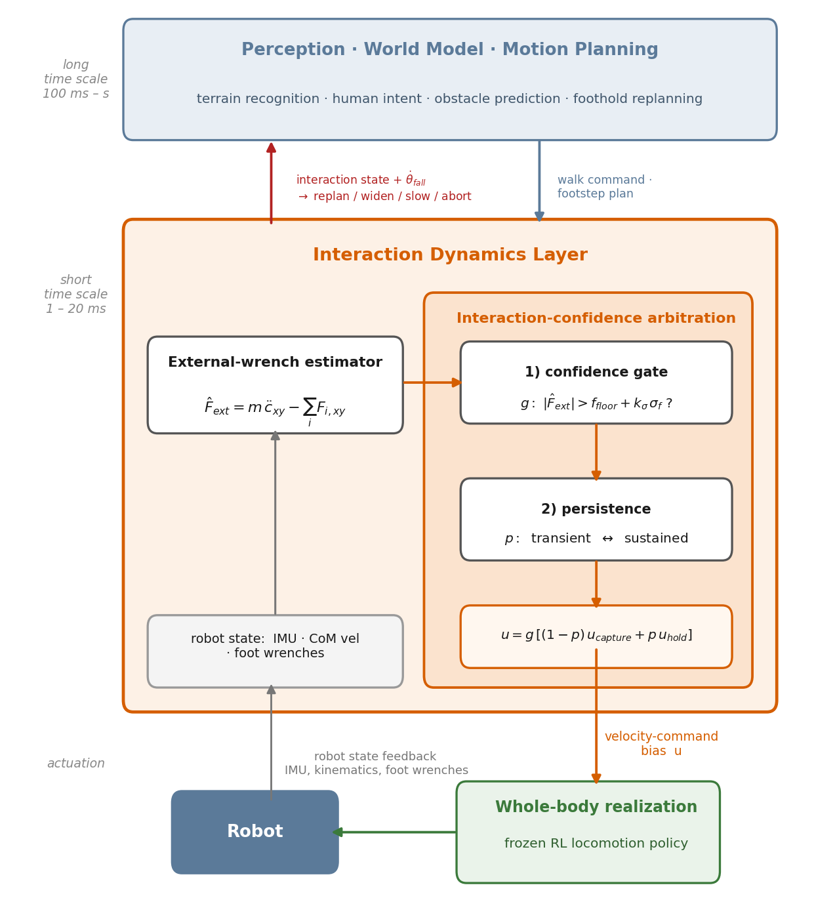
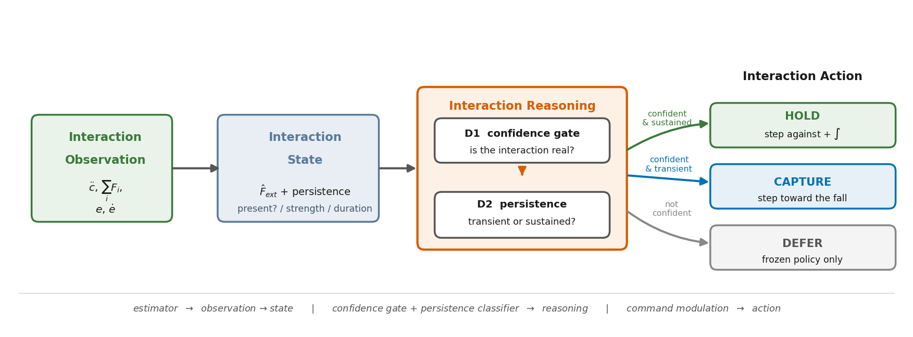
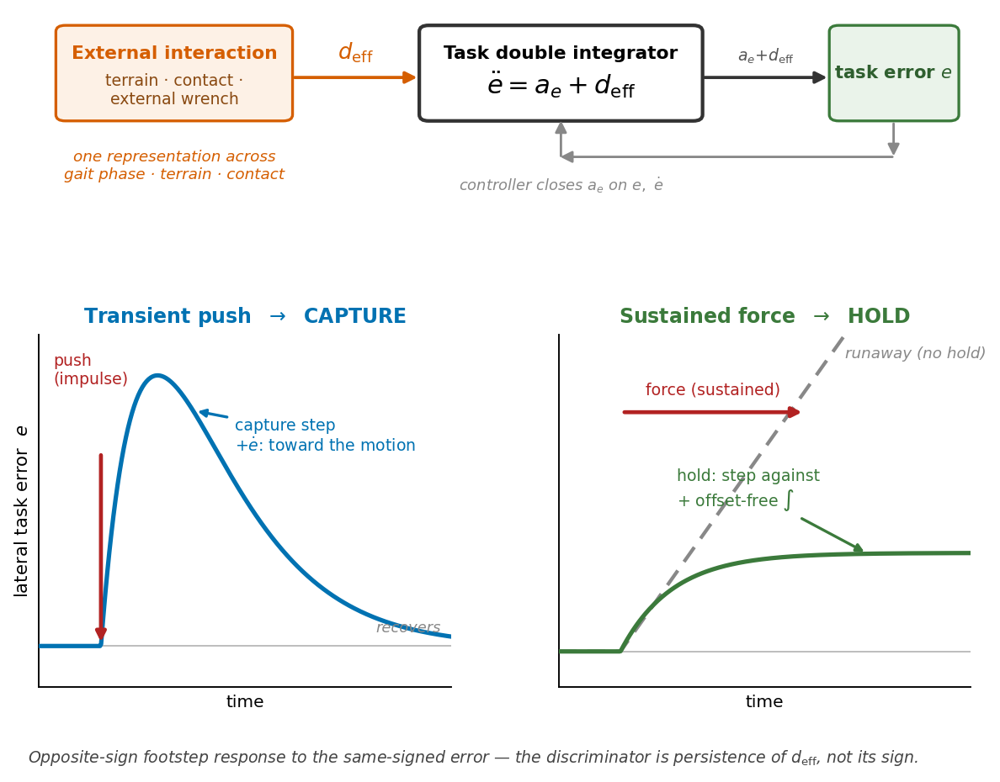
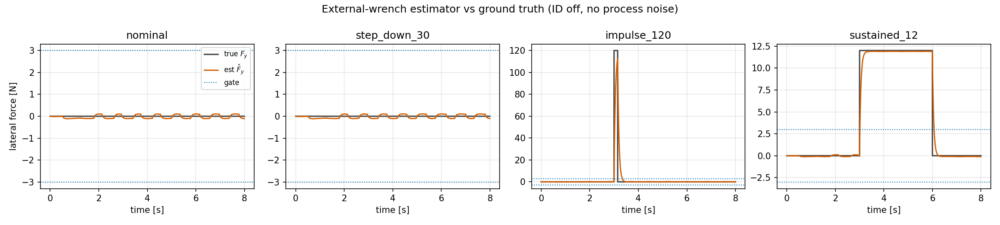
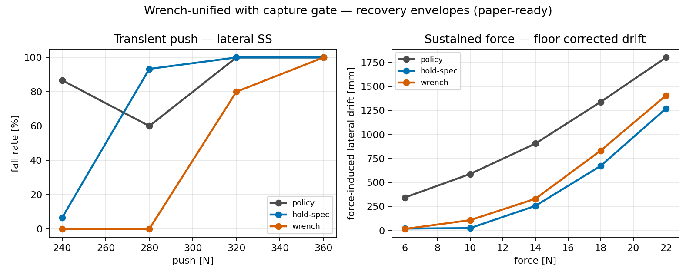

# Interaction Dynamics: A Physical-Interaction Reasoning Layer for Humanoid Robots

**Yongyan Cao**

---

## Abstract

A walking robot must cope with physical contact of very different kinds. A brief push injects momentum and is best absorbed by stepping toward the fall to capture it, whereas a sustained force, such as a lean or a payload, must be resisted by stepping against it. These two responses have opposite sign, yet center-of-mass (CoM) kinematics cannot distinguish the cases online, because a recovered push and a standing force leave the same lateral offset. What separates them is whether a force is still acting, which is not a kinematic quantity. We estimate the external force from the horizontal CoM momentum residual and use it to choose the response. The resulting Interaction Dynamics layer sits between a frozen reinforcement-learning walking policy and the robot and biases the policy's velocity command. A confidence gate engages the layer only when the estimated wrench rises above its own measured noise floor, and a persistence timer blends a predictive capture command with an integral hold. On a simulated Unitree G1, the layer cuts single-support push falls at 280 N from 24/40 to 2/40 (McNemar $p<10^{-4}$, with no paired trial made worse) and holds a sustained 8 N force to 13 mm of lateral drift, against 12 mm for a dedicated hold controller, while nominal walking is unchanged. We read the layer as a fast, short-horizon interface for physical interaction that sits below motion planning and above whole-body control.

**Index Terms** — interaction dynamics, external-wrench estimation, humanoid locomotion, push recovery, physical human–robot interaction, model-based physical AI, interaction-mode arbitration, confidence-based mode selection.

---

## I. Introduction

A legged robot in the physical world is continuously subject to *external interaction*: hands push on it, tools and payloads load it, and the terrain applies contact forces that differ from those the motion plan assumed. Such interaction is heterogeneous. A shove in a crowd is a **transient impulse** — a brief, high force that injects momentum and then vanishes. A person leaning on the robot, a wind load, or a persistent contact is a **sustained force** — a low, standing force that must be continuously resisted. These two modes are not merely different in magnitude; they demand *opposite* control actions. To recover from a transient push, a biped must step *toward* the direction of the fall so that a foot lands under the accelerating CoM (a capture step). To hold position against a sustained force, it must instead lean and step *against* the force. Applying the transient response to a sustained force amplifies the drift; applying the sustained response to a transient push fails to arrest the momentum.

This paper makes three observations that, together, motivate a new layer in the control stack.

**Observation 1 (the discrimination problem).** The correct interaction mode cannot be inferred from CoM kinematics alone. A transient push and a sustained force can leave the *same* persistent lateral displacement: after a push, a biped recovers balance at a translated position, so its CoM error stays nonzero indefinitely — indistinguishable, from position and velocity alone, from a standing force. The distinguishing information is *whether an external force is still acting*, which is not a kinematic quantity.

**Observation 2 (the representation).** Despite this heterogeneity, all external interaction shares one representation. In selected task coordinates, after nominal dynamic compensation, the tracking error obeys a fixed double integrator driven by a single *interaction residual* $d_{\rm eff}$ that aggregates the external wrench, realization error, and model mismatch. This model is invariant across configuration and contact mode: interaction becomes a *predictive state* on a shared model, rather than a property to be re-modeled per contact.

**Observation 3 (the time scale).** Physical-interaction control and perception work on different time scales and solve different problems. Perception and planning reason about the world and the task, for example by recognizing terrain, predicting a person's intent, or replanning footholds, over tens to hundreds of milliseconds. Reacting to a force cannot wait for that loop: the response must be immediate, and it needs only the estimated interaction, not a world model. This argues for a short-time-scale layer below planning and above the actuators, whose job is to manage physical interaction while the slower loops update. The same split organizes a model-based Physical AI stack, in which perception and planning reason about the world while a fast interaction layer handles the physical interaction itself; the two are complementary rather than competing.

This makes the control problem one of mode selection rather than force regulation. Classical interaction controllers, such as impedance and admittance schemes, assume that a single interaction is always present and regulate its magnitude. Here the mode is unknown and must be inferred online: the layer must first decide whether an external interaction is present, and then which regime it is, before it can act. The external-force estimate is what makes both decisions possible, and it is the information that center-of-mass kinematics lack.

We call this layer **Interaction Dynamics**. Figure 1 places it in a model-based Physical AI hierarchy:



**Fig. 1.** Interaction Dynamics as the fast physical-interaction layer between planning and the whole-body realizer. It estimates the external wrench, arbitrates capture vs. hold through a two-level confidence mechanism, and modulates the frozen policy's walk command; the falling-rate cue $\dot\theta_{\rm fall}$ returns upward through a *proposed*, unevaluated planner interface.

The layer carries out this decision in three steps (Fig. 2). It estimates the external wrench and how long it has persisted, decides whether a real interaction is present and whether it is transient or sustained, and applies the corresponding correction: defer to the policy, capture, or hold. The estimator, the confidence gate, and the persistence classifier are thus parts of one pipeline rather than separate additions. §III sets up the representation, §IV the estimator, and §V the gating and control; §VI evaluates the result.



**Fig. 2.** The interaction-reasoning pipeline: observation → estimated **interaction state** (wrench + persistence) → **reasoning** (D1: real? D2: transient or sustained?) → **action** (defer / capture / hold). The estimator, gate, and persistence classifier of §IV–V are its stages.

The layer does not replace perception or planning; it provides stability during the interval before a new plan is available. When the disturbance exceeds the layer's authority, the state it exposes, such as a falling angle whose rate shows that stabilization authority is running out, is the signal a higher layer needs to widen the stance, slow down, replan footsteps, or abandon a task.

To make the contribution about interaction and not about locomotion, we deliberately treat locomotion as a **frozen validation platform**: we take an off-the-shelf pretrained RL walking policy [16] for a Unitree G1, freeze it, and never tune it during any interaction experiment. The interaction layer sits on top and modulates the policy's walk command. A natural alternative — realizing the interaction correction through a whole-body inverse-dynamics/contact QP, as classical interaction control would — turns out to *destabilize* a strong learned policy, because the policy's balance is a closed-loop property of its own control law; we report this as a negative result that motivates the command-modulation coupling.

**Contributions.** This paper makes four contributions.

1. *Problem formulation.* We show that transient and sustained interactions call for opposite command-space recovery actions under a shared locomotion interface, and that CoM kinematics alone cannot tell the two apart online.
2. *Method.* A wrench-gated persistence arbitration that blends a predictive capture command with an integral hold and drives a frozen learned policy through its native velocity-command interface. The external-force estimate from the CoM linear-momentum residual is the enabling signal, and the fixed configuration-invariant model (Lemma 1, adapted from [1]) is the substrate.
3. *Properties.* Capture-path transparency, so the layer reduces to the frozen policy when disengaged and cannot start the capture runaway, and a bounded augmentation command under bounded estimation error (Props. 1–2).
4. *Evaluation.* A paired humanoid study on a Unitree G1 with specialist, CoM-only, and oracle ablations, statistical push and sustained-force tests, sensing-robustness sweeps, and a discovered-and-fixed failure mode.

---

## II. Related Work

**Locomotion control.** Convex MPC [2], [3], [13], whole-body inverse dynamics and hierarchical QPs [4], [5], [7], [9], and unified whole-body MPC [10] embed contact and support in the predictive model. We instead predict a fixed double-integrator task model and add a thin layer atop a frozen controller.

**Push recovery and reactive stepping.** Recovery from a shove is classically posed through the capture point and the divergent component of motion [20], [21], with reactive stepping placing a foot to arrest momentum [22]. These target the transient case and assume a model-based stepping controller. We keep such capture behavior for transients, add an explicit sustained-force mode, select between them online, and act through a learned policy's command interface rather than a dedicated stepping controller.

**External-force and momentum observers.** External forces can be estimated without force sensing through generalized-momentum observers [14], [15], used for collision detection and reaction on manipulators and, more recently, humanoids [25]. We use the CoM *linear*-momentum residual not as a collision flag but as a confidence and persistence signal that drives mode selection.

**Layering on a frozen policy.** Adding a model-based correction to a fixed learned policy connects to residual reinforcement learning [23] and to supervisory and multiple-model control, where a higher-level logic switches or blends among controllers [24]. Our layer is a supervisory arbitration in this sense: a confidence gate and a persistence classifier blend two hand-designed corrections without retraining the policy.

**Interaction control and positioning.** Impedance and admittance control [6], [11], [12] assume a single, always-present interaction and regulate its magnitude; we treat which mode is present as the unknown. The fixed-model representation and its offset-free regulation for fixed-base contact were developed in [1], and we carry them onto a floating base. Wrench estimation, confidence gating, persistence-based blending, and command-space augmentation are individually known; the contribution is their combination into an interaction layer that arbitrates transient capture against sustained hold on a frozen humanoid walker.

---

## III. Interaction Dynamics: The Representation

### A. Floating-base model and task residual

With generalized coordinates $q=[q_b^\top,q_j^\top]^\top$ (floating base and actuated joints), the dynamics are
$$
M(q)\ddot q+h(q,\dot q)=S^\top\tau+J_c^\top\lambda+w_{\rm ext},
\tag{1}
$$
with contact wrenches $\lambda$ and external interaction $w_{\rm ext}$. Let $y$ collect selected task coordinates (here planar CoM position) and $e=y-y_d$ the tracking error against a nominal plan. Under a well-conditioned task inertia and nominal feedforward, the realized error obeys the **canonical interaction model**
$$
\ddot e=a_e+d_{\rm eff},\qquad d_{\rm eff}=d_{\rm int}+d_{\rm real}+d_{\rm mod},
\tag{2}
$$
where $a_e$ is the commanded task-acceleration correction, $d_{\rm int}=M_p^{-1}F^{\rm ext}$ the task-acceleration effect of the external interaction, $d_{\rm real}$ the realization discrepancy, and $d_{\rm mod}$ the model residual.

**Lemma 1 (fixed requested-task predictor).** For a task of relative degree $r$ whose requested coordinate is held fixed across a set of contact modes, the exact zero-order-hold transition pair of (2) is the order-$r$ integrator-chain pair $(A_d,B_d)$, a function of the sample period and $r$ alone. Robot mechanics, contact geometry, and environment enter only $d_{\rm eff}$ and the admissible-command set, never $(A_d,B_d)$. A contact switch changes the residual and the recovery map but leaves the prediction matrices invariant. (Under a well-conditioned task inertia and exact nominal feedforward; the integrator-chain result follows as in [1], carried to the floating base.)

*Why the fixed model suffices.* The prediction pair $(A_d,B_d)$ describes only how a task coordinate and its rates evolve under a commanded task acceleration over one sample — pure integrator-chain kinematics, which know nothing of the robot. Everything that *is* robot- and contact-specific — the mass matrix, Coriolis and gravity terms, contact Jacobians, and the external wrench — enters only through the acceleration actually produced, i.e. through $d_{\rm eff}$ and the set of admissible commands. Changing the robot, the terrain, or the contact state therefore changes *what correction is needed and whether it is reachable*, but not the integrator that maps command to motion. This is why a single normalized model can carry interactions that would otherwise each demand a separate, contact-dependent model.

*How accurate is the representation?* Under the assumptions of Lemma 1, namely nominal dynamic compensation and task-space projection, the model $\ddot e = a_e + d_{\rm eff}$ is **exact**, not a linearization: it is a definition of $d_{\rm eff}$ as whatever acceleration the dynamics produce beyond $a_e$. Approximation enters only through imperfect compensation and unmodeled dynamics, and it does not corrupt the prediction matrices; it is absorbed into the model-residual term $d_{\rm mod}\subseteq d_{\rm eff}$, where the estimator and controller treat it exactly as they treat an external force. The integrator structure is thus an exact coordinate identity under the stated input definition; its *predictive* usefulness, however, is conditional — on the residual being observable and sufficiently persistent over the control horizon, and on the policy-mediated command map (Sec. V-C) remaining locally consistent. A large or rapidly varying $d_{\rm mod}$ leaves the identity intact but can make the fixed model uninformative for prediction.

Thus interaction is a *predictive state* on a shared, fixed model. A distinction matters here: for *control*, the capture law cancels the aggregate residual and need not separate its parts; for *mode classification*, the force component must be isolated. Writing $d_{\rm eff}=m^{-1}F_{\rm ext}+(d_{\rm real}+d_{\rm mod})$ with $d_{\rm int}=m^{-1}F_{\rm ext}$, the transient-vs-sustained decision keys on $d_{\rm int}$ alone — an aggregate acceleration residual cannot tell a persistent external force from a persistent realization or model bias — and the linear-momentum estimator of Sec. IV recovers exactly this component, $\hat d_{\rm int}=m^{-1}\hat F_{{\rm ext},xy}$. The representation is a modeling *choice*, and a falsifiable one: the task is regulated to zero steady error only when the cancelling correction $a_e=-d_{\rm eff}$ is admissible and realizable; a force beyond the command authority surfaces as an un-rejected residual or loss of balance, not as a free relabeling.

### B. The transient/sustained dichotomy

The residual model (2) is symmetric in $d_{\rm eff}$, but the *appropriate correction* is not (Fig. 3). Consider a lateral disturbance.

- **Transient impulse.** The force acts briefly, injecting CoM velocity; afterward $d_{\rm int}\!\to\!0$ but the momentum persists. The stabilizing action is to command the walking layer *toward* the error velocity, placing the swing foot under the falling CoM (capture). The sign of the useful correction is $+\dot e$.
- **Sustained force.** The force persists; without action the CoM drifts continuously. The stabilizing action is to command *against* the error and add an integral term for offset-reducing rejection. The sign is $-e-\!\int\! e$.

These are opposite — more precisely, under the evaluated velocity-command interface the effective command-space recovery actions have opposite signs (this need not hold for an ankle/hip strategy or a pure force-regulation objective). Moreover (Observation 1), $e$ and $\dot e$ do not distinguish the two: a transient push leaves a lasting position offset (recovery at a translated stance), so a persistence test on the *deviation* misfires. The distinguishing variable is the external wrench itself, which is present under a sustained force and absent (after the pulse) under a transient one — even while the CoM is still recovering. Sections IV–V build the estimator and the arbitration around exactly this variable.



**Fig. 3.** The representation and the dichotomy. *Top:* interaction lumps into one residual $d_{\rm eff}$ on a fixed double integrator $\ddot e = a_e + d_{\rm eff}$. *Bottom:* the same-signed error demands **opposite-sign** responses — capture *toward* the motion ($+\dot e$) for a transient, integral hold *against* it for a sustained force. The discriminator is $d_{\rm eff}$'s *persistence*, not its sign. The lower panels are conceptual illustrations, not measured responses.

---

## IV. External-Wrench Estimation

**CoM linear-momentum residual.** Newton's law for the CoM $c$ (mass $m$, gravity $g$, contact forces $F_{{\rm contact},i}$) is $m\ddot c=mg+\sum_i F_{{\rm contact},i}+F_{\rm ext}$, hence
$$
F_{\rm ext}=m(\ddot c-g)-\textstyle\sum_i F_{{\rm contact},i}.
\tag{3}
$$
We use only the **horizontal** components, where gravity has no component, so the term $mg$ drops out *exactly*:
$$
\hat F_{{\rm ext},xy}=m\,\ddot c_{xy}-\textstyle\sum_i F_{{\rm contact},i,xy}.
\tag{4}
$$
Here (4) uses simulation-clean CoM acceleration and contact forces (Sec. VI); on hardware, CoM acceleration and velocity require a floating-base state estimator (joint kinematics plus the model), not a single IMU, and the contact wrenches are measured with bias and noise — so a hardware observer is future implementation, not claimed here. To avoid differentiating a noisy CoM velocity, (4) may equivalently be realized as a filtered linear-momentum-residual observer $\dot{\hat l}=\sum_iF_i+\hat F_{\rm ext}$ with $\hat F_{\rm ext}=L(l-\hat l)$ and $l=m\dot c$; the residual $L(l-\hat l)$ both estimates the external force and drives the observer, giving $\dot{\hat F}_{\rm ext}=L(F_{\rm ext}-\hat F_{\rm ext})$ — a first-order low-pass of the true force (shown for scalar or commuting $L$; a general matrix gain gives $\dot{\tilde l}=F_{\rm ext}-L\tilde l$ with $\hat F_{\rm ext}=L\tilde l$, $\tilde l=l-\hat l$). We found the two forms produce comparable estimates in simulation (V6).

**Interaction confidence.** The estimator is only useful to the arbitration if it (i) does not read normal contact transitions or commanded acceleration as external force, and (ii) cleanly separates transient from sustained. We verify both in V1 below. The key property is that $|\hat F_{\rm ext}|$ spikes and then decays below the detection threshold within about 0.2 s (Table I), and toward zero within about 0.6 s, after a transient pulse, even while the robot is still recovering; under a sustained force it stays near the applied magnitude. This is the persistence signal that the kinematics could not provide, and the confidence mechanism of §V is built on it.

---

## V. Confidence-Gated Interaction Control

This section builds the **reasoning and action** stages of the pipeline (Fig. 2). We separate the layer's *controller state* from what it merely reports upward. The control law acts on
$$
x_I=[\,\hat F_{\rm ext}^\top,\; p,\; g\,]^\top,
$$
the estimated external wrench (Sec. IV) with the persistence $p\in[0,1]$ and gate $g\in\{0,1\}$ produced below. A separate report vector $z_I=[\theta_{\rm fall},\,\dot\theta_{\rm fall}]^\top$ — the base falling angle and its rate, an *instability cue* (Sec. VIII) — does *not* enter the control law; the full interaction packet sent upward is $\mathcal I=(x_I,z_I)$. The interaction layer is then the map $u=\pi_I(x_I)$ from the controller state to a velocity-command bias, and Fig. 2 is its factorization into observe → estimate → reason → act. The layer reasons over $x_I$ with two confidence decisions before acting: the confidence gate and the persistence classifier below are the two decisions of a single reasoning process — *is the interaction real?* and *which regime is it?* — whose output selects the interaction action. The bias $u\in\mathbb{R}^2$ is added to the frozen policy's walk command, so the policy recovers by *placing its feet* — the mechanism it is strong at. A deadband and rate limit keep the layer out of the nominal loop (bias $\approx 0$ when undisturbed, so nominal walking is unchanged). Two candidate corrections are available:

- **Capture** $u_{\rm cap}=-k_{\rm map}\,a_e$, where $a_e$ is the acceleration chosen by a normalized predictive controller on (2) [1]; commanding the policy in the CoM error-velocity direction steps it toward the fall, so the realized CoM acceleration opposes the disturbance.
- **Hold** $u_{\rm hold}=-k_p\,e-k_i\!\int\! e$, stepping against the disturbance with an integral term [19]. Whether this yields *zero* steady offset depends on the policy-command loop admitting integral action; we therefore call it an integral (offset-reducing) hold and assess residual offset empirically (V4).

The controller arbitrates between them with a **two-level interaction-confidence mechanism**. The exact gate and persistence updates, all parameters, and a per-step listing are in the Appendix.

### A. Level 1 — interaction-confidence gate

*Is there a real external interaction at all?* Capture (interaction-oriented behavior) is enabled only when the wrench estimate rises a margin above its own noise floor; otherwise the layer defers to the policy's internal stabilization. Let $\sigma_f$ be an online estimate of the $|\hat F_{\rm ext}|$ noise level (an RMS magnitude, not a zero-mean standard deviation), updated by an exponential moving average of $|\hat F_{\rm ext}|^2$ only during quiescent walking ($\|e\|<$ deadband). The confidence threshold is
$$
F_{\rm cap}=F_{\rm floor}+k_\sigma\,\sigma_f,
\tag{5}
$$
with $F_{\rm floor}$ a minimum meaningful force (estimator resolution) and $k_\sigma$ a noise-scaled margin. We use "confidence" operationally: $k_\sigma$ sets how many noise RMS above the floor triggers engagement, not a formal false-alarm probability under a distribution model. The gate $g\in\{0,1\}$ latches to 1 when $|\hat F_{\rm ext}|>F_{\rm cap}$, is held open while the robot is still recovering ($\|e\|>1.5\times$ deadband) so that a long capture recovery keeps full capture even after the transient force has vanished, and decays only once recovered. Sub-threshold noise never latches the gate, so capture cannot amplify unclassified drift. Because $\sigma_f$ is estimated online, $F_{\rm cap}$ self-adjusts to the measured quiescent noise floor rather than being a tuned constant — an online noise-scaled threshold, demonstrated here against injected process noise (Sec. VI, Table V); adaptation to bias, nonstationary, or impact-correlated noise is untested.

**Proposition 1 (capture-path transparency).** The layer is disengaged, $u=0$, on any interval where the CoM error stays within the deadband ($\|e\|<\delta$); there the closed loop is exactly the frozen policy, so nominal walking is unchanged. When the layer is engaged ($\|e\|\ge\delta$) but the wrench estimate is sub-threshold ($g=0$), the capture term drops out of (6), leaving $u=p\,u_{\rm hold}$: the capture positive-feedback path is inactive, so a sub-threshold drift cannot trigger the runaway of the ungated law (§VI, validation lessons). Full transparency while engaged ($u=0$ with $\|e\|\ge\delta$) additionally requires $p=0$, $e_{\rm eff}=0$, and a reset integral. Nominal-walking transparency thus comes from the deadband, and the gate adds capture-path transparency by keeping the momentum-capturing term off until a real force is confidently detected; §VI confirms both.

**Proposition 2 (bounded augmentation command).** Suppose the horizontal wrench-estimation error is bounded, $\|\hat F_{\rm ext}-F_{\rm ext}\|\le\varepsilon_F$, with the noise floor calibrated so that $F_{\rm cap}\ge\varepsilon_F$. Then: (i) with no true external force ($F_{\rm ext}=0$), nominal walking keeps the CoM within the deadband, so $u=0$ and the augmented trajectory equals the nominal-policy trajectory (and $|\hat F_{\rm ext}|\le\varepsilon_F\le F_{\rm cap}$ keeps capture ungated even if the deadband is briefly crossed by noise); and (ii) whenever the layer is engaged, the command bias is bounded, $\|u\|\le u_{\max}$, by the saturation and rate limit. The augmentation therefore cannot request unbounded velocity, and the *algebraic* command blow-up of the ungated capture law is prevented.

Part (ii) does not bound the state. A bounded velocity-command bias can still integrate into unbounded position drift, so closed-loop state boundedness is not implied; it depends on the frozen policy's own stability, which we check empirically. The evidence is in the validation lessons below: the no-force lateral drift falls from 1539 mm for the ungated law to about 95 mm once the gate is calibrated. The proposition bounds the input authority and gives exact transparency when the layer is disengaged; bounded motion is a property of the policy in the loop.

### B. Level 2 — transient-vs-sustained blend

*Given a confident disturbance, is it transient or sustained?* A persistence timer on $|\hat F_{\rm ext}|$ produces $p\in[0,1]$ (0 = transient, 1 = sustained): a transient force falls below the persistence threshold within $\sim 0.4$ s so $p$ stays low, while a sustained force keeps it high so $p\to 1$. The output blends the two corrections:
$$
u=(1-p)\,g\,u_{\rm cap}+p\,u_{\rm hold}.
\tag{6}
$$
The gate $g$ multiplies only the capture term; the hold is deviation-driven and ungated. When hold arrests a sustained drift, $\dot e\to 0$ so $u_{\rm cap}$ self-vanishes; on a transient, $p$ decays and only (gated) capture remains. Because $p$ is continuous, (6) is a persistence-weighted blend rather than a hard switch: D1 (the gate $g$) is a discrete engagement decision, D2 (the persistence $p$) a continuous belief. The whole layer is held out of the nominal loop by an outer deadband ($u=0$ when $\|e\|<\delta$), so undisturbed walking is unaffected regardless of $g$ and $p$.

### C. Realization: command modulation, not whole-body QP

We realize $u$ by modulating the frozen policy's walk command. We also implemented the classical alternative — mapping $a_e$ to a task acceleration realized by a whole-body inverse-dynamics/contact QP. On a strong learned policy this destabilizes walking (fall in $\sim 3$ s vs. $>$12 s for command modulation), because the policy's balance is a closed-loop property of its own joint-space control law and a substituted realizer breaks it. We report this as a negative result *for this policy and QP realization*: replacing the policy's learned low-level realization destabilized walking, whereas command-space modulation preserved its balance — a closed-loop property of the policy's own control law. We do not claim this holds for all residual-QP, shielded, or torque-residual schemes; it motivates our command-modulation coupling. Because the layer couples to the policy only through the command interface, the construction is policy-agnostic by design; a demonstration across policies is future work (Sec. IX).

---

## VI. Validation of the Interaction Layer

We validate the layer with a six-stage protocol, on a Unitree G1 (`unitree_rl_gym` pretrained policy, MuJoCo, 500 Hz sim). The policy is frozen throughout: it walks 10/10 seeds for 20 s at 0.477 m/s and is never tuned during any interaction experiment. Unless stated, transient studies use phase-locked lateral pushes gated on measured support, with a fall metric; sustained studies use a floor-corrected paired lateral-drift metric (V4) at low process noise.

**V1 (estimator correctness).** We logged the true applied force against $\hat F_{\rm ext}$ (interaction layer off) across nominal walking, commanded turning, diagonal (lateral) walking, a 30 mm step-down, a 120 N/0.15 s impulse, and a 12 N/3 s sustained force (Fig. 4); the blind step-up appears only in the demonstration (Sec. VII), where it causes a trip rather than a mislabelled force. False positive is the fraction of no-force samples with $|\hat F_{\rm ext}|>F_{\rm cap}$.



**Fig. 4.** Estimated horizontal external wrench $\hat F_{\rm ext}$ (interaction layer off) versus ground truth across the test scenarios: no false positives on gait and contact transitions, near-instant impulse detection with $\sim 0.19$ s decay, and $\sim 1$ N tracking of the sustained force.

| scenario | RMSE | false-positive | detect | decay |
|---|---:|---:|---:|---:|
| nominal | 0.1 N | 0.0 % | — | — |
| turning | 0.1 N | 0.0 % | — | — |
| diagonal | 0.1 N | 0.0 % | — | — |
| step-down 30 mm | 0.1 N | 0.0 % | — | — |
| impulse 120 N | — | — | $\le 2$ ms | 0.19 s |
| sustained 12 N | 1.0 N (track) | — | 0.01 s | — |

**Table I.** Wrench estimator vs. ground truth. The estimator does not read touchdown/liftoff, step transitions, or commanded acceleration as external interaction (0 % false positive; $\sim 0.1$ N residual during all no-force walking), detects a real impulse essentially instantly and clears it in 0.19 s, and tracks a sustained 12 N force to 1 N.

**V2 (architecture necessity, oracle ablation).** Six controllers on the same transient (300 N single-support) and sustained (8 N) tests: policy; a capture specialist; a hold specialist; a CoM-kinematics-only unified controller (persistence on the *deviation*, not the wrench); the wrench-gated controller; and an **oracle** that knows the true disturbance class at onset with zero delay.

| controller | transient falls /20 | sustained drift (mm) |
|---|---:|---:|
| policy | 20 | 462 |
| capture-specialist | 11 | 1080 |
| hold-specialist | 20 | 12 |
| CoM-only unified | 16 | 719 |
| **wrench-gated** | **12** | **13** |
| oracle | 11 | 12 |

**Table II.** Each specialist fails outside its regime (opposite-sign dichotomy); pure capture *amplifies* a sustained force (1080 mm, worse than policy). The CoM-only unified controller is dominated on both: **in the tested controller family and disturbance protocol, CoM-only arbitration is insufficient while wrench persistence enables near-oracle selection.** We do not claim wrench information is mathematically necessary for *every* classifier — a richer temporal model might infer duration from context. The wrench-gated controller matches the oracle on transient and nearly matches it on sustained.

**V3 (generalization, held-out).** With all thresholds and gains frozen, we evaluated cases never used for tuning: held-out impulse *durations* (0.10/0.25/0.40 s vs. the 0.15 s used in design), off-grid sustained magnitudes (6/10/14 N), ramped forces, and intermittent forces. The controller generalizes: at the held-out 0.25 s duration it matches the capture specialist (correctly classified transient, not degraded toward hold); off-grid sustained magnitudes track the trend; a 1 s ramp is rejected better than the bare policy. **One failure mode:** a rapidly intermittent force (0.5 s on/off) defeats the persistence discriminator — an intermittent force is genuinely ambiguous (repeated pushes vs. a sustained-ish force), and both the confidence gate and the persistence blend keep it in an unstable regime. We state this as a limitation (Sec. IX).

**V4 (statistical significance).** 40 paired held-out seeds; transient by fall count with an exact McNemar test, sustained by the floor-corrected paired drift (the offset with force minus the same-seed offset without force, which cancels the gait-sway/reference phase drift).

| push | policy falls | wrench falls | McNemar $p$ | wrench-worse |
|---|---:|---:|---:|---:|
| 280 N | 24/40 | **2/40** | $<10^{-4}$ | 0 |
| 300 N | 40/40 | **20/40** | $<10^{-4}$ | 0 |
| 320 N | 40/40 | 36/40 | 0.125 | 0 |

| force | policy | hold-specialist | wrench-gated |
|---|---:|---:|---:|
| 8 N | 462 mm | 12 [7–19] | **13 [8–17]** |
| 12 N | 728 mm | 121 [114–132] | 202 [186–218] |

**Table III.** Transient (top) and sustained (bottom, median [IQR] mm). The transient benefit is strongly significant, and no paired trial was worsened at the three evaluated push magnitudes; we do not extend "never worse" beyond these conditions (cf. the intermittent-force failure in V3). On sustained force at 8 N the controller's drift lies within the hold specialist's spread (13 [8–17] vs. 12 [7–19] mm), though we do not claim formal equivalence — a paired equivalence test is left to future work; the causal-detection cost is a modest $\sim 1.7$× at 12 N. The envelope (Fig. 5) shows the controller holding 0 % single-support falls through 280 N while the policy is already 60–87 %.

**V5 (sensing robustness).** We swept a horizontal foot-force bias $b_F\in\{-5,-3,0,3,5\}$ N and measurement noise, since the estimator subtracts measured contact force and sustained forces are only 8–12 N. Nominal walking is fully protected (base roll 6.8–6.9° across all bias and noise), because the online noise floor absorbs a persistent bias into $F_{\rm cap}$: the EWMA raises $\sigma_f$ so $F_{\rm cap}$ climbs above the bias and capture never engages, while sustained rejection (deviation-driven and ungated) is unaffected (see Appendix). Sustained regulation tolerates $\pm 5$ N bias (drift 10/14/22 mm at $b_F=-5/0/+5$), and the transient benefit degrades gracefully under large bias while remaining far above the policy.

**V6 (estimator implementation).** The finite-difference estimator (4) and the momentum observer produce comparable estimates in the evaluated scenarios; the finite-difference form is cleaner on the false-positive metric here, because in simulation the CoM velocity is already clean. The observer's advantage — robustness to *noisy* velocity — is a hardware consideration. We keep the finite-difference form as default.

**Validation lessons (a discovered-and-fixed failure).** When we plotted *lateral position* rather than falls, the capture path was seen to amplify any drift it engaged on but could not classify as a force — under process noise exceeding the deadband, capture drove a runaway lateral excursion (no-force drift 1539 mm at 4 N noise) that never caused a fall and so was invisible in balance metrics. This is a control-logic problem, not a tuning one: capture steps toward an unclassified drift, closing a positive feedback loop. It is exactly what motivated the Level-1 confidence gate (Sec. V-A), which enables capture only on confident evidence of a real interaction. With the gate, the no-force drift falls to $\sim 95$ mm (policy floor), while the transient and sustained benefits are preserved or improved (Tables II–III). The online noise-scaled threshold (5) recovers the value appropriate to a fixed noise level without requiring one to be hand-tuned:

| process noise | settled $F_{\rm cap}$ |
|---|---:|
| 0 N | 1.4 N |
| 1 N | 2.1 N |
| 4 N | 6.3 N |
| 8 N | 10.6 N |

**Table V.** The confidence threshold self-adapts to the sensing noise (sensitive when clean, conservative when noisy), so it is a general criterion, not an experiment-specific constant.

---

## VII. Humanoid Demonstration

On the frozen policy, the layer runs in-situ during walking. Under lateral single-support pushes it extends the recovery envelope (Fig. 5, left) and, under sustained lateral force, it holds the CoM near the nominal path where the policy droops (Fig. 5, right). On terrain, a **step-down** the policy already handles is unaffected by the layer, while a blind **step-up** beyond a few centimeters causes a toe-stub *trip* for every controller — the policy is flat-trained and cannot see the step. This is not a weakness of the interaction layer: it shows that interaction control cannot invent terrain geometry. Once perception detects the step, the planner can raise or reposition the swing foot, while the interaction layer maintains stability through the planning latency — each acting on its own time scale. It is the boundary that Sec. VIII turns into a systems argument.



**Fig. 5.** Recovery envelopes (confidence-gated layer vs. policy and the hold specialist): (left) single-support fall rate vs. push magnitude; (right) floor-corrected steady lateral drift vs. sustained force.

---

## VIII. Discussion: Interaction Dynamics in a Model-Based Physical AI Hierarchy

The proposed layer is not intended to replace perception or motion planning. It operates on a shorter time scale and solves a different problem, and it is most useful as the *bridge* between reactive physical control and deliberative model-based planning.

**Perception and interaction are complementary, not competing.** Perception and a world model estimate *what the world is*; motion planning decides *what to do next*; Interaction Dynamics governs *how the robot physically interacts in the meantime*, stabilizing on the estimated interaction while the slower loops update the plan. The blind step-up (Sec. VII) makes this concrete: no interaction controller can avoid the trip without terrain perception, but with it the planner raises or shifts the foothold while the layer stabilizes through the planning latency. The claim is not that the controller compensates for perception delay, but that interaction control and perception occupy different, complementary rungs of the stack.

**The layer buys time.** The same holds for external forces. A push is met immediately, because the response needs only $\hat F_{\rm ext}$. If the disturbance grows beyond the layer's authority, a higher layer can widen the stance, slow down, change direction, abandon the task, or enter a safe mode. The observed recovery margin suggests the layer could provide additional time for a slower planning response (a delayed planner reaction is not itself tested):
```
external push → interaction layer (ms) → robot survives → planner (100 ms) → new strategy
```

**Interaction state as a planning signal (proposed).** The information the layer exposes is more than an evaluation metric. A higher layer could consume the estimated wrench, its regime, and the falling rate $\dot\theta_{\rm fall}$. We treat $\dot\theta_{\rm fall}$ as an instability cue rather than a calibrated authority margin; a true margin would combine command saturation, foot-placement reach, and support-polygon limits, and correlating $\dot\theta_{\rm fall}$ with the recovery boundary is left for future work. This upward path is a proposed interface only. The layer exposes its interaction state, but we do not close the loop to a planner or evaluate that here.

**Where this places the contribution.** In a model-based Physical AI stack — perception → planner → interaction dynamics → whole-body realization → robot — the contribution is *one rung*: the fast physical-interaction interface between planning updates. "Physical AI" here is context, not a result; the paper defines a single rung with a clear responsibility (estimate, reason about regime, stabilize) and a clear interface above and below.

---

## IX. Limitations

- **Intermittent forcing** at a period near the detection time scale defeats the persistence discriminator (V3); this and, before the gate, sub-threshold noise share a root cause — when the layer cannot confidently classify the interaction, the capture path is unsafe. The confidence gate resolves the noise case; the intermittent case is genuinely ambiguous and remains open.
- **Whole-body realization on a learned policy** was found to destabilize walking (Sec. V-C); the interaction correction is injected through the policy's command interface. On a model-based walker, a QP realization may be preferable; we do not claim it here.
- **Sensing is simulation-clean.** The estimator uses MuJoCo-exact contact forces and a full-state CoM velocity; it is implementable from an IMU and foot six-axis wrenches. The estimated sustained drift is subject to a metric floor that we remove with a paired, self-referenced measurement.
- **Perception is out of scope.** The layer cannot invent terrain geometry (blind step-up) or anticipate a disturbance; it provides immediate stabilization, and its authority boundary is a signal for the layers that can.
- The study is on one simulated humanoid and **one locomotion policy**. The layer couples to the policy only through its command interface, so policy-independence holds by construction; still, a second-policy demonstration would substantiate the architectural claim empirically and remains future work, alongside other task coordinates, long-distance walking, deformable ground, simultaneous manipulation, and hardware.

---

## X. Conclusion

We presented Interaction Dynamics: a fast, short-time-scale layer governing a legged robot's physical interaction with the world. It represents all external interaction as a residual on a configuration-invariant fixed model, estimates the external wrench from a CoM momentum residual, and reasons over it with an online noise-scaled confidence gate and a persistence-based blend of opposite-signed capture and hold. Added atop a *frozen* RL policy through its command interface, it reduces push falls (with no paired degradation at the tested push magnitudes) and rejects sustained forces to near-specialist accuracy, with nominal walking untouched; a six-stage validation both established these claims and *discovered and resolved* a capture-amplification failure mode. We propose Interaction Dynamics as a candidate *fast physical-interaction layer* between perception-driven planning and whole-body realization — one rung of a model-based Physical AI hierarchy whose end-to-end validation remains future work.

---

## Appendix. Controller Equations and Parameters

The simulation runs at 500 Hz and the layer at 50 Hz ($\Delta t=0.02$ s). The planar-CoM error is $e=c_{xy}-c_{xy}^{\rm ref}$ with a deadband-shrunk error $e_{\rm eff}=e\,\max(0,\|e\|-\delta)/\|e\|$. The external force $\hat F_{\rm ext}$ is estimated by (4), low-passed at 5 Hz.

**Confidence gate.** During quiescence ($\|e\|<\delta$) an EWMA tracks the wrench-noise power, $\sigma_f^2\leftarrow(1-\alpha)\sigma_f^2+\alpha\|\hat F_{\rm ext}\|^2$ with $\alpha=1-e^{-2\pi f_\sigma\Delta t}$, and $F_{\rm cap}=F_{\rm floor}+k_\sigma\sqrt{\sigma_f^2}$. The latch is
$$
g\leftarrow\begin{cases}
1,& \|\hat F_{\rm ext}\|>F_{\rm cap},\\
\max(0,\,g-\Delta t/\tau_g),& \|\hat F_{\rm ext}\|\le F_{\rm cap}\ \text{and}\ \|e\|<1.5\delta,\\
g,&\text{otherwise,}
\end{cases}
$$
so capture stays engaged through a long recovery ($\|e\|\ge1.5\delta$) and releases only once recovered.

**Persistence.** A wrench timer, decaying at twice the fill rate:
$$
t_F\leftarrow\begin{cases}t_F+\Delta t,&\|\hat F_{\rm ext}\|>F_{\rm th},\\ \max(0,t_F-2\Delta t),&\text{else,}\end{cases}\qquad p=\mathrm{clip}\big((t_F-\tau_0)/\tau_r,0,1\big).
$$

**Capture and hold.** $a_e$ is the first input of a horizon-$N$ MPC on $\ddot e=a_e+\hat d_{\rm eff}$ minimizing $\sum_j(q_p\|e_j\|^2+q_v\|\dot e_j\|^2+r\|a_{e,j}\|^2)$ subject to $\|a_e\|\le a_{\max}$; then $u_{\rm cap}=-k_{\rm map}\,a_e$ ($k_{\rm map}$, in seconds, maps task acceleration to a velocity-command bias). The hold uses a $p$-gated leaky integral $e_I\leftarrow0.98\,e_I+p\,e_{\rm eff}\Delta t$, $u_{\rm hold}=-k_p e_{\rm eff}-k_i e_I$, and
$$
u=\mathrm{sat}_{v_{\max}}\big(\mathrm{slew}[(1-p)\,g\,u_{\rm cap}+p\,u_{\rm hold}]\odot s_{\rm axis}\big),
$$
added to the frozen policy's walk command.

| symbol | meaning | value |
|---|---|---|
| $\Delta t$ | control period | 0.02 s (50 Hz) |
| $\delta$ | error deadband | 0.03 m |
| $F_{\rm floor}$ | force floor | 1.0 N |
| $k_\sigma$ | confidence margin | 3.0 |
| $f_\sigma$ | noise-tracker bandwidth | 0.3 Hz |
| $\tau_g$ | gate-release window | 1.6 s |
| $F_{\rm th}$ | persistence threshold | 3.0 N |
| $\tau_0,\tau_r$ | persistence delay, ramp | 0.4 s, 0.4 s |
| $N$ | MPC horizon | 20 (0.4 s) |
| $q_p,q_v,r$ | MPC weights | 15, 100, 0.05 |
| $a_{\max}$ | MPC accel bound | 6 m/s² |
| $k_{\rm map}$ | accel→cmd map | 0.12 s |
| $k_p,k_i$ | hold P, I | 3.0, 8.0 |
| $s_{\rm axis}$ | $(x,y)$ channel scale | (0.2, 1.0) |
| $v_{\max}$, slew | bias clamp, rate limit | 0.6 m/s, 6.0 m/s² |

**Table VI.** Layer parameters (as implemented).

**Algorithm 1 (per 50 Hz step).**

1. Estimate $\hat F_{\rm ext}=m\ddot c_{xy}-\sum_i F_{i,xy}$ (low-pass 5 Hz).
2. If $\|e\|<\delta$: update $\sigma_f^2$ (EWMA) and return $u=0$ (quiescent).
3. $F_{\rm cap}=F_{\rm floor}+k_\sigma\sqrt{\sigma_f^2}$; update the latch $g$.
4. Update persistence $p$.
5. $a_e=\mathrm{MPC}(e_{\rm eff},\dot e,\hat d_{\rm eff})$; $u_{\rm cap}=-k_{\rm map}\,a_e$.
6. $u_{\rm hold}=-k_p e_{\rm eff}-k_i e_I$ ($e_I$: $p$-gated leaky integral).
7. $u=(1-p)\,g\,u_{\rm cap}+p\,u_{\rm hold}$; scale by $s_{\rm axis}$, slew-limit, saturate.
8. Add $u$ to the policy's velocity command.

**Floor-corrected sustained drift.** For seed $i$ and force $F$, $D_i(F)=|\bar o_i(F)-\bar o_i(0)|$, where $\bar o_i(F)$ is the settled lateral CoM offset from the recorded reference and $\bar o_i(0)$ the same-seed no-force run; we report median [IQR] over seeds. Same-seed subtraction cancels the gait-sway/reference-phase floor (~30 mm).

**Why a persistent bias does not fire the gate.** A constant foot-force bias $b$ is absorbed by $\sigma_f$: during quiescence the EWMA drives $\sigma_f^2\to b^2$, so $F_{\rm cap}\to F_{\rm floor}+k_\sigma b\approx16$ N at $b=5$ N — far above the bias — hence $\|\hat F_{\rm ext}\|=b$ never crosses $F_{\rm cap}$ and capture is not engaged. Sustained rejection is unaffected because the hold path is deviation-driven and ungated. A slowly-updated bias estimate $\mu_F$ with the gate on $\|\hat F_{\rm ext}-\mu_F\|$ would separate bias from force explicitly; we note this as the cleaner design for hardware.

---

## References

[1] Y. Cao and J. Tang, "Toward Interaction Dynamics: A Predictive Framework for Safe Physical Human–Robot Interaction," 2026, arXiv:2606.08281.

[2] J. Di Carlo, P. M. Wensing, B. Katz, G. Bledt, and S. Kim, "Dynamic locomotion in the MIT Cheetah 3 through convex model-predictive control," in *Proc. IEEE/RSJ IROS*, pp. 1–9, 2018.

[3] D. Kim, J. Di Carlo, B. Katz, G. Bledt, and S. Kim, "Highly dynamic quadruped locomotion via whole-body impulse control and model predictive control," in *Proc. IEEE/RSJ IROS*, pp. 4656–4663, 2019.

[4] C. D. Bellicoso, C. Gehring, J. Hwangbo, P. Fankhauser, and M. Hutter, "Perception-less terrain adaptation through whole body control and hierarchical optimization," in *Proc. IEEE-RAS Humanoids*, pp. 558–564, 2016.

[5] T. Koolen *et al.*, "Design of a momentum-based control framework and application to the humanoid robot Atlas," *Int. J. Humanoid Robotics*, vol. 13, no. 1, 2016.

[6] O. Khatib, "A unified approach for motion and force control of robot manipulators: The operational space formulation," *IEEE J. Robotics Autom.*, vol. 3, no. 1, pp. 43–53, 1987.

[7] L. Sentis and O. Khatib, "Synthesis of whole-body behaviors through hierarchical control of behavioral primitives," *Int. J. Humanoid Robotics*, vol. 2, no. 4, pp. 505–518, 2005.

[8] D. E. Orin, A. Goswami, and S.-H. Lee, "Centroidal dynamics of a humanoid robot," *Autonomous Robots*, vol. 35, no. 2–3, pp. 161–176, 2013.

[9] L. Righetti, J. Buchli, M. Mistry, and S. Schaal, "Inverse dynamics control of floating-base robots with external constraints: A unified view," in *Proc. IEEE ICRA*, pp. 1085–1090, 2011.

[10] J.-P. Sleiman, F. Farshidian, M. V. Minniti, and M. Hutter, "A unified MPC framework for whole-body dynamic locomotion and manipulation," *IEEE Robot. Autom. Lett.*, vol. 6, no. 3, pp. 4688–4695, 2021.

[11] N. Hogan, "Impedance control: An approach to manipulation—Parts I, II, III," *ASME J. Dyn. Syst. Meas. Control*, vol. 107, no. 1, pp. 1–24, 1985.

[12] A. Albu-Schäffer, C. Ott, and G. Hirzinger, "A unified passivity-based control framework for position, torque and impedance control of flexible joint robots," *Int. J. Robotics Research*, vol. 26, no. 1, pp. 23–39, 2007.

[13] R. Grandia, F. Jenelten, S. Yang, F. Farshidian, and M. Hutter, "Perceptive locomotion through nonlinear model-predictive control," *IEEE Trans. Robotics*, vol. 39, no. 5, pp. 3402–3421, 2023.

[14] A. De Luca and R. Mattone, "Sensorless robot collision detection and hybrid force/motion control," in *Proc. IEEE ICRA*, pp. 999–1004, 2005.

[15] S. Haddadin, A. De Luca, and A. Albu-Schäffer, "Robot collisions: A survey on detection, isolation, and identification," *IEEE Trans. Robotics*, vol. 33, no. 6, pp. 1292–1312, 2017.

[16] N. Rudin, D. Hoeller, P. Reist, and M. Hutter, "Learning to walk in minutes using massively parallel deep reinforcement learning," in *Proc. Conf. Robot Learning (CoRL)*, pp. 91–100, 2022.

[17] B. Stellato, G. Banjac, P. Goulart, A. Bemporad, and S. Boyd, "OSQP: An operator splitting solver for quadratic programs," *Math. Program. Comput.*, vol. 12, no. 4, pp. 637–672, 2020.

[18] E. Todorov, T. Erez, and Y. Tassa, "MuJoCo: A physics engine for model-based control," in *Proc. IEEE/RSJ IROS*, pp. 5026–5033, 2012.

[19] Y.-Y. Cao, Z. Lin, and D. G. Ward, "Anti-windup design of output tracking systems subject to actuator saturation and constant disturbances," *Automatica*, vol. 40, no. 7, pp. 1221–1228, 2004.

[20] J. Pratt, J. Carff, S. Drakunov, and A. Goswami, "Capture point: A step toward humanoid push recovery," in *Proc. IEEE-RAS Humanoids*, 2006, pp. 200–207.

[21] J. Englsberger, C. Ott, and A. Albu-Schäffer, "Three-dimensional bipedal walking control based on divergent component of motion," *IEEE Trans. Robotics*, vol. 31, no. 2, pp. 355–368, 2015.

[22] B. J. Stephens and C. G. Atkeson, "Push recovery by stepping for humanoid robots with force controlled joints," in *Proc. IEEE-RAS Humanoids*, 2010, pp. 52–59.

[23] T. Johannink et al., "Residual reinforcement learning for robot control," in *Proc. IEEE ICRA*, 2019, pp. 6023–6029.

[24] K. S. Narendra and J. Balakrishnan, "Adaptive control using multiple models," *IEEE Trans. Autom. Control*, vol. 42, no. 2, pp. 171–187, 1997.

[25] J. Vorndamme, M. Schappler, and S. Haddadin, "Collision detection, isolation and identification for humanoids," in *Proc. IEEE ICRA*, 2017, pp. 4754–4761.
