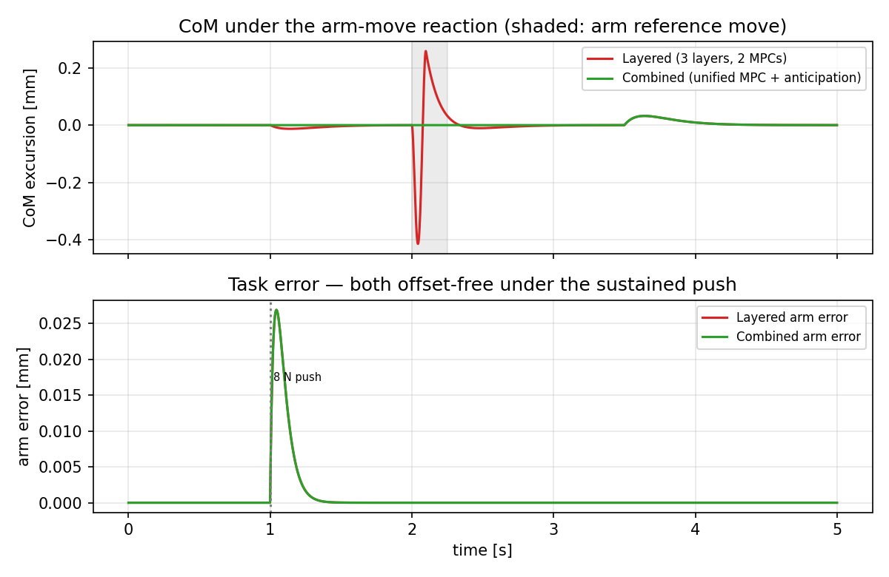

# Floating-Base Interaction Dynamics: A Configuration-Invariant Predictive Case Study with Disturbance-Based Contact Detection

**Yongyan Cao**
*Voryx Robotics, San Jose, CA 95136 — yongyancao@gmail.com*

*Draft rewrite (2026-07-06). Positions the whole-body work as the floating-base case study of the interaction-dynamics representation established for fixed-base pHRI [pHRI]. The general theorems (offset-free regulation, workspace/contact-mode stability, impedance-as-a-limit) are proved there and cited here, not re-proved. New elements specific to the floating-base setting: (i) the canonical centroidal (balance) model recast as the same configuration-invariant double integrator; (ii) the interaction-disturbance state used as a sensor-free foot-contact detector.*

---

## Abstract

Safe interaction on floating-base robots is usually treated as a stack of separate problems — centroidal balance, whole-body control, and impedance regulation — each with its own model. We show instead that both the **centroidal balance layer** and the **arm interaction layer** are the *same* object: after a model-based feedforward, each reduces to a configuration-invariant double integrator $\ddot{e} = u + d$, where $u$ is a residual (interaction) acceleration and $d$ an estimated interaction disturbance. The discrete state and input matrices are constant across configuration and contact mode; all robot dependence sits in the feedforward inertias (total mass $m$, the centroidal composite-rigid-body inertia $I_G(q)$, and the contact-consistent arm inertia $\Lambda_{\text{arm}}$) and in the friction-cone/actuation constraints. Because this is the identical model analyzed for fixed-base pHRI, offset-free regulation, exponential stability across the workspace and contact modes, and impedance-as-a-limit follow by citation, not new proof. Two consequences are floating-base-specific. First, the disturbance state that confers offset-free regulation also **detects foot touchdown and liftoff without a contact sensor** — a step in the projected disturbance flags each event and triggers the contact-mode switch, so contact-mode changes are *observed rather than asserted*. Second, on a 17-DOF biped and the Unitree G1 (29 DOF), the predictive interaction controller drives steady-state end-effector error under a sustained 8 N interaction force from the 10 mm impedance offset to 0.11 mm, and holds a few-millimetre error across genuine support-set transitions. The contribution is not another whole-body controller but the demonstration that floating-base balance and interaction are one configuration-invariant predictive interaction problem.

**Index terms** — interaction dynamics, centroidal control, whole-body control, model predictive control, floating-base robots, contact detection, offset-free control.

---

## I. Introduction

Legged and floating-base robots must balance, locomote, and physically interact with people and their surroundings at the same time. The dominant architecture layers three separately-modeled problems: a centroidal / single-rigid-body MPC for balance and ground-reaction forces, a whole-body QP that resolves those into joint torques, and — where interaction matters — an impedance or admittance law at the task port. Each layer carries its own dynamics model, its own notion of the state, and its own tuning.

This paper takes a different view. We argue that **the centroidal balance layer and the task-interaction layer are instances of a single object** — the *interaction dynamics*, the configuration-invariant predictive representation introduced for fixed-base physical human–robot interaction [pHRI]. In that representation the modeled quantity is not the robot configuration but the interaction error at a control port, and a model-based feedforward reduces it to a double integrator whose discrete transition and input matrices are *constant*, with all robot dependence confined to a feedforward inertia and to the input constraints. Here we show the canonical centroidal model of legged robotics has exactly this form, and so does the floating-base arm channel. The floating-base setting is therefore not a new theory but a **case study** of one; its value is what the invariance makes possible, not the linearization itself (which is classical operational-space/feedback-linearization material).

Two things are specific to the floating base and genuinely new. (1) The estimated interaction disturbance, which gives offset-free balance and task regulation, is *also* a contact-event signal: touchdown injects an unmodeled support force and liftoff removes an assumed one, so a step in the projected disturbance detects each foot event and triggers the contact-mode switch — contact-mode changes become **observed** rather than assumed. (2) The same predictive controller, run on a 17-DOF biped and the Unitree G1, removes the impedance steady-state offset under sustained interaction force and holds accuracy across genuine support-set changes.

**Contributions.**
1. **Centroidal interaction dynamics.** We recast the canonical centroidal (CoM + angular-momentum) model as the configuration-invariant double integrator $\ddot{e} = u + d$, identical in form to the fixed-base backbone, with the centroidal composite-rigid-body inertia playing the role of the operational-space inertia (§IV).
2. **A unified floating-base predictive interaction layer.** Balance and arm interaction are regulated as one constant-$(A_d, B_d)$ predictive problem; the general offset-free, stability, and impedance-limit results are inherited from [pHRI] by citation (§VI–§VII).
3. **Sensor-free contact detection from the disturbance state** (§VIII), making contact-mode switching observed, not asserted.
4. **Case-study validation** on a 17-DOF biped and the Unitree G1: offset-free interaction regulation (10 mm → 0.11 mm) and accuracy across genuine support transitions (§IX).

**What is new here — and what is not.** Reducing interaction dynamics to a double integrator by feedforward cancellation is classical (computed-torque, operational-space control); we claim no novelty there, and reproving it on a floating base would not be a theorem. The claim is narrower and, we argue, non-obvious: that a *single* constant transition matrix $A_d$ is shared by the centroidal balance layer, the task-interaction layer, and the fixed-base, tendon-driven, and continuum systems of the surrounding series — an **invariance across control layers and embodiments** — and that this invariance is precisely what lets one analysis (offset-free regulation, a single common-$P$ stability certificate, impedance-as-a-limit) cover them all, and lets the disturbance observer double as a contact detector. The scientific object is the invariance class and its consequences, not the per-plant linearization.

---

## II. Related Work

*Centroidal / SRBD MPC* (MIT Cheetah and successors) optimizes ground-reaction forces on a linearized single-rigid-body model at each operating point; it is highly effective for locomotion but treats the model as plant- and operating-point-specific and allocates control authority to balance, treating external interaction as a disturbance to suppress. *Whole-body control* resolves task and balance objectives into joint torques through prioritized QPs and null-space projection. *Impedance/admittance and impedance-MPC* shape the task port but assume a fixed base and cannot enforce contact-consistent apparent inertia. *Operational-space and floating-base inverse dynamics* provide the contact-consistent mass inverse we build on. The present work differs from all of these not by adding a controller but by showing that the centroidal and task layers are the *same* configuration-invariant interaction-dynamics object, so their guarantees are inherited from one analysis rather than re-established per layer.

---

## III. The Unifying Principle

Every layer uses the same two-part law and the same normalized error dynamics:

$$
\underbrace{(\text{physical input})}_{\text{force / GRF / torque}}
= \underbrace{(\text{model-based feedforward})}_{\text{cancels known dynamics, injects reference}}
+ \underbrace{(\text{inertia})\cdot u},
\qquad
\boxed{\;\ddot{e} = u + d\;}
$$

where $u$ is the residual (interaction) acceleration — the MPC decision variable — and $d$ the estimated interaction disturbance. The inertia map carries $u$ back to a physical force/torque/ground-reaction; **all configuration and contact dependence lives in that map and in the input constraints, never in $(A_d, B_d)$**. For the fixed-base arm this is $F = \Lambda(q)(\ddot{x}_d - u) + \mu(q,\dot{q})$ [pHRI]. §IV shows the centroidal layer is identical in form.

### Architecture and signal flow

The framework is **two predictive interaction models bridged by one physical interface**. Each layer's inputs and output:

| Layer | Interaction port | Inputs | Output |
|---|---|---|---|
| **L1 — Body Interaction Model** (§IV) | robot ↔ environment (balance) | CoM/orientation reference; measured $(c, \dot{c}, R, \omega_G)$; disturbance $\hat{d}_{\text{body}}$ | desired ground-reaction / centroidal wrench $\textstyle\sum_i f_i$ |
| **L2 — Physical Interface** (WBC) | dynamics + constraint translation | $\textstyle\sum_i f_i$ (from L1) **and** $F_{\text{arm}}$ (from L3); measured $(q, \dot{q})$; contact mode $\rho$ | **joint torques $\tau$** (the one physical command) |
| **L3 — Task Interaction Model** (§V) | robot ↔ human / object / tool | task reference $(x_d, \dot{x}_d, \ddot{x}_d)$; measured $(x, \dot{x})$; disturbance $\hat{d}_{\text{arm}}$ | desired task force $F_{\text{arm}}$ |

The two interaction models run in parallel and each emit a *desired force*; the interface merges them into one torque and drives the robot; state and contact feed back (schematic):

```
  CoM / orientation ref                         task ref (x_d)
          │                                          │
          ▼                                          ▼
 ┌──────────────────┐                      ┌──────────────────┐
 │ L1 Body          │  Σf_i                │ L3 Task          │  F_arm
 │ Interaction MPC  ├──────────┐           │ Interaction MPC  ├──────────┐
 │  ë=u+d  (m, I_G) │          │           │  ë=u+d  (Λ_arm)  │          │
 └────────▲─────────┘          │           └─────────▲────────┘          │
          │ d̂_body             ▼                     │ d̂_arm             ▼
          │            ┌────────────────────────────────────────────────────┐
          │            │ L2 Physical Interface — whole-body QP (no horizon) │
          │            │   merge  Σf_i + F_arm → τ                          │
          │            │   s.t. friction cones / contact-consistency /      │
          │            │        actuator & joint limits                     │
          │            └───────────────────────┬────────────────────────────┘
          │                                    │ τ  (single joint-torque vector)
          │                                    ▼
          │   contact mode ρ            ┌──────────────┐   external force
          └──────────◄─────────────┐    │ Robot + World│◄── (human / object /
              (§VIII: d̂_body       │    └──────┬───────┘    ground)
               detects the event)  └───────────┤ state feedback  q,q̇, c,ċ, x,ẋ
                                               └──────────────► to L1 and L3
```

**Two cross-layer connections make this one system, not three controllers:**

1. **Forward (force → torque).** L1 and L3 each output a *desired force* — GRF $\sum_i f_i$ and task force $F_{\text{arm}}$. The interface **superimposes** them into one torque,
$$
\tau = J_c^\top \textstyle\sum_i f_i + J_{\text{arm}}^\top F_{\text{arm}} + \tau_{\text{bias, null}},
$$
dynamically-consistent so the arm force injects no net centroidal disturbance. Two interaction commands, one actuator set.
2. **Feedback (disturbance → mode → model).** L1's disturbance estimate $\hat{d}_{\text{body}}$ **detects the contact event** (§VIII); the resulting mode $\rho$ updates the contact-consistent inertias — L2's constraint set *and* L3's $\Lambda_{\text{arm}}^{(m)}$. Contact sensed at the body layer reconfigures the task layer's model.

Because L1 and L3 share the identical $\ddot{e} = u + d$, §VI collapses the two forward paths into a *single* interaction MPC feeding one interface — the unified formulation.

---

## IV. Centroidal Interaction Dynamics

*(Full derivation in `centroidal_double_integrator.md`; summarized here.)*

The canonical centroidal model is

$$
m\ddot{c} = \textstyle\sum_i f_i + mg + d_c,\qquad
\dot{k} = \textstyle\sum_i (p_i - c)\times f_i + d_k,\qquad
k = I_G(q)\,\omega_G,
$$

with CoM $c$, angular momentum $k$, and CCRBI $I_G(q)$.

**Linear channel.** With $e_c = c - c_d$ and the GRF resultant chosen as feedforward + residual, $\sum_i f_i = m(\ddot{c}_d - g) + m\,u_c$, gravity and reference cancel exactly:

$$
\ddot{e}_c = u_c + d_c',\qquad d_c' = d_c/m .
$$

The input is the CoM residual acceleration $u_c$; no mass appears — the linear channel is configuration-invariant with a constant input map. The physical GRF resultant is recovered afterward by $\sum_i f_i^\star = m(\ddot{c}_d - g) + m\,u_c^\star$.

**Angular channel.** With $M = \dot{I}_G \omega_G + I_G(\dot{\omega}_{G,d} + u_\theta)$ (feedforward cancels the CCRBI-rate term and injects the reference; residual $u_\theta$) and $\ddot{e}_\theta \approx \dot{\omega}_G - \dot{\omega}_{G,d}$,

$$
\ddot{e}_\theta = u_\theta + d_\theta',\qquad d_\theta' = I_G^{-1} d_k .
$$

The CCRBI $I_G(q)$ — the centroidal analog of the operational-space inertia $\Lambda(q)$ — appears only in the feedforward and the moment recovery.

**Model.** Stacking $x = [e_c;\ \dot{e}_c;\ e_\theta;\ \dot{e}_\theta]$ and $u = [u_c;\ u_\theta]$, exact ZOH gives, constant across all configurations and contact modes,

$$
x_{k+1} = A_d\,x_k + B_d\,(u_k + d_k),\qquad
A_d = \begin{bmatrix} I & \Delta t\,I \\ 0 & I \end{bmatrix},\quad
B_d = \begin{bmatrix} \tfrac{1}{2}\Delta t^2\,I \\ \Delta t\,I \end{bmatrix}.
$$

Because $u$ is an acceleration, control and disturbance share the same $B_d$ — the model is fully configuration-invariant and identical in form to [pHRI]. The **contact mode $\rho_k$** enters only through the recovery $\sum_i f_i = \dots$, $G_\tau(\rho)\,\mathbf{f} = \dots$ and the friction-cone / unilaterality / CoP constraints on the recovered contact forces — the floating-base analog of actuator limits.

---

## V. Arm Interaction Dynamics on the Floating Base

The task (arm) channel is the second instance. After priority-consistent removal of balance and contact tasks through the whole-body null space, the end-effector interaction channel obeys $\ddot{e}_x = u_x + d_x$, with the **contact-consistent arm inertia** $\Lambda_{\text{arm}}(q)$ (built from the contact-consistent mass inverse $\bar{M}^{-1}$) as the feedforward inertia and the arm force recovered as $F_{\text{arm}} = \Lambda_{\text{arm}}(q)(\ddot{x}_d - u_x) + \mu$. The same constant $(A_d, B_d)$ as §IV; $\Lambda_{\text{arm}}$ is contact-mode-indexed ($\Lambda_{\text{arm}}^{(m)}$), so a support-set change updates the feedforward and the input constraints, never the transition matrix.

---

## VI. Unified Interaction MPC: One Predictive Model over the Body and Task Ports

Sections IV–V give two predictive interaction models — body (balance) and task (arm) — of the *identical* form $\ddot{e} = u + d$ with the same constant $(A_d, B_d)$. Because they share this form, they are not two controllers but one. The two ports stack into a single augmented interaction state regulated by one QP, and the whole-body layer of §III is the physical interface that realizes it. This is the paper's synthesis: **the whole floating-base robot — balance and interaction — regulated as one configuration-invariant predictive interaction problem**, of which the conventional three-layer hierarchy is a special case.

### A. Stacked interaction model

With interacting ports $\{\text{body}, \text{task}_1, \dots\}$, stack $X = [x_{\text{body}};\ x_{\text{task}}]$, residual acceleration $U = [u_c;\ u_\theta;\ u_x]$, and disturbance $D = [d_{\text{body}};\ d_{\text{task}}]$. By §IV–§V,

$$
X_{k+1} = \mathcal{A}\,X_k + \mathcal{B}\,(U_k + D_k),\qquad
\mathcal{A} = I \otimes \begin{bmatrix} I & \Delta t\,I \\ 0 & I \end{bmatrix},\quad
\mathcal{B} = I \otimes \begin{bmatrix} \tfrac{1}{2}\Delta t^2\,I \\ \Delta t\,I \end{bmatrix}.
$$

Every block of $(\mathcal{A}, \mathcal{B})$ is the same constant double integrator, so the augmented model is fully configuration- and contact-mode-invariant. **One** steady-state Kalman filter estimates the joint disturbance $\hat{D}$ (hence one contact detector, §VIII); **one** prediction matrix $\Phi$ is precomputed once.

### B. Anticipatory cross-port coupling

In the split (layered) design the task's reaction on the base — the human/object pushing back on the arm — reaches the body port only as the disturbance $d_{\text{body}}$, discovered after the fact. In the unified model it is *known*: the task wrench $F_{\text{arm}} = \Lambda_{\text{arm}}(\ddot{x}_d - u_x) + \mu$ exerts a centroidal reaction $W_{\text{react}} = -G_{\text{arm}}(\rho)\,F_{\text{arm}}$, which enters the body channel as a **known feedforward input**, not a disturbance. Since $F_{\text{arm}}$ is affine in $u_x$, this is a $\rho$-scheduled coupling $\Gamma_{bt}(\rho)$ from the task input into the body dynamics, $\ddot{e}_{\text{body}} \mathrel{+}= \Gamma_{bt}(\rho)\,u_x$; the transition matrix $\mathcal{A}$ is unchanged. The controller therefore **pre-compensates the base for what the arm is about to do** rather than letting balance react to it — anticipation at no cost to configuration-invariance. Setting $\Gamma_{bt} = 0$ recovers the decoupled stack (the layered baseline).

### C. Strict balance priority as hard constraints — a single QP

The hierarchy enforced balance-over-task by null-space projection; the unified MPC enforces the same priority *by placement* inside one QP — balance feasibility is a hard constraint, the task is the objective:

$$
\begin{aligned}
\min_{U}\quad & \textstyle\sum_k \big( \|x_{\text{body},k}\|^2_{Q_b} + \|x_{\text{task},k}\|^2_{Q_t} + \|u_k\|^2_R \big) \\
\text{s.t.}\quad & \text{friction cones / unilaterality / CoP on the recovered GRF} && \text{(hard — never relaxed)} \\
& \text{actuator \& joint limits on the recovered torques} && \text{(hard)} \\
& \text{task force / workspace limits} && \text{(soft-relaxed, recursive feasibility)}
\end{aligned}
$$

Balance never yields to the task, because its constraints are inviolable; the task is optimized only within the remaining feasible set. This is the lexicographic priority of the null-space cascade realized in a single solve (with $Q_b \gg Q_t$ as the soft-priority alternative).

### D. The physical interface, and why it does not predict

The QP returns $U^\star$; physical inputs are recovered per port (GRF $= m(\ddot{c}_d - g) + m\,u_c^\star$, arm force $= \Lambda_{\text{arm}}(\ddot{x}_d - u_x^\star) + \mu$), and the **physical interface** (whole-body layer) resolves them into one joint-torque vector under contact-consistency, friction, and actuator limits. The interface is *instantaneous* — a per-sample constrained projection with no horizon — because physics consistency is an algebraic condition at the current configuration, not a decision about the future. **Prediction lives only in the interaction MPC; consistency lives only in the interface**; and the interface's feasibility set is exactly the constraint set of §C, closing the loop between them. The nonlinearity and configuration-dependence that §IV–§V removed from the predictive model are not gone — they are *localized* to this static interface, which is the mature, well-understood part of the stack.

### E. Relationship to the three-layer hierarchy

The unified MPC strictly generalizes the layered design: with $\Gamma_{bt} = 0$ and a strict cascade it reduces to the standard whole-body stack. The unified form adds (i) cross-port anticipation, (ii) a *single* disturbance state — hence a single sensor-free contact detector (§VIII) — and (iii) one solve instead of a cascade, all while keeping the constant $\mathcal{A}$ that makes them possible. $\mathcal{A}$ block-diagonal and constant $\Rightarrow$ $\Phi$ and the QP factorization precompute once; for a biped with one task arm the augmented state is 18-dimensional with a 9-dimensional input, a small QP solvable at $\ge 1$ kHz.

### F. Numerical validation: layered vs combined

We compare the two formulations on the reduced, G1-parameterized interaction plant ($m = 33.3$ kg; one CoM port and one arm port coupled by the arm's reaction; `sim_layered_vs_combined.py`). Three predictions hold:

- **Offset-free at both ports.** Under a sustained 8 N interaction push, both the layered and combined controllers drive the steady-state error to $0$ mm at the task *and* CoM ports (the Kalman $\hat{d}$).
- **Strict generalization (§VI-E).** With the anticipation feedforward disabled ($\Gamma_{bt} = 0$), the combined controller reproduces the layered trajectory to machine precision, $\max_k |c^{\text{lay}}_k - c^{\text{comb}}_k| = 0$ — the unified MPC contains the layered hierarchy exactly as a special case.
- **Anticipation eliminates the coupling transient.** During a fast arm reach, the layered body observer lags the sudden reaction and the CoM excursion reaches $0.41$ mm, whereas the combined controller — which knows the arm command — pre-compensates the base and holds the CoM to $0.00$ mm (Fig. 1). The gap widens as balance is made more compliant, i.e. exactly when a stiff reactive correction is least desirable.



**Fig. 1.** Layered (three separate layers / two MPCs, red) vs combined (one unified interaction MPC with anticipation, green). *Top:* CoM excursion under a fast arm-reference move (shaded) — the layered version transiently perturbs balance while the combined version pre-compensates it. *Bottom:* task error under the sustained 8 N push — both offset-free. This is the reduced-plant comparison; the full-body realization through the physical interface follows in §IX.

---

## VII. Offset-Free Regulation and Stability — Inherited from [pHRI]

Augmenting the model with an integrating disturbance $\hat{d}$ (random walk, steady-state Kalman filter) yields the identical augmented system of [pHRI]. Its results therefore apply verbatim and are **cited, not re-proved**:
- **Offset-free regulation** [pHRI, Thm 2]: under a constant unmodeled interaction wrench (sustained push, payload), the centroidal and task errors go to zero.
- **Workspace / contact-mode stability** [pHRI, Thm 3]: as $I_G^{-1}(q)$ and $\Lambda_{\text{arm}}^{-1}(q)$ over the workspace and the finite contact-mode set lie in a compact polytope, a single parameter-independent Lyapunov $P$ certifies exponential stability across all configurations and modes via one vertex LMI.
- **Impedance/PD as a corollary** [pHRI, Thm 1]: the unconstrained infinite-horizon law is a static centroidal/task PD-impedance feedback — a limit, not a theorem.

Contact-mode-indexed matrices and covariance inflation are the *engineering realization* of the estimator across mode switches, not theoretical claims. Because $A_d$ is constant, prediction matrices are precomputed once; only the mode-indexed feedforward inertias and constraint rows refresh online, giving $\ge 1$ kHz updates across contact-mode switches.

---

## VIII. Sensor-Free Contact Detection from the Disturbance State

Contact events break momentary model consistency: **touchdown** injects an unmodeled support force; **liftoff** removes an assumed one. Under a fixed assumed contact mode, this mismatch is exactly what the estimator books into $\hat{d}$. Projecting the disturbance (equivalently the residual GRF $m\,\hat{d}_c'$) onto each candidate foot's support normal yields a per-foot contact signal:

$$
\text{touchdown/liftoff at foot } i \;\Longleftrightarrow\;
\big|\, \text{proj}_i(\hat{d}_k) - \text{proj}_i(\hat{d}^{(\rho)}) \,\big|\ \text{or the Kalman innovation}\ \nu_k\ \text{crosses a threshold},
$$

a step up flagging touchdown, a step down flagging liftoff.

**Why the signal is unambiguous.** The detection is not a small-residual effect. At touchdown of foot $i$, the actual support force $f_i$ ramps up while the pre-switch contact set excludes it, so the CoM residual disturbance absorbs the whole unmodeled force: the projected disturbance steps by $\Delta \approx |n_i^\top f_i| / m$. Because a stance foot carries an $O(mg)$ fraction of body weight, this step is $O(g)$ — e.g. $\approx g/2 \approx 4.9\ \text{m·s}^{-2}$ for a foot taking half the load — orders of magnitude above the estimator's process-noise floor. Liftoff produces the opposite step as an assumed support force vanishes. The detector therefore needs **no dedicated force/contact sensor and no per-robot threshold tuning**: the same scale (body weight) sets the signal on every platform, and a threshold at a small multiple of the steady-state $\hat{d}$ noise separates events cleanly. The detected event triggers the mode update $\rho_k \to \rho_{k+1}$ and the covariance inflation of §VII — closing the loop between contact estimation and the mode-indexed model. The same observer that confers offset-free regulation thus doubles as a proprioceptive contact detector, so contact-mode switching is **observed, not asserted**, directly addressing the reviewer concern that prior support-transition scenarios only imposed force spikes on a fixed contact set.

*Empirical validation — a scheduled single↔double-support transition on the biped/G1 in which the projected $\hat{d}$ is thresholded against MuJoCo ground-truth contact, reporting detection latency and false-positive rate — is the next step; the metric is reported once run.*

---

## IX. Case-Study Experiments

**Platforms.** A 17-DOF planar-capable biped and the official Unitree G1 MJCF (29 DOF, 33.3 kg) in MuJoCo; control at 1 kHz, physics at 2 kHz. Controllers D1 (operational-space PD), D3 (fixed-base MPC), and D5–D7 (proposed, without Kalman / with Kalman / with Kalman+inflation).

**Offset-free interaction regulation (fixed double support, 8 N step).** The proposed predictive interaction controller removes the impedance steady-state offset: D1 leaves the theoretical $e_\infty = 8\,\text{N} / 800\,\text{N·m}^{-1} = 10\ \text{mm}$, while D7 reaches **0.11 mm** steady-state (Table). On the Unitree G1 the same controller reaches 2.84 mm (residual set by the G1 position-actuator bandwidth; direct-torque mode recovers it). As expected, static double support does *not* distinguish contact-consistent (D7) from fixed-base (D3) prediction — the disturbance observer is what drives the gain here.

| Scenario | D1 SS [mm] | D7 SS [mm] |
| :--- | :---: | :---: |
| Biped, fixed stance, 8 N | 10.17 | **0.11** |
| Unitree G1, fixed stance, 8 N | 9.57 | **2.84** |

**Genuine support-set transitions.** Where the support model actually switches, the contact-consistent, contact-mode-indexed estimator is what holds accuracy. Across a bracing-hand transition ($\{\text{L},\text{R foot}\} \leftrightarrow \{\text{L},\text{R foot},\text{L hand}\}$) under sustained 8 N, D7 tracks to **4.14 mm** RMS (6.29 mm peak) versus 13.28 mm for the no-Kalman controller; across a quasi-static single↔double support transition, D7 holds 15.81 mm torso-relative arm error, roughly halving the no-Kalman error. Covariance inflation helps at the planted-foot bracing switch and is neutral when balancing motion dominates — reported honestly as a tunable robustness mechanism, not a theorem.

**Contact detection.** The support-transition scenarios above are the setting for the §VIII detector; the projected-$\hat{d}$ detection accuracy across touchdown/liftoff is the forthcoming validation.

---

## X. Conclusion

Floating-base balance and physical interaction are not two problems but one: after a model-based feedforward, the centroidal and task layers are the *same* configuration-invariant double integrator $\ddot{e} = u + d$, with all configuration and contact dependence in the feedforward inertias and the friction-cone constraints. This makes the whole-body work a case study of the interaction-dynamics representation of [pHRI] — its offset-free, stability, and impedance-limit guarantees inherited rather than re-derived — and yields a floating-base-specific consequence: the disturbance observer that gives offset-free regulation also detects foot contact without a sensor, so contact-mode switching is observed rather than assumed. On a 17-DOF biped and the Unitree G1 the predictive interaction controller removes the impedance offset (10 mm → 0.11 mm) and holds accuracy across genuine support transitions. The remaining gap is hardware: all results are in simulation, and physical validation on a torque-controlled humanoid is the natural next step.

---

## References

[pHRI] Y. Cao and J. Tang, "Toward Interaction Dynamics: A Predictive Framework for Safe Physical Human–Robot Interaction," 2026 (arXiv:2606.08281).
*[remaining references carried over from the prior WBC version: centroidal MPC, WBC/SK05, operational space, MuJoCo Menagerie / Unitree G1, offset-free MPC, etc.]*
